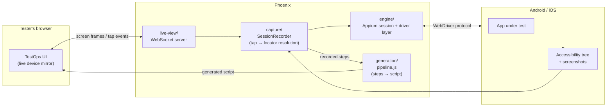
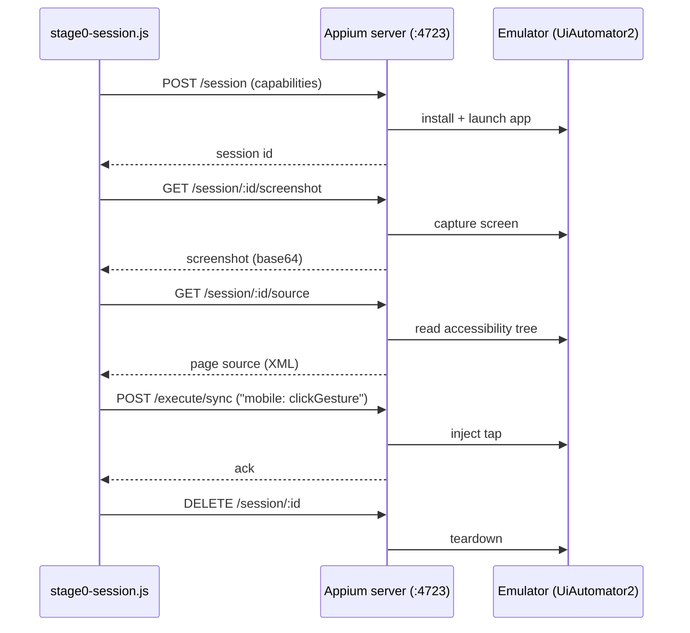

# Phoenix

Proprietary mobile test-recording and generation engine for TestOps.

Testers record a flow once, inside TestOps — no Appium Inspector, no local install, no separate device-farm dashboard. Phoenix captures the session and generates a working automated script.

Built on a fork of Appium's core engine (Apache 2.0), extended with an AI-native layer Appium doesn't have.

See [`docs/PHOENIX_SPEC.md`](docs/PHOENIX_SPEC.md) for the full architecture and roadmap.

## Repo layout

| Directory | Purpose |
|---|---|
| `engine/` | Forked Appium core + drivers (Android/iOS), stripped to session + driver essentials |
| `capture/` | Records taps, accessibility-tree snapshots, and screenshots during a session |
| `generation/` | Turns a captured session into a named, asserted, parameterized script |
| `live-view/` | Embeddable component: streams the device screen and forwards taps into TestOps |
| `docs/` | Architecture, spec, and decision records |

## Architecture



## Stage 0 milestone flow

The current proven pipe, end to end against a local emulator (`engine/stage0-session.js`):



## Market comparison

How Phoenix (target state, not yet fully built — see Status below) compares to what testers use today for mobile automation.

| Capability | **Phoenix** | Appium + Appium Inspector | BrowserStack App Automate | Katalon | mabl | Testim / Tricentis |
|---|:---:|:---:|:---:|:---:|:---:|:---:|
| No local tool install for the tester | ✅ | ❌ | ❌ (Inspector still local) | ❌ | ✅ | ✅ |
| Guided record → AI-generated script | ✅ | ❌ | ❌ | ⚠️ (record/playback, minimal AI) | ✅ | ✅ |
| Script generated from a **live, in-browser** device mirror | ✅ | ❌ | ❌ | ❌ | ❌ | ❌ |
| Self-authored locator strategy tuned to our test suites | ✅ | ⚠️ (manual) | ⚠️ (manual) | ⚠️ (manual) | ❌ (vendor black box) | ❌ (vendor black box) |
| Proprietary / not visible to competitors | ✅ | ❌ (open source) | ❌ (3rd-party SaaS) | ❌ (3rd-party SaaS) | ❌ (3rd-party SaaS) | ❌ (3rd-party SaaS) |
| No per-seat / per-minute vendor licensing | ✅ | ✅ | ❌ | ❌ | ❌ | ❌ |
| Runs on real devices + emulators/simulators | ✅ | ✅ | ✅ | ✅ | ✅ (limited device range) | ✅ (limited device range) |
| Full control over the underlying engine (fork, extend, fix) | ✅ | ✅ | ❌ | ❌ | ❌ | ❌ |
| Works out of the box, zero engine knowledge needed | ✅ (target) | ❌ | ❌ (still Appium under the hood) | ⚠️ (own DSL to learn) | ✅ | ✅ |
| Vendor lock-in risk | ✅ none (ours) | ✅ none | ❌ | ❌ | ❌ | ❌ |

⚠️ = partial support / workaround required, not a clean yes.

This is the case *for* building Phoenix, not a claim that today's repo already beats these tools — see Status for what's actually working right now.

## Status

**Stage 0 complete.** `engine/stage0-session.js` runs end to end against a local Android emulator via Appium 3 + `appium-uiautomator2-driver`: session start → screenshot → accessibility tree → tap → clean teardown, with no project-level Appium version pin (Appium and its drivers are installed globally via the `appium` CLI, not as `engine/package.json` dependencies).

**Stage 1 complete.** `capture/recorder.js` now resolves a tap coordinate to a real locator — resource-id, then accessibility-id (content-desc), then text, then a computed structural xpath, then raw coordinates as a last resort — by walking the accessibility tree and picking the smallest element whose bounds contain the tap point. Verified with a test suite (`capture/test/`) run against the actual tree captured during the Stage 0 run, not synthetic XML. `live-view/server.js`'s tap-forwarding path is wired to it, using the device's real window size (not the rendered image's) to convert a tester's on-screen tap ratio into device pixels, and the legacy `touchAction` call there is fixed the same way Stage 0's was — Appium 3 needs `mobile: clickGesture`, not JSONWP touch actions.

**Stage 2 (v1) complete.** `generation/pipeline.js` turns a captured session into a runnable WebdriverIO script — entirely rule-based, no LLM call yet: `inferTestName` names the flow from the first screen's title, `inferAssertions` diffs each step's before/after accessibility tree and proposes an assertion per label that newly appeared, `extractParameters` lifts typed values into named test data from the field's own locator, and `synthesizeCode` renders it all as a `describe`/`it` block with `waitForDisplayed`/`click`/`setValue` calls and `expect(...).toBeDisplayed()` assertions — falling back to a flagged raw-coordinate tap only when Stage 1 couldn't resolve a stable locator. Verified with a test suite (`generation/test/`) against a synthetic login flow, output included below.

<details>
<summary>Sample generated script (login flow, 3 recorded steps)</summary>

```js
// Generated by Phoenix from a recorded session — 3 step(s).
// Locators use the priority resolved during capture: resource-id > accessibility-id > text > xpath > coordinate.

// Test data — lifted from values typed during recording.
const username = "prabath@example.com";
const password = "hunter2";

describe("login", () => {
  it("login", async () => {
    // Step 1
    const step0El = await $("android=new UiSelector().resourceId(\"com.phoenix.demo:id/username_input\")");
    await step0El.waitForDisplayed();
    await step0El.click();
    await step0El.setValue(username);

    // Step 2
    const step1El = await $("android=new UiSelector().resourceId(\"com.phoenix.demo:id/password_input\")");
    await step1El.waitForDisplayed();
    await step1El.click();
    await step1El.setValue(password);

    // Step 3
    const step2El = await $("android=new UiSelector().resourceId(\"com.phoenix.demo:id/login_button\")");
    await step2El.waitForDisplayed();
    await step2El.click();
    await expect($("android=new UiSelector().resourceId(\"com.phoenix.demo:id/welcome_text\")")).toBeDisplayed(); // "Welcome" appeared
  });
});
```
</details>

The LLM call comes in as a v2 refinement layered on top of this — better flow names, filtering incidental assertions (a clock ticking over) from meaningful ones, smarter parameter naming — without changing the pipeline's shape or output contract.

**End-to-end wiring complete, proven on a real device with a real multi-step flow.** `run-session.js` at the repo root wires all four pieces into one live recording session: starts a real Appium session (`engine/session.js`), starts `live-view`'s WebSocket server against it with a `SessionRecorder` attached, and on `"stop"` hands the recorded steps to `generation/pipeline.js`, writes the resulting script to `generated/<test-name>.test.js`, and sends it back over the socket as a `script-generated` message. A real run against ApiDemos (home screen → "Views" submenu → "Animation" demo screen, 2 real taps) surfaced and fixed two real bugs: list-row selectors needing `resourceId` + `text` combined to disambiguate (shared row-template ids), and assertion diffing needing to key on `(resourceId, text, bounds)` rather than text alone (two different elements coincidentally sharing a label across screens).

**Real front-end complete.** `frontend/index.html` (served by `frontend/server.js`, no build step, vanilla JS) is the actual tester-facing recording UI — replaces `live-view/test-client.js`'s simulated tester with a real live device mirror: it renders each polled screenshot, lets the tester click directly on the image to tap (converting the click position to a device coordinate ratio automatically), has a text field for typed input, a live list of recorded steps, a "Stop & Generate Script" button, and displays the generated script inline with a copy button once the session finishes.

### Running the full loop locally

With the emulator + Appium server already running (see Stage 0 instructions above):

```bash
# terminal 4 — starts the session, live-view server, and waits for a tester
export PHOENIX_STAGE0_APP_PATH=~/Downloads/apidemos.apk
node run-session.js

# terminal 5 — serves the real recording UI
node frontend/server.js
```

Then open **http://localhost:8091/** in a browser: you'll see the live device mirror, and can tap directly on it to record a real flow, type into fields, and stop to see the generated script.

To exercise the loop without a browser (e.g. in CI, or to test a specific tap sequence programmatically), `live-view/test-client.js` still works the same way — a scripted stand-in for a tester, configurable via `PHOENIX_TAP_SEQUENCE`:

```bash
node live-view/test-client.js
```

Next: harden the live-view/generation edge cases further (typed-input flows, back-navigation, screens with no accessible labels), or start the actual Appium fork work in `engine/` once a concrete reason to embed rather than spawn Appium shows up.

### Running Stage 0 locally

```bash
# one-time setup
npm i -g appium
appium driver install uiautomator2
sdkmanager --sdk_root=$ANDROID_HOME "build-tools;34.0.0"   # provides aapt2

# terminal 1 — leave running
appium

# terminal 2 — leave running
emulator -avd <your_avd_name>

# terminal 3
cd engine
npm install
export PHOENIX_STAGE0_APP_PATH=/absolute/path/to/some-app.apk
npm run stage0
```

Do not declare `appium` or `appium-uiautomator2-driver` in `engine/package.json` — Appium 3.x's drivers require `appium@^3.0.0-rc.2` as a peer, and pinning an older `appium` there causes an ERESOLVE conflict. The CLI manages driver installation itself.
