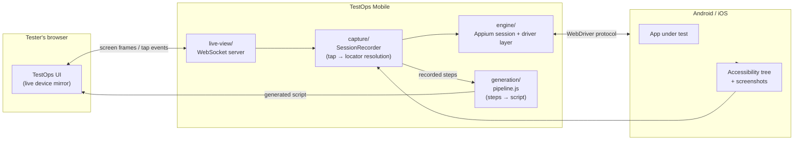
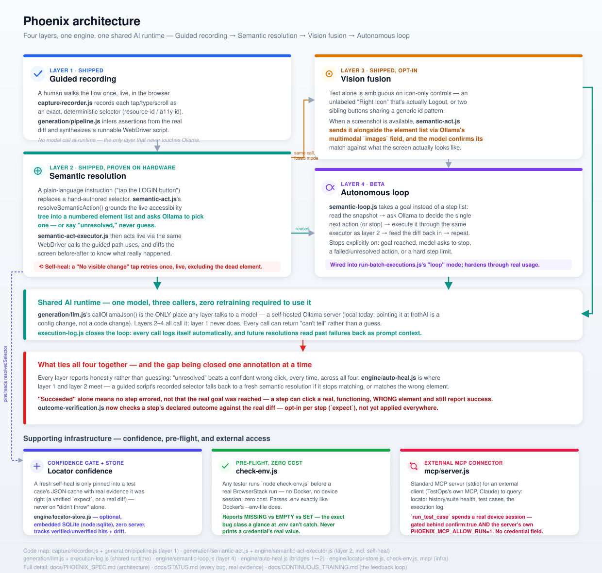

# TestOps Mobile

[](https://github.com/prabathkumar/phoenix/actions/workflows/test.yml)
[](https://github.com/prabathkumar/phoenix/actions/workflows/deploy-frontend.yml)

Proprietary mobile test-recording and generation engine for TestOps.

Testers record a flow once, inside TestOps — no Appium Inspector, no local install, no separate device-farm dashboard. TestOps Mobile captures the session and generates a working automated script. Built on a fork of Appium's core engine (Apache 2.0), extended with an AI-native layer Appium doesn't have.

**Live: [prabathkumar.github.io/phoenix](https://prabathkumar.github.io/phoenix/)** — the actual recording UI, connecting to a TestOps Mobile backend running against a real device.

| Doc | For | What's in it |
|---|---|---|
| [`docs/TESTOPS_MOBILE_SPEC.md`](docs/TESTOPS_MOBILE_SPEC.md) | Anyone wanting the full picture | The original spec: why guided-first, the Act 1/2/3 roadmap, what each phase is and isn't |
| [`docs/STATUS.md`](docs/STATUS.md) | Engineering — the source of truth | Every capability, every real bug found and fixed with root cause and evidence, what's still open. If a claim anywhere else in these docs needs checking, this is where it's backed up |
| [`docs/SETUP.md`](docs/SETUP.md) | An infra engineer standing TestOps Mobile up | Local Appium host vs. BrowserStack, credentials, env vars, one checklist from a cold machine |
| [`docs/DEVELOPER_GUIDE.md`](docs/DEVELOPER_GUIDE.md) | A tester or dev recording a flow | Walkthrough: record once in the browser, get a runnable script back |
| [`docs/REAL_DEVICE_BATCH_TESTING.md`](docs/REAL_DEVICE_BATCH_TESTING.md) | Running batches on real hardware | The `run-batch-executions.js` runbook — guided/semantic/loop/test-case modes, env vars, reading the report |
| [`docs/CONTINUOUS_TRAINING.md`](docs/CONTINUOUS_TRAINING.md) | Understanding how the model improves | What's automatic today (execution logging, past-failure feedback, log retention) vs. what a real fine-tune pipeline would need (GPU infra, a regression gate) — written against the actual frothAI hardware |
| [`docs/TESTOPS_WORKFLOW_UX.md`](docs/TESTOPS_WORKFLOW_UX.md) | TestOps dev team — UI/UX | The screen-by-screen flow (library → cycle → app → run) to build TestOps's own UI against `test-case` mode |
| [`docs/TESTOPS_INTEGRATION_GUIDE.md`](docs/TESTOPS_INTEGRATION_GUIDE.md) | TestOps dev team — backend integration | The data model/fields their UI needs, frothAI (Ollama) wiring, server installation |
| [`docs/TESTOPS_MOBILE_DOCKER.md`](docs/TESTOPS_MOBILE_DOCKER.md) | TestOps dev team — getting the code running | Building/exporting the "TestOps Mobile" Docker image and pulling the source into their own GitHub org |
| [`docs/RELEASING.md`](docs/RELEASING.md) | Cutting a release | The `vX.Y.Z` version-tag scheme and the automated `ghcr.io` build+push workflow — implemented, unverified until the first real tag push |
| [`docs/COMPETITIVE_LANDSCAPE.md`](docs/COMPETITIVE_LANDSCAPE.md) | Evaluating TestOps Mobile against alternatives | Full comparison vs. Appium-MCP and other AI-agent test tooling |
| [`mcp/README.md`](mcp/README.md) | Connecting an external MCP client (e.g. TestOps's own MCP) | The `mcp/server.js` connector — tools exposed, setup, the real-run safety gate |

|  |  |
|:---:|:---:|
| Real session recorded through the public frontend against ApiDemos on a local emulator — 11 steps, 8 assertions, one typed parameter, script generated live. | Uploading a `.apk`/`.ipa` directly starts a real BrowserStack session — no pre-configured app path needed. |

## Repo layout

| Directory | Purpose |
|---|---|
| `engine/` | Forked Appium core + drivers (Android/iOS), stripped to session + driver essentials |
| `capture/` | Records taps, accessibility-tree snapshots, and screenshots during a session |
| `generation/` | Turns a captured session into a named, asserted, parameterized script |
| `live-view/` | Embeddable component: streams the device screen and forwards taps into TestOps |
| `mcp/` | MCP connector — exposes the locator store, test cases, and execution log to an external MCP client (stdio) |
| `check-env.js` | Zero-cost, zero-dependency `.env` verification a tester runs before a real BrowserStack run (no Docker/device session) |
| `docs/` | Architecture, spec, and decision records |

## Architecture



**Engine session flow.** Every entry point (`run-session.js` and friends) drives the same four-step lifecycle against the device — session start → screenshot → accessibility tree → tap → teardown — over one of two architectures that coexist on purpose:

| | Spawn (`stage0-session.js`, default) | Embedded (`embedded-session*.js`) |
|---|---|---|
| How it talks to the driver | Separate `appium` CLI process, over HTTP | Same Node process, direct method calls — no server, no HTTP hop |
| Status | Proven on real hardware, what every product path uses today | Proven on real hardware in isolation; not yet migrated into the main pipeline |

Full sequence diagram, the spawn-vs-embedded tradeoffs, and setup commands for each: [`docs/STATUS.md#engine-session-flow-spawn-path`](docs/STATUS.md#engine-session-flow-spawn-path).

## The four layers: Guided, Semantic, Vision, Loop

The diagram above is the guided-recording pipeline (Act 1) in isolation. TestOps Mobile is actually four layers stacked on the same engine, each one shipped and proven at a different stage — the picture below is the whole thing:



- **1. Guided layer (Act 1) — shipped.** A human walks the flow once, live, in the browser. `capture/recorder.js` records each tap/type/scroll as an exact, deterministic selector; `generation/pipeline.js` infers assertions from the real diff and synthesizes a runnable script. No AI judgment at runtime — this is the proven, ship-today path.
- **2. Semantic layer (Act 2) — shipped, proven on real hardware.** A plain-language instruction ("tap the LOGIN button") replaces a hand-authored selector. `generation/semantic-act.js`'s `resolveSemanticAction()` grounds the live accessibility tree into a numbered element list and asks the local model to pick one — or say "unresolved," never guess. `engine/semantic-act-executor.js` acts live via the same WebDriver calls the guided path uses, and diffs the screen before/after to know what really happened. This layer also self-heals live: a tap that produces "No visible change" triggers one automatic retry, excluding the dead element, before anything is reported — no log, no human, no separate chat needed. `engine/auto-heal.js` is where this layer and layer 1 meet: a guided script's recorded selector falls back to a fresh semantic resolution if it stops matching, or starts matching the wrong element.
- **3. Vision fusion — shipped, opt-in.** Text alone is ambiguous on icon-only controls (an unlabeled "Right Icon" that's actually Logout; two sibling buttons sharing a generic id pattern). When a screenshot is available, `semantic-act.js` sends it alongside the numbered element list via Ollama's multimodal `images` field (`generation/llm.js`), and the model confirms its text-based match against what the screen actually looks like. Omitted entirely for a text-only model — nothing breaks, it just resolves on tree text alone, same as before fusion existed.
- **4. Autonomous loop (Act 3) — Beta: wired in and usable, hardens through real-world use.** `engine/semantic-loop.js` takes a goal in plain language instead of a step list: read the snapshot → ask the model to decide the single next action (or stop) → execute it through the same executor as layer 2 → feed the resulting diff back in as context for the next decision → repeat. Stops explicitly on: goal reached, model asks to stop, an action fails or can't resolve, or a hard step-count limit — never a silent retry loop. It's wired into `run-batch-executions.js` as a real, selectable mode (`TESTOPS_MOBILE_BATCH_MODES=loop`), not dead code. It's less proven than layers 1-2 today — its own runtime warning says so, because it's repeatedly gotten stuck at the same points on real hardware — but the path to closing that gap is the same evidence-driven one used throughout this repo: real usage surfaces real failures, each gets diagnosed and fixed. With Hemant's team integrating it and testers running it continuously, that hardening loop runs far faster than one person manually. (Note: this is prompt/guardrail hardening, not literal model fine-tuning — no model weights change.)

### Element identification in React / hybrid / Flutter apps — decided, not just discussed

This question comes up often enough ("why don't we take the Playwright fork out and mix it up for React/Flutter/hybrid apps") that the decision is recorded here, permanently, instead of relitigated in chat each time:

- **React-in-WebView and hybrid apps — solved, shipped.** `generation/webview-snapshot.js` + `generation/webview-act.js` + `engine/webview-context.js` already do the thing being asked for, without forking Playwright's code. There's no Chromium process to drive here — Appium's own WebView bridge gives real DOM access over the exact same WebDriver connection every native step already uses. So instead of vendoring Playwright, TestOps Mobile replicates its *idea* (a compact, ref-indexed snapshot of interactive elements an LLM can pick from, never raw HTML) via `driver.execute()` inside the WebView context. A WebView resolution comes back in the same selector contract as a native one, so `engine/semantic-act-executor.js` treats both identically.
- **Flutter — NOT solved by the above, and never will be by this approach.** Flutter paints its UI on its own Skia canvas — no WebView, no native Android/iOS widget tree, nothing for Appium's accessibility tree or the WebView-DOM approach above to see. Earlier code comments mentioning "Flutter" alongside "hybrid/React" were aspirational, not accurate — corrected now. Closing this gap for real needs Flutter's own semantics/accessibility bridge (`flutter_driver` / the Flutter semantics tree exposed via `SemanticsNode`), which is unbuilt. That's a separate, real piece of work, not a side effect of the WebView work above.

| App type | Element ID approach | Status |
|---|---|---|
| Native Android/iOS | Accessibility tree (`generation/semantic-snapshot.js`) | ✅ shipped, proven on real hardware |
| Hybrid / React-in-WebView | WebView DOM via Appium's WebView bridge (`generation/webview-snapshot.js`) | ✅ shipped |
| Flutter | None — needs Flutter's own semantics API | ❌ unbuilt, real gap |

### Supporting infrastructure — confidence, pre-flight, and external access

Three smaller pieces sit alongside the four layers above, closing gaps found through real usage rather than designed up front — each shown as its own band at the bottom of the architecture diagram above.

| Component | What it does | Opt-in? | Docs |
|---|---|:---:|---|
| **Confidence-gated locator cache** (`engine/test-case-runner.js`'s gate + `engine/locator-store.js`) | A freshly self-healed selector is only pinned into a test case's `resolvedSelector` cache when there's real evidence it was right (a verified `expect`, or a real diff) — never on "the click didn't throw" alone. The optional store is an embedded SQLite DB (`node:sqlite`, zero new dependency, zero server) tracking verified/unverified hits and drift per step, for a suite-wide "is this regression suite rotting" view. | Gate: always on. Store: `TESTOPS_MOBILE_ENABLE_LOCATOR_STORE` | [`docs/STATUS.md`](docs/STATUS.md) |
| **`check-env.js`** | A tester runs `node check-env.js <test-case>.json` before spending a real BrowserStack session — no Docker, no device, zero cost. Parses `.env` exactly like Docker's `--env-file` does, so a credential line present but empty (`KEY=`) is correctly flagged, not mistaken for "set." Never prints a credential's real value. | Always available, nothing to enable | this README's Quick start, below |
| **`mcp/server.js`** | A standard MCP server (stdio) exposing the locator store, test cases, and execution log to an external MCP client — built for the user's TestOps MCP ahead of its Claude-marketplace integration. `run_test_case` spends a real device session, so it's gated behind `confirm: true` **and** the server's own `TESTOPS_MOBILE_MCP_ALLOW_RUN=1`, with no credential field on its schema at all. | Separate package (`mcp/`), run only if/when wired up | [`mcp/README.md`](mcp/README.md) |

**The gap none of these four close on their own:** every layer is built to report "unresolved" rather than guess, but "succeeded" by itself only ever meant no step errored — not proof the real on-screen goal was reached. A step can click a real, functioning, *wrong* element and still report success. `generation/outcome-verification.js` is the first real piece of closing this: an opt-in `expect: {appeared?, disappeared?}` field on a test-case step, checked by plain substring matching against the real diff (deliberately not another model judgment call) — a step that "succeeds" but whose declared outcome never shows up is now reported as a failure, and its selector is never cached as proven-correct either. **Scope, stated plainly:** this only protects a step someone annotated with `expect` — it doesn't retroactively protect every existing step, so closing the gap everywhere is still a matter of adding `expect` to the steps that matter (navigate, confirm, submit). See `docs/STATUS.md`'s "Outcome verification" entry for the full detail and exactly which `addons.json` steps have it today.

## Market comparison

How TestOps Mobile compares to what testers use today for mobile automation, and to the AI-agent tooling closest to TestOps Mobile's own semantic layer. This is the case *for* building TestOps Mobile, not a claim that every row is already fully proven in this repo — see [`docs/STATUS.md`](docs/STATUS.md) for exactly what's proven on real hardware today vs. still in progress.

| Capability | **TestOps Mobile** | Appium + Inspector | BrowserStack App Automate | Katalon / mabl / Testim |
|---|:---:|:---:|:---:|:---:|
| No local tool install for the tester | ✅ | ❌ | ❌ | ✅ |
| Guided record → AI-generated script, from a **live, in-browser** device mirror | ✅ | ❌ | ❌ | ⚠️ record/playback, minimal AI, not in-browser |
| Plain-language step resolution (no selector authored by hand) | ✅ | ❌ | ❌ | ⚠️ limited, vendor-locked |
| Self-healing selectors, learned and cached automatically run-to-run | ✅ | ❌ | ❌ | ⚠️ some vendors, closed-source |
| Self-heal is **confidence-gated** — a guess only gets pinned as the trusted baseline with real evidence (a verified outcome, or an actual screen change), never on "the click didn't throw" alone | ✅ | ❌ | ❌ | ⚠️ not disclosed — closed-source self-heal, no stated evidence bar |
| Suite-wide health visibility — which steps have never been confirmed correct, which have drifted most across builds | ✅ (`engine/locator-store.js`) | ❌ | ⚠️ per-run reports only, no cross-run rollup | ⚠️ some vendors, dashboard-level only |
| Zero-cost, zero-dependency pre-flight check before spending a real device session | ✅ (`check-env.js`) | ❌ | ❌ | ❌ |
| Exposes its own data (locators, test cases, run history) to an external AI/MCP client | ✅ (`mcp/server.js`) | ⚠️ `appium-mcp` exposes Appium itself, not a recording product's own data | ❌ | ❌ |
| Full control over the underlying engine (fork, extend, fix) | ✅ | ✅ | ❌ | ❌ |
| No per-seat / per-minute vendor licensing, no vendor lock-in | ✅ | ✅ | ❌ | ❌ |
| Runs on real devices + emulators/simulators | ✅ | ✅ | ✅ | ✅ limited range |

⚠️ = partial support or a workaround required.

TestOps Mobile's semantic/autonomous layer is also compared head-to-head against `appium-mcp` and similar AI-agent projects — full table in [`docs/COMPETITIVE_LANDSCAPE.md`](docs/COMPETITIVE_LANDSCAPE.md).

## Status

**Current state: TestOps Mobile records a real flow — on a real Android emulator/device or a real iOS Simulator — and generates a real, runnable script from it, with an optional local-LLM refinement pass. Every capability below is proven on real hardware, not just unit-tested.**

- **Guided recording (Act 1) — shipped, working today.** Record a flow, get a runnable, asserted, parameterized script. See [`docs/DEVELOPER_GUIDE.md`](docs/DEVELOPER_GUIDE.md) for the tester-facing walkthrough.
- **Semantic action layer (Act 2, Phase 2) — fully proven on real hardware, including both real-world entry points.** Resolve a plain-language instruction ("tap the Login button") against a live screen with no recorded selector, returning a real locator or refusing rather than guessing — proven both via the standalone CLI and the experimental REST endpoint, against two different real apps.
- **Autonomous loop (Phase 3) — Beta, Android closed out, proven end to end on a real login.** Give it a goal, it decides and executes one action at a time until done or stuck. Nine real bugs found and fixed against a real BrowserStack Android account (dead-end tap targets, a model typing a field's hint instead of the real value, prompt-template echoing, an ambiguous shared-resource-id field, a password selector going stale after typing, and a code-level backstop that stops the loop fast when an action is repeated with no visible effect, instead of burning the whole step budget) — a full login (home screen → login form → correct credentials → submit) completes end to end against a real device, with the app's own response (invalid-credentials dialog, then a successful login reaching the post-login screen) confirming the result both times. **Scope today: `loop` is wired in and usable, but still mode-flagged for exploration rather than test authoring** — if the steps can be written down at all (true for virtually any real test, including login), that belongs in `test-case` mode below, since the model has repeatedly needed more than one attempt to reliably finish even a sequence where every individual step resolves correctly on its own. This is expected to harden the same way the other three layers did: through real use — TestOps testers running it against real flows surfaces the failure cases, each one gets diagnosed from evidence and fixed (a prompt fix, a code-level backstop, a new guardrail), same discipline as the 18 bugs closed out in `test-cases/addons.json`. It is not literal model fine-tuning/training — no weights change — it's this same evidence-driven hardening loop, continuously, driven by their testers' runs instead of one person pasting logs.
- **Login automation — closed out on both platforms, real hardware, deterministic.** The autonomous loop's per-step model planning proved unreliable for a known, fixed sequence like login (two consecutive real-hardware iOS runs failed at the identical "both fields filled, now submit" decision point despite different goal wording). A dedicated fixed-sequence mode hardcodes step *order* while still resolving each individual step with the same proven per-instruction resolver — removing the model's discretion over sequencing entirely. iOS needed six further real bugs found and fixed this way (a secure field's accessibility id going stale once typed into, a same-named tab button mistaken for the real hidden field, a secure field silently not accepting injected keystrokes until explicitly tap-focused, and a home-screen button sharing one accessibility id *and* label with the form's own submit button, requiring a WebDriverAgent class-chain predicate keyed on name+visibility to tell them apart) before a full run completed cleanly on real BrowserStack hardware, with the login screen entirely replaced by the real post-login home screen. See [`docs/STATUS.md`](docs/STATUS.md) for the full bug-by-bug trail (bugs 18–23).
- **Data-driven test cases (`test-case` mode) — the generalized form of the above, proven path for adopting TestOps Mobile.** A test case is a plain JSON step list (`test-cases/login.json` is the proven login sequence, extracted byte-for-byte, unchanged), run via `engine/test-case-runner.js` against the exact same per-instruction resolver already proven on real hardware — a new flow is a new JSON file, not a new commit. `login-script` mode above is now just this mode pointed at the one built-in login file. **Recommended adoption order: start a new test case on this layer (Act 2/3) — write the steps as a JSON file, let the resolver self-heal against whatever's actually on screen. Fall back to guided recording (Act 1) only for a specific flow if the semantic layer genuinely can't resolve something on it.**
- **Selector caching/self-healing + `tapIfExists` — the architecture-level fix for test-case reliability, proven bug-by-bug on real hardware across a full multi-screen flow.** A test case's steps now self-heal: `resolvedSelector` caches a selector proven correct on a prior run and replays it deterministically (no LLM call) until it genuinely misses, at which point full semantic resolution runs once and the new answer is persisted back to the JSON file — `"${ENV_VAR}"` credential placeholders are never what's written, only the learned selector. Separately, a new `tapIfExists` step kind removes the LLM from conditional/optional "is this maybe-present thing here" steps entirely: a hand-authored, evidence-backed exact selector either exists (tapped) or doesn't (silently skipped) — no judgment call, no possibility of a confident wrong guess. This was forced by real evidence, not designed up front: a resolver repeatedly, confidently mismatched between two visually/semantically similar on-screen elements (a dialog's own CANCEL vs. its adjacent SETTINGS button; a screen's correctly-labeled Profile tab vs. an unrelated card it had just clicked) no matter how the instruction was reworded — three separate rounds of prompt hardening each failed the same way on the next real run. `test-cases/addons.json`, a brand-new multi-screen flow (login → dashboard → Add-ons purchase screen → close its popup → Profile menu → confirm Logout) authored blind with zero prior real-hardware verification, has had 18 real bugs found and fixed this way end to end on real BrowserStack Android hardware, including every conditional step in the file converted to `tapIfExists` and every reachable screen in the flow resolved. Full bug-by-bug trail in [`docs/STATUS.md`](docs/STATUS.md).
- **Live self-heal, wired into the semantic layer itself — not a script, not tied to one log source or one machine.** `generation/semantic-act.js`/`engine/semantic-act-executor.js` now catch one concrete, provable failure mode automatically, during the run: a `tap` that resolves to an element which exists and clicks without error, but produces `"No visible change."` — a confident pick that was actually a dead end. On that exact signal, the resolver retries once, live, with that element excluded from the candidate list, before ever reporting the step done. No log has to be pasted back for this class of failure; it heals itself the same way wherever TestOps Mobile runs (local emulator, any cloud device provider, CI). **Scope, stated plainly:** this does not fix a click that's visibly "successful" but hits the *wrong* element (most of the `addons.json` bugs above) — there's no diff-based way to tell "the right button" from "a different, equally real button." That class still needs an evidence-backed `tapIfExists` selector or genuine outcome verification against an expected end state, which is the still-unbuilt requirement-traceability layer, not this increment.
- **Automatic execution logging + feedback loop — every semantic-layer call learns from, and teaches, every other one, with zero manual step.** `generation/execution-log.js` is called from inside `engine/semantic-act-executor.js` itself: every resolution automatically writes a structured, credential-safe record (never a typed password's real value, only that one was given). `generation/semantic-act.js` automatically reads that history back two ways: a repeated **failure** for the exact same instruction is surfaced to the model as a soft hint on the very next attempt (never a hard exclusion, since the screen can genuinely change between runs); a selector already **proven dead** (a tap that produced literally "No visible change." on a prior run of this exact instruction) is hard-excluded from the candidate list entirely, on every future run — the cross-run extension of the in-run dead-tap self-heal, since a dead tap is a concrete fact about one control, not a judgment call. Old records past a 15-day retention window are pruned automatically too (`TESTOPS_MOBILE_TRAINING_LOG_RETENTION_DAYS`), via a sentinel file, no cron job required. **Scope, stated plainly:** this is prompt-level feedback, not model fine-tuning — no weights change. The equivalent for a wrong-but-*functional* click (the dominant real bug class) still isn't built — it needs the outcome-verification `expect` signal applied more broadly first. See [`docs/CONTINUOUS_TRAINING.md`](docs/CONTINUOUS_TRAINING.md) for the full picture, including what an actual weight-level training pipeline would need (GPU infra, a periodic job, an automatic regression gate).
- **iOS** is proven at the same bar as Android across the board: engine layer, full record-to-script pipeline, typed input, and now login automation, all confirmed on real hardware (Simulator and BrowserStack real devices).
- **BrowserStack App Automate** is the confirmed path when there's no local device host — upload, record, generate all proven end to end on real hardware.
- **"TestOps Mobile" Docker image — built and verified end to end, both pipelines.** `docker build` produces a working image on real hardware (not just a Dockerfile that parses): confirmed running both `run-session.js` (the recording pipeline) and `run-batch-executions.js` in `test-case` mode against a real BrowserStack Android session, reaching the app, executing real taps, and producing a structured pass/fail report. The container caught a real false-success on its first live run — proof the outcome-verification layer above works from inside the container exactly as it does on bare metal, not a Docker bug. See [`docs/TESTOPS_MOBILE_DOCKER.md`](docs/TESTOPS_MOBILE_DOCKER.md) for the build/export/handoff workflow.
- **`test-cases/addons.json` — a full real-device run, start to finish, in the Docker container.** Login → Add-ons tab → Logout confirmation → confirmed logout, back at the login screen, with zero manual intervention. Getting here from the first containerized attempt closed three more real, evidence-found bugs, none of them in the app under test: (1) the container couldn't reach the host's Ollama instance at all (`fetch failed`) — Ollama defaults to binding `127.0.0.1` only, which refuses a connection arriving over Docker's bridge network via `host.docker.internal` even though that name resolves correctly, fixed by starting Ollama with `OLLAMA_HOST=0.0.0.0:11434` plus correcting `TESTOPS_MOBILE_OLLAMA_HOST` in `.env`, which had been left pointed at `localhost`; (2) a batch run's flat startup sleep landed on the app's launch splash screen on a slow/queued BrowserStack boot, failing step 1 with "every element is a known non-clickable dead end" — fixed by polling the page source for an actual tappable element instead of guessing a fixed delay (`run-batch-executions.js`'s `waitForAppReady`); (3) the Add-ons tap itself correctly hit the right, cached selector, but the resulting screen loads its content over the network and hadn't rendered within the existing (animation-tuned) 800ms settle delay, so outcome verification failed on a real false negative — fixed with a bounded poll-and-recheck specifically for steps that declare an `expect` (`engine/semantic-act-executor.js`'s outcome-settle retry), so a genuinely slow-but-correct load gets time to finish before a verdict is made.

Full detail — every capability, real bugs found and fixed with root causes, sample generated scripts, and the complete backlog for the dev team — lives in **[`docs/STATUS.md`](docs/STATUS.md)**.

## Quick start

**Option A — upload a build through the page (matches TestOps's own flow):**

```bash
cd frontend && npm install && cd ..
node frontend/server.js
```

Open **http://localhost:8091/**, drag in a `.apk`/`.ipa`, and click "Start recording session." See [`docs/STATUS.md#uploading-an-app-directly`](docs/STATUS.md#uploading-an-app-directly) for what's happening under the hood, and [`docs/SETUP.md`](docs/SETUP.md) for BrowserStack credentials / local Appium host setup.

**Option B — run an existing test case against real hardware (recommended for adopting TestOps Mobile on a new flow — see Status above):**

```bash
# Zero-cost pre-flight -- catches a missing/empty .env value before it
# costs a real BrowserStack session:
node check-env.js test-cases/login.json

TESTOPS_MOBILE_APPIUM_PROVIDER=browserstack \
TESTOPS_MOBILE_BATCH_MODES=test-case \
TESTOPS_MOBILE_TEST_CASE_FILE=test-cases/login.json \
node run-batch-executions.js
```

Point `TESTOPS_MOBILE_TEST_CASE_FILE` (and `check-env.js`'s argument) at a new JSON step list to automate a new flow — no new code, no new commit. See [`docs/REAL_DEVICE_BATCH_TESTING.md`](docs/REAL_DEVICE_BATCH_TESTING.md) for every mode (`guided`/`semantic`/`loop`/`test-case`/`login-script`) and the full env-var reference, and [`docs/SETUP.md`](docs/SETUP.md) for credentials.

**Option C — let an external MCP client (e.g. TestOps's own MCP) query TestOps Mobile directly:**

```bash
cd mcp && npm install && node server.js
```

Exposes locator-confidence history, test cases, and the execution log as MCP tools over stdio — see [`mcp/README.md`](mcp/README.md) for the client config and the full tool list.

For running the engine directly and the public GitHub Pages URL, see [`docs/STATUS.md`](docs/STATUS.md).
