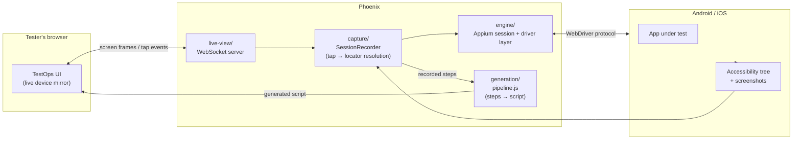
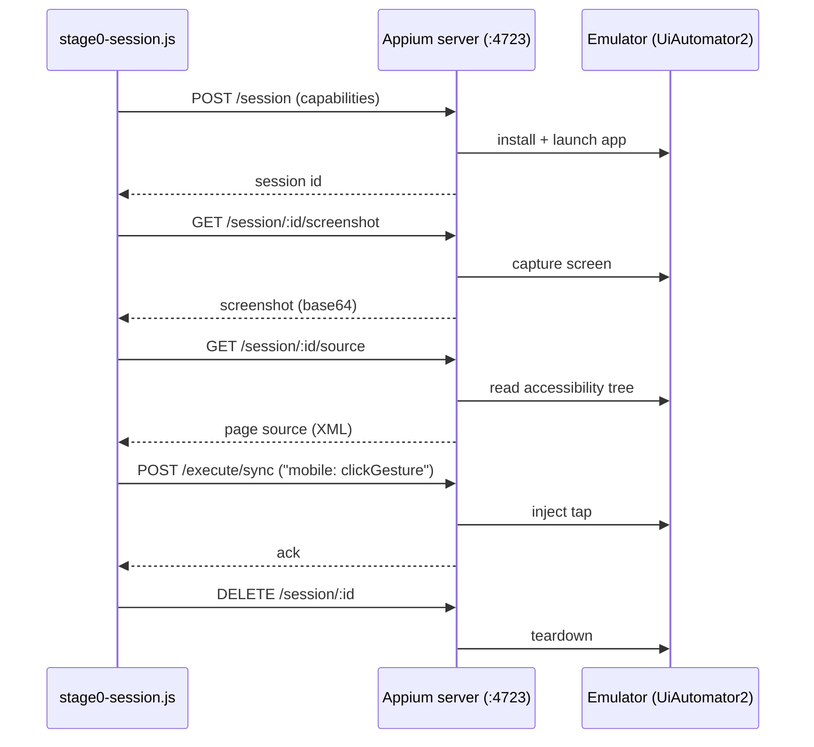

# Phoenix

[](https://github.com/prabathkumar/phoenix/actions/workflows/test.yml)
[](https://github.com/prabathkumar/phoenix/actions/workflows/deploy-frontend.yml)

Proprietary mobile test-recording and generation engine for TestOps.

Testers record a flow once, inside TestOps — no Appium Inspector, no local install, no separate device-farm dashboard. Phoenix captures the session and generates a working automated script.

Built on a fork of Appium's core engine (Apache 2.0), extended with an AI-native layer Appium doesn't have.

See [`docs/PHOENIX_SPEC.md`](docs/PHOENIX_SPEC.md) for the full architecture and roadmap, [`docs/SETUP.md`](docs/SETUP.md) if you're infra standing this up, or [`docs/DEVELOPER_GUIDE.md`](docs/DEVELOPER_GUIDE.md) if you just want to record a flow and get a script.

**Live: [prabathkumar.github.io/phoenix](https://prabathkumar.github.io/phoenix/)** — the actual recording UI, connecting to a Phoenix backend running against a real device.


*A real session recorded through the public frontend against ApiDemos on a local emulator — 11 steps, 8 assertions, one typed parameter, script generated live.*

## Repo layout

| Directory | Purpose |
|---|---|
| `engine/` | Forked Appium core + drivers (Android/iOS), stripped to session + driver essentials |
| `capture/` | Records taps, accessibility-tree snapshots, and screenshots during a session |
| `generation/` | Turns a captured session into a named, asserted, parameterized script |
| `live-view/` | Embeddable component: streams the device screen and forwards taps into TestOps |
| `docs/` | Architecture, spec, and decision records |

## Architecture



## Engine session flow (spawn path)

The core session lifecycle every entry point builds on, end to end against a local emulator:



## Market comparison

How Phoenix (target state, not yet fully built — see Status below) compares to what testers use today for mobile automation.

| Capability | **Phoenix** | Appium + Appium Inspector | BrowserStack App Automate | Katalon | mabl | Testim / Tricentis |
|---|:---:|:---:|:---:|:---:|:---:|:---:|
| No local tool install for the tester | ✅ | ❌ | ❌ (Inspector still local) | ❌ | ✅ | ✅ |
| Guided record → AI-generated script | ✅ | ❌ | ❌ | ⚠️ (record/playback, minimal AI) | ✅ | ✅ |
| Script generated from a **live, in-browser** device mirror | ✅ | ❌ | ❌ | ❌ | ❌ | ❌ |
| Self-authored locator strategy tuned to our test suites | ✅ | ⚠️ (manual) | ⚠️ (manual) | ⚠️ (manual) | ❌ (vendor black box) | ❌ (vendor black box) |
| Proprietary / not visible to competitors | ✅ | ❌ (open source) | ❌ (3rd-party SaaS) | ❌ (3rd-party SaaS) | ❌ (3rd-party SaaS) | ❌ (3rd-party SaaS) |
| No per-seat / per-minute vendor licensing | ✅ | ✅ | ❌ | ❌ | ❌ | ❌ |
| Runs on real devices + emulators/simulators | ✅ | ✅ | ✅ | ✅ | ✅ (limited device range) | ✅ (limited device range) |
| Full control over the underlying engine (fork, extend, fix) | ✅ | ✅ | ❌ | ❌ | ❌ | ❌ |
| Works out of the box, zero engine knowledge needed | ✅ (target) | ❌ | ❌ (still Appium under the hood) | ⚠️ (own DSL to learn) | ✅ | ✅ |
| Vendor lock-in risk | ✅ none (ours) | ✅ none | ❌ | ❌ | ❌ | ❌ |

⚠️ = partial support / workaround required, not a clean yes.

This is the case *for* building Phoenix, not a claim that today's repo already beats these tools — see Status for what's actually working right now.

## Status

**Current state: Phoenix records a real flow — on a real Android emulator/device or a real iOS Simulator — and generates a real, runnable script from it, with an optional local-LLM refinement pass. Every capability below is proven on real hardware, not just unit-tested.** CI (`test.yml`) runs the `capture/` and `generation/` suites on every push; the frontend (`deploy-frontend.yml`) auto-deploys to GitHub Pages on every push that touches it.

### Recording and script generation

**Session engine.** `engine/session.js` (Android, UiAutomator2) and `engine/ios-session.js` (iOS, XCUITest) each start a real Appium session and expose the same lifecycle: session start → screenshot → accessibility tree → tap → clean teardown. Android needs no project-level Appium version pin (Appium and its drivers are installed globally via the `appium` CLI, not as `engine/package.json` dependencies); iOS capabilities target either a built `.app`/`.ipa` or, for smoke-testing the plumbing itself, an app already on the Simulator by bundle id (`appium:bundleId`).

**Locator resolution.** `capture/recorder.js` resolves a tap coordinate to a real locator — resource-id/name, then accessibility-id (content-desc/name), then text/label/value, then a computed structural xpath, then raw coordinates as a last resort — by walking the accessibility tree and picking the smallest element whose bounds contain the tap point. Reads either platform's tree shape (Android's `resource-id`/`content-desc`/`text`/single `bounds` string, or iOS's `name`/`label`/`value`/`x`,`y`,`width`,`height`) with no upfront platform flag needed at this layer. Verified with a test suite (`capture/test/`) against both a real captured Android tree and a real captured iOS/XCUITest tree, not synthetic XML alone. `live-view/server.js`'s tap-forwarding path is wired to it, using the device's real window size (not the rendered image's) to convert a tester's on-screen tap ratio into device pixels, and injects the tap via each platform's own extension (`mobile: clickGesture` on Android, `mobile: tap` on iOS — neither platform's driver implements the legacy JSONWP touch-actions endpoint anymore).

**Script generation.** `generation/pipeline.js` turns a captured session into a runnable WebdriverIO script — entirely rule-based by default, no LLM call required: `inferTestName` names the flow from the first screen's title, `inferAssertions` diffs each step's before/after accessibility tree and proposes an assertion per label that newly appeared, `extractParameters` lifts typed values into named test data from the field's own locator, and `synthesizeCode` renders it all as a `describe`/`it` block with `waitForDisplayed`/`click`/`setValue` calls and `expect(...).toBeDisplayed()` assertions — falling back to a flagged raw-coordinate tap only when locator resolution couldn't resolve a stable one. A `platform` option switches selector syntax and the tap extension between Android's `UiSelector`/`mobile: clickGesture` and iOS's `-ios predicate string:`/`mobile: tap`. Verified with a test suite (`generation/test/`, 17 tests) covering both platforms, output included below.

`inferAssertions` also collapses repeated labels within a single step to one assertion each: nested accessibility nodes commonly expose the same text at multiple bounds (a button and its inner label child both reading "Screen Time"), which the underlying `(resourceId, label, bounds)` diff key correctly treats as distinct elements — needed for the cross-screen "seen" tracking described in the function's own comments — but which read as pure repetition when each one produced its own near-identical `toBeDisplayed()` check in the same step. Found on a real 15-step iOS Settings recording (178 assertions, several outright duplicated); fixed by tracking already-asserted labels per step while leaving the cross-step dedup logic untouched.

<details>
<summary>Sample generated script (login flow, 3 recorded steps)</summary>

```js
// Generated by Phoenix from a recorded session — 3 step(s).
// Locators use the priority resolved during capture: resource-id > accessibility-id > text > xpath > coordinate.

// Test data — lifted from values typed during recording.
const username = "prabath@example.com";
const password = "hunter2";

describe("login", () => {
  it("login", async () => {
    // Step 1
    const step0El = await $("android=new UiSelector().resourceId(\"com.phoenix.demo:id/username_input\")");
    await step0El.waitForDisplayed();
    await step0El.click();
    await step0El.setValue(username);

    // Step 2
    const step1El = await $("android=new UiSelector().resourceId(\"com.phoenix.demo:id/password_input\")");
    await step1El.waitForDisplayed();
    await step1El.click();
    await step1El.setValue(password);

    // Step 3
    const step2El = await $("android=new UiSelector().resourceId(\"com.phoenix.demo:id/login_button\")");
    await step2El.waitForDisplayed();
    await step2El.click();
    await expect($("android=new UiSelector().resourceId(\"com.phoenix.demo:id/welcome_text\")")).toBeDisplayed(); // "Welcome" appeared
  });
});
```
</details>

### LLM refinement (opt-in)

**Complete, verified on real hardware end to end.** `generation/llm.js` refines `inferTestName`'s and `inferAssertions`' output via a local Ollama instance (`PHOENIX_OLLAMA_HOST`/`PHOENIX_OLLAMA_MODEL`, see `.env.example`) — a better flow name summarizing the whole recorded path instead of just the first screen, and filtering out incidental assertions (a clock or ad banner ticking over) a plain accessibility-tree diff can't tell apart from a meaningful change. It's designed to never break the pipeline: any failure (Ollama not running, a timeout, a malformed response) is caught and falls back to the exact v1 rule-based value, logging a warning. Verified both ways: with Ollama absent (clean fallback, no crash, unchanged v1 output) and with Ollama + `llama3` running against a real 11-step recorded flow (no fallback triggered — produced `accessibility_clock_talkback_explore` as the flow name, a real whole-flow summary rather than the first-screen-title heuristic, and kept 13 of the diff's proposed assertions). Opt in with `generateScript(steps, { useLlm: true })`, or `PHOENIX_USE_LLM=1` for `run-session.js`; the default stays the unrefined v1 rule-based output, which remains a complete result on its own.

### End-to-end wiring and frontend

**Complete, proven on a real device with a real multi-step flow.** `run-session.js` at the repo root wires all four pieces into one live recording session: starts a real Appium session (Android or iOS, via `PHOENIX_PLATFORM`), starts `live-view`'s WebSocket server against it with a `SessionRecorder` attached, and on `"stop"` hands the recorded steps to `generation/pipeline.js`, writes the resulting script to `generated/<test-name>.test.js`, and sends it back over the socket as a `script-generated` message. A real Android run against ApiDemos (home screen → "Views" submenu → "Animation" demo screen, 2 real taps) surfaced and fixed two real bugs: list-row selectors needing `resourceId` + `text` combined to disambiguate (shared row-template ids), and assertion diffing needing to key on `(resourceId, text, bounds)` rather than text alone (two different elements coincidentally sharing a label across screens). A real iOS run (Safari, launched by bundle id, 2 taps) confirmed the same wiring on the XCUITest path — see the iOS section below.

**Real front-end complete.** `frontend/index.html` (served by `frontend/server.js`, no build step, vanilla JS) is the actual tester-facing recording UI — replaces `live-view/test-client.js`'s simulated tester with a real live device mirror: it renders each polled screenshot, lets the tester click directly on the image to tap (converting the click position to a device coordinate ratio automatically), has a text field for typed input, a live list of recorded steps, a "Stop & Generate Script" button, and displays the generated script inline with a copy button once the session finishes.

### Uploading an app directly

**Confirmed end to end on real hardware, for the BrowserStack provider; local-provider support is wired but only reaches an Appium server on the same machine, not yet exercised.** Originally, the app under test was fixed by an env var (`PHOENIX_STAGE0_APP_PATH`/`PHOENIX_IOS_APP_PATH`/`PHOENIX_BROWSERSTACK_APP_URL`) before `run-session.js` even started — there was no way for a tester to pick a file once the page was open, unlike TestOps proper, where a tester uploads a `.ipa`/`.apk` directly. `frontend/index.html` now opens on an upload screen (drag-and-drop or click to choose a `.apk`/`.ipa`) instead of connecting immediately; the frontend posts it as `multipart/form-data` to a new endpoint, `POST /api/sessions` (`frontend/upload-session.js`), which:

- saves the upload to `frontend/uploads/`,
- figures out the platform from the file extension (`.apk` → Android, `.ipa` → iOS; a `platform` form field can override this if ever needed),
- under `PHOENIX_APPIUM_PROVIDER=browserstack` (the priority path — TestOps is already tightly integrated with BrowserStack, so this needed no new infrastructure, just one more hop): calls `engine/browserstack-upload.js`'s existing `uploadApp()` on the saved file to get a `bs://` URL, then deletes the local copy,
- under the local provider: passes the saved file's own path through as `appium:app` directly — this only works when `frontend/server.js` and the Appium server share a filesystem (the same constraint `PHOENIX_STAGE0_APP_PATH`/`PHOENIX_IOS_APP_PATH` already have; an upload doesn't relax it). This is the path for TestOps's own Android VM and the planned AWS iOS VM once those are Appium hosts in their own right, not yet exercised against either.
- starts a session via a new `engine/session-manager.js` (the orchestration extracted from `run-session.js`'s original `main()`, so the boot-once CLI flow and this on-demand one share one implementation) with that app reference as a `capabilityOverrides` argument, overriding the env-var default for just this session,
- responds with the started session's live-view port, and the page connects its WebSocket to it exactly as before.

Only one recording session runs at a time — a second upload while one's in progress gets a 409, since today's live-view server binds a single fixed port and `capture/recorder.js` assumes one active driver; a real device-pool (concurrent sessions, one port each) is a bigger follow-on, not part of this. Uploaded files are deleted after a successful BrowserStack hand-off, or left in `frontend/uploads/` (gitignored) on the local-provider path/on error, for now.

The env-var-configured flow (`PHOENIX_STAGE0_APP_PATH` + `node run-session.js` before opening the page) still works completely unchanged — `run-session.js` is now a five-line wrapper around `engine/session-manager.js`'s `startRecordingSession()` with no app override, so nothing about that path's behavior moved.

**This upload endpoint only exists on a self-hosted `frontend/server.js`.** The public GitHub Pages deploy (below) serves `index.html` as a static file with no backend behind it at all — `POST /api/sessions` has nowhere to land there. Uploading a file only works when you're running `node frontend/server.js` yourself (or pointing the public page at a self-hosted backend that also serves this endpoint, which it doesn't today — the public page still assumes a pre-started `run-session.js` reachable at `?host=&port=`).

Verified with a unit test suite (`frontend/test/`, 7 tests, and `engine/test/session-manager.test.js`, 4 tests) covering platform detection, the concurrency guard, capability-override wiring for both providers, and error responses — against fake session/upload/provider modules, no real network or Appium session. **And confirmed against a real BrowserStack account with a real tester's browser end to end:** dragging `BitBarSampleApp.ipa` into the upload screen below, with only `PHOENIX_APPIUM_PROVIDER=browserstack` + BrowserStack credentials exported (no `PHOENIX_BROWSERSTACK_APP_URL` set beforehand — that's the whole point) started a real session on a real BrowserStack device and dropped straight into the live mirror.


A real 4-tap recording against the biometrics screen from that same session generated this:

<details>
<summary>Sample generated script, from the upload flow (BitBar Sample App, biometrics screen, 4 recorded steps)</summary>

```js
describe("bitbar_sample_app", () => {
  it("bitbar_sample_app", async () => {
    // Step 1
    const step0El = await $("~Biometric authentication");
    await step0El.waitForDisplayed();
    await step0El.click();
    // ...16 assertions on the screen's labels appearing, including:
    await expect($("-ios predicate string:label == \"Authentication status title WAITING\" OR value == \"Authentication status title WAITING\"")).toBeDisplayed();

    // Step 2 — tapped an element with no accessible name/label at all
    const step1El = await $("~");
    await step1El.waitForDisplayed();
    await step1El.click();

    // Step 3 — same
    const step2El = await $("~");
    await step2El.waitForDisplayed();
    await step2El.click();

    // Step 4 — also unlabeled, fell back to a structural XPath
    const step3El = await $("/AppiumAUT[1]/XCUIElementTypeApplication[1]/.../XCUIElementTypeOther[3]");
    await step3El.waitForDisplayed();
    await step3El.click();
    await expect($("-ios predicate string:label == \"Authentication status title FAILED\" OR value == \"Authentication status title FAILED\"")).toBeDisplayed(); // real state change: WAITING -> FAILED
  });
});
```
</details>

The `WAITING` → `FAILED` assertion is real inferred state — the app's own authentication status label actually changed between steps, and `inferAssertions` caught it correctly. Steps 2-4's weak locators are a real gap, not a recording error — see "What's still open" below.

This surfaced one real bug along the way, now fixed: `remote-provider.js`'s `buildCapabilities()` validated `PHOENIX_BROWSERSTACK_APP_URL` unconditionally, even when `capabilityOverrides` already supplied a per-session `appium:app` — which is exactly what the upload path does after calling `uploadApp()`. Every upload failed immediately with "requires PHOENIX_BROWSERSTACK_APP_URL" until that validation was changed to check `overrides["appium:app"]` first. Covered by a new regression test in `engine/test/remote-provider.test.js`.

**What's still open:**
- **Local-provider upload path** (Android VM, planned AWS iOS VM) is implemented identically to the BrowserStack path but not yet run against a real local Appium host reachable from `frontend/server.js` — the two are expected to be co-located once those VMs exist, but that's unverified.
- **One session at a time.** A concurrent-session device pool (matching TestOps's real device-farm model) is a real follow-on, not started.
- **Upload cleanup on the local-provider path** — files in `frontend/uploads/` are only deleted after a successful BrowserStack hand-off; a local-provider run or a failed upload leaves the file behind today.
- ~~Locator quality on elements with no accessible label~~ **Root-caused, fixed, and re-confirmed on real hardware.** Two of the four taps in the first biometrics recording resolved to an unusable empty accessibility-id (`~""`, nothing after the tilde) instead of falling through to a real locator. `capture/recorder.js`'s `resolveElementAtCoordinate()` chose the accessibility-id strategy based on a plain truthiness check on the raw `name`/`content-desc` attribute — but a whitespace-only value (e.g. `name="   "`) is truthy in JS, so it was accepted as a "real" identifier instead of being treated as absent and falling through to text/xpath as designed. Fixed by trimming before the truthiness check, covered by a new test in `capture/test/`. **Re-recording the same app after the fix** (a real 28-step BrowserStack session, not a replay) confirmed it: zero empty accessibility-id selectors anywhere in the output — every tap either resolved a real `~<name>` or correctly fell through to a structural xpath.
- ~~Assertion on an empty/invisible label~~ **Also root-caused and fixed, found in that same 28-step re-recording.** One assertion read `expect($(...label == ""...)).toBeDisplayed(); // "" appeared` — a real, non-empty label that nonetheless displays as nothing. The cause: iOS accessibility containers can roll up a child's label as a **zero-width space** (`\u200B`), which is non-empty and truthy in JS, and — unlike ordinary whitespace — `String.prototype.trim()` doesn't strip it either, so it survived both `capture/recorder.js`'s and `generation/pipeline.js`'s existing whitespace checks as a "real" value. Fixed by adding a shared `isBlank()`/`cleanLabel()` check (in `generation/pipeline.js`, and the equivalent inline in `capture/recorder.js`) that strips zero-width space/non-joiner/joiner and the BOM/ZWNBSP before deciding whether a value counts as blank, so a rolled-up-empty label is skipped entirely (as an assertion source) or treated as absent (as a locator candidate) instead of appearing as a visually-empty result. Covered by new tests in both `capture/test/` and `generation/test/` reproducing the exact character; not yet re-confirmed against a fresh recording of this specific app screen (the fix landed after that 28-step session).
- **The public GitHub Pages frontend still can't upload** (see above) — it only works against a pre-started session today.

### Running the full loop locally

**Option A — upload the app through the page (no env var, matches TestOps's own flow):**

```bash
cd frontend && npm install && cd ..
node frontend/server.js
```

Open **http://localhost:8091/**, drag in a `.apk`/`.ipa`, and click "Start recording session" — Phoenix uploads it (to BrowserStack, or uses it directly under the local provider) and connects you straight into the live device mirror. See "Uploading an app directly" above for what's actually happening.

**Option B — the original env-var-configured flow**, with the emulator + Appium server already running (see "Running the Android engine directly" near the bottom of this doc for one-time setup):

```bash
# terminal 4 — starts the session, live-view server, and waits for a tester
export PHOENIX_STAGE0_APP_PATH=~/Downloads/apidemos.apk
node run-session.js

# terminal 5 — serves the recording UI, with ?port=8090 so it skips the upload screen
node frontend/server.js
```

Then open **http://localhost:8091/?port=8090** in a browser: you'll see the live device mirror, and can tap directly on it to record a real flow, type into fields, and stop to see the generated script.

To exercise the loop without a browser (e.g. in CI, or to test a specific tap sequence programmatically), `live-view/test-client.js` still works the same way — a scripted stand-in for a tester, configurable via `PHOENIX_TAP_SEQUENCE`:

```bash
node live-view/test-client.js
```

### Public frontend URL

`frontend/index.html` is also deployed via GitHub Actions (`.github/workflows/deploy-frontend.yml`) to GitHub Pages on every push to `main` that touches `frontend/`, so it has a stable public URL instead of needing `node frontend/server.js` run locally every time:

**https://prabathkumar.github.io/phoenix/**

**This deploys the static page only — it still needs a Phoenix backend to talk to.** The page connects, in your own browser, to `run-session.js`'s live-view WebSocket. Two ways to use it:

- **Backend on the same machine as your browser (the normal case):** just open the public URL — it defaults to `ws://localhost:8090`, and browsers treat `localhost` as a secure-context exception, so an `https://` page connecting to `ws://localhost` works with no extra setup. Start `run-session.js` locally as usual, then open the public URL instead of running `frontend/server.js`.
- **Backend on a different machine:** tunnel `run-session.js`'s port (e.g. `ngrok http 8090`) and open the public URL with `?host=<tunnel-host>&port=<tunnel-port>`.

**One-time setup required** (can't be done from a git push — a repo owner needs to flip this once): in the repo's GitHub Settings → Pages, set **Source** to **GitHub Actions**. Until that's set, the workflow will run but the page won't be reachable at the URL above.

### Engine architecture: spawn vs. embedded (Android)

**Complete.** `engine/embedded-session.js` runs `appium-uiautomator2-driver` **in-process** — no spawned `appium` server, no separate process, no WebDriver-over-HTTP round trip to our own server. `engine/embedded-session-stage0.js` re-runs the exact engine-session milestone (session start → screenshot → accessibility tree → tap → teardown) through it, calling the driver's own command methods directly (`getScreenshot()`, `getPageSource()`, `mobileClickGesture()`) instead of going through webdriverio's `remote()` client.

Two architecturally different ways to talk to the driver now coexist in `engine/` on purpose:

| | `stage0-session.js` / `run-session.js` (spawn) | `embedded-session*.js` (embed) |
|---|---|---|
| Process model | Separate `appium` CLI process, talked to over HTTP | Same Node process, direct method calls |
| Driver install | `appium driver install uiautomator2` (CLI-managed) | `npm install` in `engine/` (normal npm dependency) |
| `appium`/`appium-uiautomator2-driver` in `engine/package.json` | Must **not** be listed (CLI manages its own, causes ERESOLVE if pinned here too) | **Must** be listed (no CLI involved, this is how they get installed) |
| What's proven | Real device, full multi-step flow, real front-end | **Confirmed on real hardware** — full milestone (session start → screenshot → accessibility tree → tap → teardown) run against a real emulator (ApiDemos, `emulator-5554`), no `appium` server process involved |

Full vendoring/forking of the driver's own source was scoped and deliberately not done: `appium-uiautomator2-driver`'s exports are entangled with the `appium` package's own subpath exports rather than the more decoupled `@appium/base-driver`, so a real fork would mean also forking `appium-android-driver` and `@appium/base-driver`'s session/capability machinery — a multi-week effort with no upstream precedent for doing it this way, for no clear payoff yet. Embedding gets the actual goal (no separate process, no extra HTTP hop) without that cost; revisit vendoring only if a concrete need shows up that embedding can't satisfy (e.g. a protocol extension the driver itself doesn't expose).

```bash
cd engine
npm install
export PHOENIX_STAGE0_APP_PATH=~/Downloads/apidemos.apk
npm run embedded-stage0   # needs the emulator running — no appium server needed
```

**Verified against a real emulator** — `npm run embedded-stage0` completed all four milestone steps end to end with no `appium` server running: session created (`AndroidUiautomator2Driver` in-process, session id assigned directly), screenshot captured (72,552 bytes base64), accessibility tree captured (13,600 chars), tap injected via `mobileClickGesture`, and teardown ran cleanly (UiAutomator2 server instrumentation exited with code 0, port forward removed, hidden-api policy restored). The Appium fork work (embed v1) is closed.

Next (open, not yet scheduled): decide whether `run-session.js`'s full pipeline should migrate from the spawn path to the embedded path — not required now since both are proven, but embedding removes a process and an HTTP hop, which matters more once this needs to scale to many concurrent sessions.

Next (product side): harden the live-view/generation edge cases further (typed-input flows, back-navigation, screens with no accessible labels).

### iOS support

`engine/ios-session.js` and `engine/ios-stage0-session.js` mirror the Android spawn path against `appium-xcuitest-driver` instead of `appium-uiautomator2-driver` — same architecture, different driver, different capability shape (`appium:app` is a `.app`/`.ipa`, not a `.apk`; `appium:deviceName`/`appium:platformVersion` select an installed Simulator rather than a fixed AVD name). `run-session.js` picks the platform via `PHOENIX_PLATFORM` (`android` default, or `ios`).

The parts of the pipeline that assumed Android's UiAutomator2 tree shape now handle XCUITest's shape too: `capture/recorder.js`'s `resolveElementAtCoordinate` and `generation/pipeline.js`'s `extractLabels` read either attribute set (Android's `resource-id`/`content-desc`/`text`/single `bounds` string, or iOS's `name`/`label`/`value`/`x`,`y`,`width`,`height`), and `generation/pipeline.js`'s selector/tap-extension generation (`buildSelector`, `buildResourceIdSelector`, `synthesizeCode`) takes a `platform` option that switches between Android's `UiSelector`/`mobile: clickGesture` and iOS's `-ios predicate string:`/`mobile: tap`.

**Confirmed on real hardware.** `npm run ios-stage0` ran end to end against a real booted Simulator (`iPhone 15 Pro`, iOS 17.0), launching Safari by bundle id (`appium:bundleId`, see `engine/ios-session.js` — useful for smoke-testing the session/driver layer without a custom app build first): session started, a real XCUITest accessibility tree captured (22,539 chars — confirmed the exact shape `capture/recorder.js` and `generation/pipeline.js` were built to parse: `name`/`label`/`value`/`x`/`y`/`width`/`height` attributes, no `resource-id` or single `bounds` string), a screenshot captured, a tap injected via `mobile: tap`, and teardown ran cleanly. Combined with the unit tests against real XCUITest-shaped fixtures (`capture/test/`, `generation/test/`), iOS is now proven at both the engine layer and the capture/generation layer — the same two layers Android needed before being called complete. **Full pipeline also confirmed.** A real `run-session.js` recording (`PHOENIX_PLATFORM=ios`, launching Safari by bundle id) recorded 2 taps and generated a runnable script: one tap correctly resolved to `~favoritesItemIdentifierHeader` (the accessibility-id strategy, `~value`, identical syntax to Android since it's cross-platform in WebdriverIO), the other correctly fell back to a structural xpath when the tapped element had no name/label — exactly the designed fallback behavior. iOS is now proven at the same bar Android was: engine layer and full record-to-script pipeline both confirmed on real hardware (a real booted Simulator). Not yet done: a recording against a real custom `.app` (rather than Safari) to see assertions/parameters populate against an app with real navigation — Safari's static start page didn't produce screen changes between the two arbitrary taps used here, so 0 assertions in this run reflects the test app choice, not a gap in the assertion-diffing logic (already unit-tested separately).

**iOS typed-input path — fixed after two attempts, confirmed live.** `live-view/server.js`'s `"type"` handler originally drove XCUITest through `driver.keys()` (W3C key actions), which WebDriverAgent on Appium 3 rejects for plain character input (`Key Down action 's' must have a closing Key Up successor`) — reproduced live against a real Simulator recording session. First fix attempt routed iOS typing through the `mobile: type` extension instead; also confirmed live to fail, but differently — this xcuitest-driver build doesn't implement that extension at all (`405 Method is not implemented`). The fix that actually lands: `elementSendKeys`/`elementClear` against the currently-focused element (found via the standard `getActiveElement`), a separate, older WebDriver endpoint XCUITest implements directly rather than through W3C actions, so it hits neither broken path. Android is unaffected throughout and keeps the plain `driver.keys()` path.

That fix surfaced one more real edge case live: `getActiveElement()` only resolves to a usable element when XCUITest considers a field genuinely keyboard-focused — tapping a non-editable row (a plain Settings cell, a disabled control) leaves nothing focused, and WDA's resulting "no such element" response was crashing the whole `run-session.js` process instead of failing just that one keystroke. Now handled the same way as typing before any tap is recorded: reports a `type-error` back to the tester ("tap directly into a text field that brings up the on-screen keyboard") and keeps the session alive. See `live-view/server.js` and its test suite (`live-view/test/`, 5 tests — dedicated cases for the working iOS path, confirming neither `driver.keys()` nor `mobile: type` is ever called and `elementClear`/`elementSendKeys` receive the expected calls, and for the unfocused-field case not crashing the session).

**Confirmed end to end on real hardware.** A real 17-step `run-session.js` recording against a booted Simulator tapped into an Apple ID sign-in field and typed into it: the generated script correctly emitted `step11El.setValue(username)` against the `~username-field` accessibility-id locator, with `username = "test"` lifted into named test data by `extractParameters` — the full tap → type → parameter-extraction pipeline working on iOS the same way it already did on Android. iOS typed input is no longer an open item.

**Precondition, not a Phoenix bug — recorded apps need accessibility identifiers.** A real 18-step recording against a custom SwiftUI app (`org.stratalang.orders`) resolved every single tap to the same `~Orders` locator and produced zero assertions, regardless of where on screen the tester tapped. `capture/recorder.js`'s `resolveElementAtCoordinate` picks the smallest accessible element whose bounds contain the tap point — that logic is correct and already unit-tested; the app's own XCUITest accessibility tree simply exposed only one accessible node on screen (the nav title/root view, named "Orders"), with none of its rows, buttons, or fields carrying their own `.accessibilityIdentifier(...)`. Without distinct accessible elements underneath, there is nothing smaller for any resolution strategy to find, on any tool built on XCUITest, not just Phoenix. **Takeaway for anyone recording a custom app**: the app's interactive views need explicit accessibility identifiers (SwiftUI's `.accessibilityIdentifier("...")`, or UIKit's `accessibilityIdentifier` property) before a recording will produce distinguishable locators or meaningful assertions — confirm first with Xcode's Accessibility Inspector (Xcode → Open Developer Tool → Accessibility Inspector, hover the app's elements on the booted Simulator) that individual controls report their own identifiers, not just the screen as a whole.

### Remote provider: BrowserStack App Automate, for when there's no local device host

TestOps running on Linux VMs is a hard wall for iOS specifically —
Xcode and the iOS Simulator only run on macOS, and Apple's license
rules out virtualizing macOS on non-Apple hardware, so there's no way
to stand one up directly on a Linux host. Standing up a dedicated Mac
(owned or cloud-rented) works but is a real ongoing cost on top of
whatever's already paid for; `engine/remote-provider.js` lets an
already-licensed BrowserStack App Automate account be reused instead,
with **no changes needed anywhere else in the pipeline** —
`capture/`, `generation/`, and `live-view/` only ever see a normal
WebdriverIO `Browser`, regardless of where its session actually runs.
This falls directly out of a decision already made early on:
`engine/session.js` and `engine/ios-session.js` always talked to
Appium over a plain hostname/port rather than assuming `localhost`,
so "point this at a different Appium-compatible endpoint" was already
possible — BrowserStack just needed its own connection shape (HTTPS,
a fixed hub hostname, account auth via a `bstack:options` capability
block) and app-reference format (an uploaded app's `bs://` URL, not a
local file path or a bundle id already installed on a
Simulator/emulator) taught to it, via `PHOENIX_APPIUM_PROVIDER=browserstack`.

One real tradeoff: BrowserStack App Automate runs real physical
devices for iOS, not Simulators — `PHOENIX_IOS_DEVICE_NAME`/
`PHOENIX_IOS_PLATFORM_VERSION` then mean "which of BrowserStack's
real-device catalog to request," not "which Simulator to boot."

See `docs/SETUP.md`'s "2b. Or: skip your own device host entirely and
use BrowserStack" for the full walkthrough, including
`engine/browserstack-upload.js` (a one-time-per-build helper for
getting an app its `bs://` URL, since BrowserStack has no concept of
"a file already on this machine"). Verified with a unit test suite
(`engine/test/`, 9 tests) covering both providers' connection config
and capability shape, including the required-env-var error messages,
and now also confirmed end to end against a real BrowserStack App
Automate account: uploading BrowserStack's own `BitBarSampleApp.ipa`
(`bitbar/test-samples`), running a full recording session against it
on real hardware, and generating a correct script from real captured
taps confirmed the provider, install, session, live-view, and
generation layers all work correctly together. That run also isolated
a separate problem seen with an internal app (Rope): a 404 on launch
there is Rope's own backend being unreachable from BrowserStack's
real-device network, not a Phoenix or BrowserStack integration issue
— since a public app with no backend dependency rendered and recorded
correctly on the same setup.

That backend-reachability gap is what BrowserStack Local (a tunnel
binary that gives BrowserStack's remote devices a route into a
private/internal network) is for. It's only needed for an
app-under-test whose backend isn't reachable from the public internet
(Rope, for instance) — a self-contained app with no such backend
dependency (BrowserStack's own sample apps, including the biometrics
screens in `BitBarSampleApp.ipa`) runs on BrowserStack App Automate
with **no Local tunnel at all**, exactly as already verified above.

`engine/remote-provider.js` now supports Local for when it *is*
needed: with a `BrowserStackLocal` tunnel already running separately
(Phoenix doesn't start or manage that process — see BrowserStack's own
docs for the binary), set `PHOENIX_BROWSERSTACK_LOCAL=1` (and
`PHOENIX_BROWSERSTACK_LOCAL_IDENTIFIER` if running more than one
tunnel at once) to route that session's `bstack:options` through it;
leave both unset for anything that doesn't need it. Verified via
`engine/test/`'s unit suite (2 more tests covering the flag's
on/off/identifier shape); not yet exercised against a real internal
backend end to end.

### Running the Android engine directly (spawn path)

One-time setup and a minimal session against just `engine/`, with no capture/generation/live-view involved — useful to confirm the engine layer works in isolation before running the full loop above.

```bash
# one-time setup
npm i -g appium
appium driver install uiautomator2
sdkmanager --sdk_root=$ANDROID_HOME "build-tools;34.0.0"   # provides aapt2

# terminal 1 — leave running
appium

# terminal 2 — leave running
emulator -avd <your_avd_name>

# terminal 3
cd engine
npm install
export PHOENIX_STAGE0_APP_PATH=/absolute/path/to/some-app.apk
npm run stage0
```

Do not declare `appium` or `appium-uiautomator2-driver` in `engine/package.json` for this path — Appium 3.x's drivers require `appium@^3.0.0-rc.2` as a peer, and pinning an older `appium` there causes an ERESOLVE conflict. The CLI manages driver installation itself. (The embedded path, described earlier under "Engine architecture: spawn vs. embedded", has the opposite rule — see its table.)

For the equivalent iOS check, see the iOS section above (`npm run ios-stage0`) and `docs/SETUP.md`'s iOS setup instructions.
