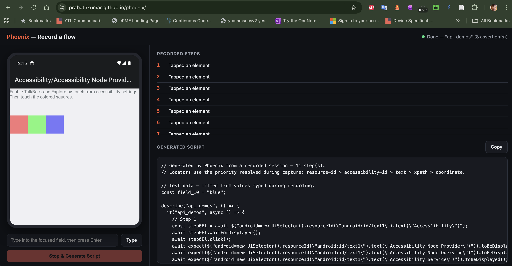
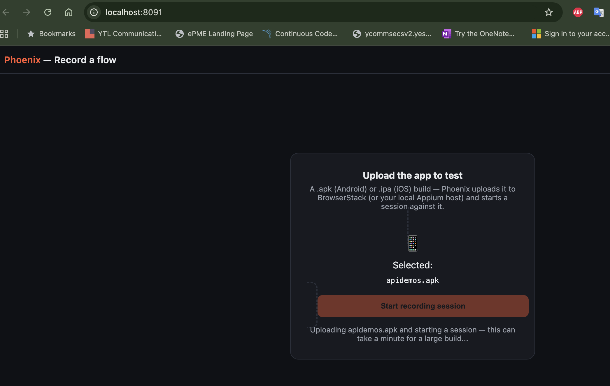
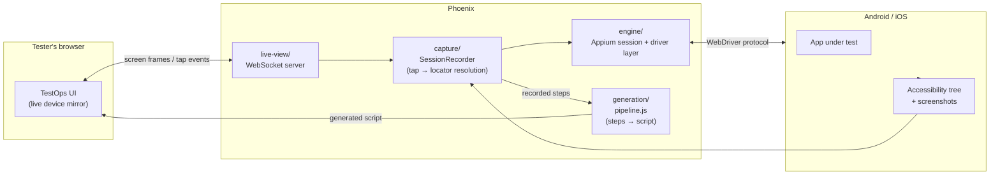

# Phoenix

[](https://github.com/prabathkumar/phoenix/actions/workflows/test.yml)
[](https://github.com/prabathkumar/phoenix/actions/workflows/deploy-frontend.yml)

Proprietary mobile test-recording and generation engine for TestOps.

Testers record a flow once, inside TestOps — no Appium Inspector, no local install, no separate device-farm dashboard. Phoenix captures the session and generates a working automated script. Built on a fork of Appium's core engine (Apache 2.0), extended with an AI-native layer Appium doesn't have.

**Live: [prabathkumar.github.io/phoenix](https://prabathkumar.github.io/phoenix/)** — the actual recording UI, connecting to a Phoenix backend running against a real device.

| Doc | For |
|---|---|
| [`docs/PHOENIX_SPEC.md`](docs/PHOENIX_SPEC.md) | Full architecture and roadmap |
| [`docs/SETUP.md`](docs/SETUP.md) | Standing up a Phoenix instance |
| [`docs/DEVELOPER_GUIDE.md`](docs/DEVELOPER_GUIDE.md) | Recording a flow and getting a script |
| [`docs/REAL_DEVICE_BATCH_TESTING.md`](docs/REAL_DEVICE_BATCH_TESTING.md) | `run-batch-executions.js` runbook |
| [`docs/TESTOPS_WORKFLOW_UX.md`](docs/TESTOPS_WORKFLOW_UX.md) | Dev team: the UI/UX workflow for integrating `test-case` mode into TestOps (library → cycle → app → run) |
| [`docs/COMPETITIVE_LANDSCAPE.md`](docs/COMPETITIVE_LANDSCAPE.md) | Full write-up vs. Appium-MCP and other AI-agent competitors |
| [`docs/STATUS.md`](docs/STATUS.md) | Detailed engineering status: every capability, real bugs found/fixed, what's still open |

|  |  |
|:---:|:---:|
| Real session recorded through the public frontend against ApiDemos on a local emulator — 11 steps, 8 assertions, one typed parameter, script generated live. | Uploading a `.apk`/`.ipa` directly starts a real BrowserStack session — no pre-configured app path needed. |

## Repo layout

| Directory | Purpose |
|---|---|
| `engine/` | Forked Appium core + drivers (Android/iOS), stripped to session + driver essentials |
| `capture/` | Records taps, accessibility-tree snapshots, and screenshots during a session |
| `generation/` | Turns a captured session into a named, asserted, parameterized script |
| `live-view/` | Embeddable component: streams the device screen and forwards taps into TestOps |
| `docs/` | Architecture, spec, and decision records |

## Architecture



**Engine session flow.** Every entry point (`run-session.js` and friends) drives the same four-step lifecycle against the device — session start → screenshot → accessibility tree → tap → teardown — over one of two architectures that coexist on purpose:

| | Spawn (`stage0-session.js`, default) | Embedded (`embedded-session*.js`) |
|---|---|---|
| How it talks to the driver | Separate `appium` CLI process, over HTTP | Same Node process, direct method calls — no server, no HTTP hop |
| Status | Proven on real hardware, what every product path uses today | Proven on real hardware in isolation; not yet migrated into the main pipeline |

Full sequence diagram, the spawn-vs-embedded tradeoffs, and setup commands for each: [`docs/STATUS.md#engine-session-flow-spawn-path`](docs/STATUS.md#engine-session-flow-spawn-path).

## Market comparison

How Phoenix (target state, not yet fully built — see [`docs/STATUS.md`](docs/STATUS.md)) compares to what testers use today for mobile automation, and to the AI-agent tooling closest to Phoenix's own semantic layer.

| Capability | **Phoenix** | Appium + Inspector | BrowserStack App Automate | Katalon / mabl / Testim |
|---|:---:|:---:|:---:|:---:|
| No local tool install for the tester | ✅ | ❌ | ❌ | ✅ |
| Guided record → AI-generated script, from a **live, in-browser** device mirror | ✅ | ❌ | ❌ | ⚠️ (record/playback, minimal AI, not in-browser) |
| Full control over the underlying engine (fork, extend, fix) | ✅ | ✅ | ❌ | ❌ |
| No per-seat / per-minute vendor licensing, no vendor lock-in | ✅ | ✅ | ❌ | ❌ |
| Runs on real devices + emulators/simulators | ✅ | ✅ | ✅ | ✅ (limited range) |

⚠️ = partial support / workaround required. This is the case *for* building Phoenix, not a claim that today's repo already beats these tools. Phoenix's semantic/autonomous layer (Act 2, below) is also compared against `appium-mcp` and similar AI-agent projects — full table in [`docs/COMPETITIVE_LANDSCAPE.md`](docs/COMPETITIVE_LANDSCAPE.md).

## Status

**Current state: Phoenix records a real flow — on a real Android emulator/device or a real iOS Simulator — and generates a real, runnable script from it, with an optional local-LLM refinement pass. Every capability below is proven on real hardware, not just unit-tested.**

- **Guided recording (Act 1) — shipped, working today.** Record a flow, get a runnable, asserted, parameterized script. See [`docs/DEVELOPER_GUIDE.md`](docs/DEVELOPER_GUIDE.md) for the tester-facing walkthrough.
- **Semantic action layer (Act 2, Phase 2) — fully proven on real hardware, including both real-world entry points.** Resolve a plain-language instruction ("tap the Login button") against a live screen with no recorded selector, returning a real locator or refusing rather than guessing — proven both via the standalone CLI and the experimental REST endpoint, against two different real apps.
- **Autonomous loop (Phase 3) — R&D only, Android closed out, proven end to end on a real login.** Give it a goal, it decides and executes one action at a time until done or stuck. Nine real bugs found and fixed against a real BrowserStack Android account (dead-end tap targets, a model typing a field's hint instead of the real value, prompt-template echoing, an ambiguous shared-resource-id field, a password selector going stale after typing, and a code-level backstop that stops the loop fast when an action is repeated with no visible effect, instead of burning the whole step budget) — a full login (home screen → login form → correct credentials → submit) completes end to end against a real device, with the app's own response (invalid-credentials dialog, then a successful login reaching the post-login screen) confirming the result both times. **Scope, by explicit decision: `loop` is R&D/exploration only, never test authoring** — not even a first draft of a test case. If the steps can be written down at all (true for virtually any real test, including login), that belongs in `test-case` mode below, because the model has repeatedly failed to reliably finish even a sequence where every individual step resolves correctly. `loop` stays useful for genuine open-ended exploration with no existing test case yet.
- **Login automation — closed out on both platforms, real hardware, deterministic.** The autonomous loop's per-step model planning proved unreliable for a known, fixed sequence like login (two consecutive real-hardware iOS runs failed at the identical "both fields filled, now submit" decision point despite different goal wording). A dedicated fixed-sequence mode hardcodes step *order* while still resolving each individual step with the same proven per-instruction resolver — removing the model's discretion over sequencing entirely. iOS needed six further real bugs found and fixed this way (a secure field's accessibility id going stale once typed into, a same-named tab button mistaken for the real hidden field, a secure field silently not accepting injected keystrokes until explicitly tap-focused, and a home-screen button sharing one accessibility id *and* label with the form's own submit button, requiring a WebDriverAgent class-chain predicate keyed on name+visibility to tell them apart) before a full run completed cleanly on real BrowserStack hardware, with the login screen entirely replaced by the real post-login home screen. See [`docs/STATUS.md`](docs/STATUS.md) for the full bug-by-bug trail (bugs 18–23).
- **Data-driven test cases (`test-case` mode) — the generalized form of the above, proven path for adopting Phoenix.** A test case is a plain JSON step list (`test-cases/login.json` is the proven login sequence, extracted byte-for-byte, unchanged), run via `engine/test-case-runner.js` against the exact same per-instruction resolver already proven on real hardware — a new flow is a new JSON file, not a new commit. `login-script` mode above is now just this mode pointed at the one built-in login file. **Recommended adoption order: start a new test case on this layer (Act 2/3) — write the steps as a JSON file, let the resolver self-heal against whatever's actually on screen. Fall back to guided recording (Act 1) only for a specific flow if the semantic layer genuinely can't resolve something on it.**
- **iOS** is proven at the same bar as Android across the board: engine layer, full record-to-script pipeline, typed input, and now login automation, all confirmed on real hardware (Simulator and BrowserStack real devices).
- **BrowserStack App Automate** is the confirmed path when there's no local device host — upload, record, generate all proven end to end on real hardware.

Full detail — every capability, real bugs found and fixed with root causes, sample generated scripts, and the complete backlog for the dev team — lives in **[`docs/STATUS.md`](docs/STATUS.md)**.

## Quick start

**Upload a build through the page (matches TestOps's own flow):**

```bash
cd frontend && npm install && cd ..
node frontend/server.js
```

Open **http://localhost:8091/**, drag in a `.apk`/`.ipa`, and click "Start recording session." See [`docs/STATUS.md#uploading-an-app-directly`](docs/STATUS.md#uploading-an-app-directly) for what's happening under the hood, and [`docs/SETUP.md`](docs/SETUP.md) for BrowserStack credentials / local Appium host setup.

For the env-var-configured flow, running the engine directly, and the public GitHub Pages URL, see [`docs/STATUS.md`](docs/STATUS.md).
