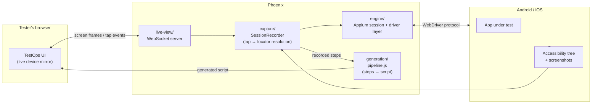
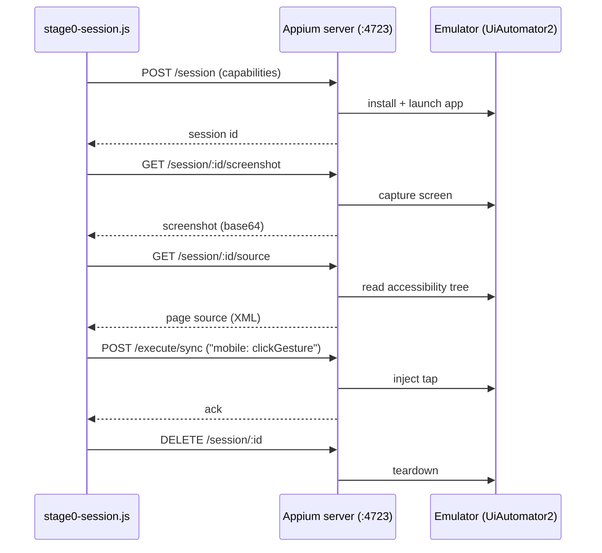

# Phoenix

Proprietary mobile test-recording and generation engine for TestOps.

Testers record a flow once, inside TestOps — no Appium Inspector, no local install, no separate device-farm dashboard. Phoenix captures the session and generates a working automated script.

Built on a fork of Appium's core engine (Apache 2.0), extended with an AI-native layer Appium doesn't have.

See [`docs/PHOENIX_SPEC.md`](docs/PHOENIX_SPEC.md) for the full architecture and roadmap.

## Repo layout

| Directory | Purpose |
|---|---|
| `engine/` | Forked Appium core + drivers (Android/iOS), stripped to session + driver essentials |
| `capture/` | Records taps, accessibility-tree snapshots, and screenshots during a session |
| `generation/` | Turns a captured session into a named, asserted, parameterized script |
| `live-view/` | Embeddable component: streams the device screen and forwards taps into TestOps |
| `docs/` | Architecture, spec, and decision records |

## Architecture



## Stage 0 milestone flow

The current proven pipe, end to end against a local emulator (`engine/stage0-session.js`):



## Market comparison

How Phoenix (target state, not yet fully built — see Status below) compares to what testers use today for mobile automation.

| Capability | **Phoenix** | Appium + Appium Inspector | BrowserStack App Automate | Katalon | mabl | Testim / Tricentis |
|---|:---:|:---:|:---:|:---:|:---:|:---:|
| No local tool install for the tester | ✅ | ❌ | ❌ (Inspector still local) | ❌ | ✅ | ✅ |
| Guided record → AI-generated script | ✅ | ❌ | ❌ | ⚠️ (record/playback, minimal AI) | ✅ | ✅ |
| Script generated from a **live, in-browser** device mirror | ✅ | ❌ | ❌ | ❌ | ❌ | ❌ |
| Self-authored locator strategy tuned to our test suites | ✅ | ⚠️ (manual) | ⚠️ (manual) | ⚠️ (manual) | ❌ (vendor black box) | ❌ (vendor black box) |
| Proprietary / not visible to competitors | ✅ | ❌ (open source) | ❌ (3rd-party SaaS) | ❌ (3rd-party SaaS) | ❌ (3rd-party SaaS) | ❌ (3rd-party SaaS) |
| No per-seat / per-minute vendor licensing | ✅ | ✅ | ❌ | ❌ | ❌ | ❌ |
| Runs on real devices + emulators/simulators | ✅ | ✅ | ✅ | ✅ | ✅ (limited device range) | ✅ (limited device range) |
| Full control over the underlying engine (fork, extend, fix) | ✅ | ✅ | ❌ | ❌ | ❌ | ❌ |
| Works out of the box, zero engine knowledge needed | ✅ (target) | ❌ | ❌ (still Appium under the hood) | ⚠️ (own DSL to learn) | ✅ | ✅ |
| Vendor lock-in risk | ✅ none (ours) | ✅ none | ❌ | ❌ | ❌ | ❌ |

⚠️ = partial support / workaround required, not a clean yes.

This is the case *for* building Phoenix, not a claim that today's repo already beats these tools — see Status for what's actually working right now.

## Status

**Stage 0 complete.** `engine/stage0-session.js` runs end to end against a local Android emulator via Appium 3 + `appium-uiautomator2-driver`: session start → screenshot → accessibility tree → tap → clean teardown, with no project-level Appium version pin (Appium and its drivers are installed globally via the `appium` CLI, not as `engine/package.json` dependencies).

**Stage 1 complete.** `capture/recorder.js` now resolves a tap coordinate to a real locator — resource-id, then accessibility-id (content-desc), then text, then a computed structural xpath, then raw coordinates as a last resort — by walking the accessibility tree and picking the smallest element whose bounds contain the tap point. Verified with a test suite (`capture/test/`) run against the actual tree captured during the Stage 0 run, not synthetic XML. `live-view/server.js`'s tap-forwarding path is wired to it, using the device's real window size (not the rendered image's) to convert a tester's on-screen tap ratio into device pixels, and the legacy `touchAction` call there is fixed the same way Stage 0's was — Appium 3 needs `mobile: clickGesture`, not JSONWP touch actions.

Next: Stage 2 — the generation pipeline in `generation/pipeline.js` (naming the flow, inferring assertions from before/after diffs, extracting parameters, and the actual LLM code-synthesis call). All four functions there are currently stubs.

### Running Stage 0 locally

```bash
# one-time setup
npm i -g appium
appium driver install uiautomator2
sdkmanager --sdk_root=$ANDROID_HOME "build-tools;34.0.0"   # provides aapt2

# terminal 1 — leave running
appium

# terminal 2 — leave running
emulator -avd <your_avd_name>

# terminal 3
cd engine
npm install
export PHOENIX_STAGE0_APP_PATH=/absolute/path/to/some-app.apk
npm run stage0
```

Do not declare `appium` or `appium-uiautomator2-driver` in `engine/package.json` — Appium 3.x's drivers require `appium@^3.0.0-rc.2` as a peer, and pinning an older `appium` there causes an ERESOLVE conflict. The CLI manages driver installation itself.
