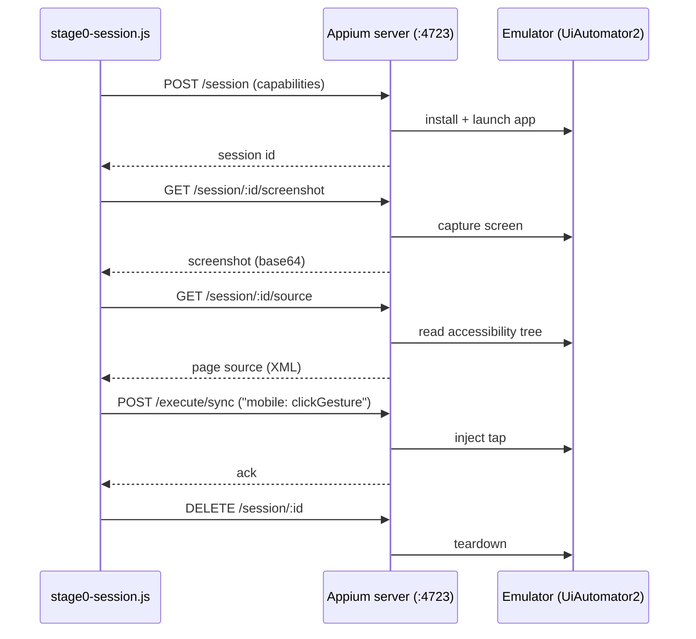

# Status — detailed engineering record

This is the full, detailed status history: every capability, what's
proven on real hardware vs. only unit-tested, real bugs found and
fixed (with root causes), and what's still open. The [README](../README.md)
carries only the current-state summary and points here for the rest.

CI (`test.yml`) runs the `capture/`, `generation/`, `engine/`,
`live-view/`, and `frontend/` suites on every push; the frontend
(`deploy-frontend.yml`) auto-deploys to GitHub Pages on every push that
touches it.

## Contents

- [Handoff to the dev team](#handoff-to-the-dev-team)
- [The "AI" question, answered precisely](#the-ai-question-answered-precisely)
- [Recording and script generation](#recording-and-script-generation)
- [LLM refinement (opt-in)](#llm-refinement-opt-in)
- [End-to-end wiring and frontend](#end-to-end-wiring-and-frontend)
- [Uploading an app directly](#uploading-an-app-directly)
- [Running the full loop locally](#running-the-full-loop-locally)
- [Public frontend URL](#public-frontend-url)
- [Engine session flow (spawn path)](#engine-session-flow-spawn-path)
- [Engine architecture: spawn vs. embedded (Android)](#engine-architecture-spawn-vs-embedded-android)
- [iOS support](#ios-support)
- [Remote provider: BrowserStack App Automate](#remote-provider-browserstack-app-automate-for-when-theres-no-local-device-host)
- [Running the Android engine directly (spawn path)](#running-the-android-engine-directly-spawn-path)

## Handoff to the dev team

**Ready now (BrowserStack path only):** upload flow, session/live-view/capture/generation pipeline, script output — all proven end to end on real hardware (see "Uploading an app directly" below). This is what's in scope for immediate use; the local-provider path (your own Android/iOS VM hosts) is implemented the same way but genuinely unverified, and isn't expected to be exercised until those VMs exist (Oct–Nov).

**Real backlog for the dev team to plan against, not blockers for using the BrowserStack path today:**
- ~~Concurrent sessions. One recording session at a time, hard limit — a second upload while one's active gets a 409. No device pool yet.~~ **Done — a real device/session pool, unit-tested.** `engine/session-pool.js`'s `SessionPool` tracks N slots (`PHOENIX_SESSION_POOL_SIZE`, default **1** — unconfigured deployments behave exactly as before) and allocates each a distinct live-view port (`PHOENIX_LIVE_VIEW_PORT` + sequential offset, skipping ports already held by another active slot), rather than every session binding the same fixed port. `engine/session-manager.js` now reserves a slot *before* awaiting the real Appium session start (so two uploads arriving a tick apart can't both pass the capacity check and collide), releases it if starting the session itself throws, and rekeys the slot from a temporary reservation id to the real `driver.sessionId` once it's known. `isSessionActive()`/the upload endpoint's 409 now mean "pool is full," not "literally any session exists" — with capacity raised above 1, two uploads can record concurrently without stepping on each other's driver/recorder/live-view state. **Verified by unit tests only** (`engine/test/session-pool.test.js`: slot/port bookkeeping in isolation; `engine/test/session-manager.test.js`: two concurrent fake sessions getting distinct ports, a failed start releasing its slot, the pool-full rejection) — **no real multi-device concurrent run has been executed** (this sandbox has no real Appium/BrowserStack access to run two real sessions side by side); that's the next real-hardware milestone, not something this change claims to have proven.
- **TestOps embedding.** Per the original spec (`docs/PHOENIX_SPEC.md` §3), a generated script should save directly as a TestOps test case with no export/import step. Today it's written to `generated/<name>.test.js` on disk and shown in the browser with a copy button — the actual integration with TestOps's own test-case storage hasn't been built.
- **Real-device CI.** `test.yml` only runs unit tests (`capture/`, `generation/`, `engine/`, `live-view/`, `frontend/`) against fixtures and fakes — every "confirmed on real hardware" claim in this doc came from a manual session, not an automated gate. Worth a scheduled or gated real-device/BrowserStack CI job at some point.
- ~~Elements with no accessibility info at all (custom-drawn Canvas/OpenGL UI) still fall back to a raw screen coordinate — the last-resort tier, and the most fragile one.~~ **Its single biggest real fragility fixed.** A coordinate-fallback tap isn't going away — recognizing/interacting with arbitrary custom-drawn content with zero accessibility info is a fundamentally different, vision-model-shaped problem, not a resolution-order fix — but the provable part of "most fragile" was that it hardcoded the RECORDING device's absolute pixels, so it broke the moment replay landed on a different device/resolution (routine on a BrowserStack device farm). `live-view/server.js` already computes the tap's position as a 0..1 ratio of the rendered screen before scaling it up to that device's pixels; it now threads that ratio through to `capture/recorder.js`'s `CapturedStep.tapRatio` instead of discarding it, and `generation/pipeline.js`'s `synthesizeCode()` re-scales the ratio against the REPLAY device's own `getWindowSize()` at runtime rather than baking in the recording device's pixels. A recording with no ratio (older data, or a non-live-view capture path) still falls back to the literal pixel coordinate exactly as before — nothing regresses, it only gets better when the ratio is available. New tests: `capture/test/resolveElementAtCoordinate.test.js` (`SessionRecorder.beginStep`/`completeStep` threading `tapRatio` through), `live-view/test/server.test.js` (the ratio actually reaching the recorder, not just the scaled pixels), `generation/test/pipeline.test.js` (the generated script re-scales via `getWindowSize()` when a ratio was recorded, and falls back to the raw pixel when it wasn't).
- Smaller, already-noted items: upload cleanup only happens on the BrowserStack success path (see "Uploading an app directly"), and the public GitHub Pages frontend can't accept an upload itself (static hosting, no backend).

## The "AI" question, answered precisely

Phoenix's AI story is two deliberately separate acts, not one blurred claim:

- **Act 1 — Guided AI (shipped, working today).** A human still walks the flow once — the judgment calls (an OTP screen, a payment confirmation, "is this actually the right button") aren't reliably solvable by an agent yet, and guessing wrong there is the kind of mistake that costs trust fast (`docs/PHOENIX_SPEC.md` §2 — this is why v1 is guided recording, not autonomous, on purpose). What's AI here is everything *around* that human judgment: `capture/recorder.js` resolves the right locator, `generation/pipeline.js` infers what to assert from what visibly changed, and an opt-in local-LLM pass (`generation/llm.js`, `PHOENIX_USE_LLM=1`, Ollama) writes a better flow name and filters incidental noise — fails safe to the plain rule-based output if Ollama isn't running. The pitch: *a human's judgment, a machine's tedium removed.* Real, demoed end to end, defensible under questions.
- **Act 2 — Unattended AI (Phase 2 building blocks built, now reaching a live session).** Give the agent a goal in plain language and it reads the screen the way the guided version already does, decides the next action itself, and knows when to stop and hand back to a human rather than guess — `docs/PHOENIX_SPEC.md` §6. The three Phase 2 bullets each have a first implementation, built in isolation from the guided (Act 1) path so nothing here risks it:
  - **Grounded snapshot** — `generation/semantic-snapshot.js` turns a captured accessibility tree into a compact, ref-indexed text block an LLM can read directly (`[3] Button "Log In" (id: login_button)`), the mobile equivalent of the grounded ARIA-snapshot approach used by web agents. `buildFusedSnapshot()` adds the other half of that bullet — pairing a bounds-annotated version of the same text (`at 100,560 880x100`) with a real screenshot, so a multimodal-capable model can cross-check the two. Opt-in via `useVisualGrounding: true` on `executeSemanticAction()` (default off — text-only is cheaper and is what's been exercised so far); a screenshot-capture failure falls back to text-only rather than failing the action.
  - **Semantic action layer** — `generation/semantic-act.js` resolves `act("tap the Login button")`-style instructions against that snapshot via the local Ollama model, returning a concrete `{strategy, value}` locator (reusing the same selector shape `pipeline.js`'s `buildSelector` already consumes) when confident, or `{resolved: false, reason}` rather than ever guessing. **Real bug found and fixed on a live BrowserStack run:** a container element (e.g. a Compose tab control's `composeView`) can itself be non-clickable with no clickable ancestor of its own (its clickable descendants sit *below* it in the tree, not above) — a guaranteed no-op tap target that was still being offered to the model alongside a correctly-redirectable label, and got picked. Fixed by filtering such elements out of the tap-candidate list entirely.
  - **State-diff reporting → assertion inference** — `generation/semantic-diff.js` diffs two grounded snapshots and reports what appeared/disappeared; `generation/semantic-assertions.js` turns that into the same `{label, resourceId}` shape the guided path's `inferAssertions` already produces. Both `engine/semantic-act-executor.js` (every single action) and `engine/semantic-loop.js` (every step, stamped with its index) compute this automatically.
  - **Live execution** — `engine/semantic-act-executor.js` is the piece that actually reaches a real device: it takes one instruction, resolves it via `semantic-act.js` against the session's current screen, taps or types through the *same* WebDriver calls (`driver.$(selector).click()`/`.setValue()`) the guided path's generated scripts use, re-checks the element still exists immediately before acting, and reports the diff.
  - **`run-semantic-action.js`** — a standalone CLI (mirrors `run-session.js`'s shape) that starts a real session and runs exactly one instruction through `executeSemanticAction()`: `node run-semantic-action.js "tap the Login button"`. **Now proven on real hardware** — a real run against `my.yes.yes4g` on BrowserStack correctly resolved and tapped the real LOGIN button and reported the resulting screen change. Its first-ever run surfaced one real gap, now fixed: it read the screen immediately on session start, before the app was past its splash screen, and correctly refused to guess rather than act on it — `run-batch-executions.js` already had a startup-delay fix for exactly this, this CLI just hadn't gotten it yet. Fixed with the same `PHOENIX_STARTUP_DELAY_MS`-configurable wait; the next run succeeded.
  - **`POST /api/semantic-action`** (`frontend/semantic-action-endpoint.js`, gated behind `PHOENIX_ENABLE_SEMANTIC_API=1`) — runs an instruction against whatever session a tester already has open through the normal upload flow, rather than starting its own. Answers `200` with the resolved selector + diff on success, `422` when the action couldn't be resolved/failed, `409` if no session is active. Plain JSON over HTTP, so TestOps's actual stack (Python backend, JS/React frontend) can call it directly — `docs/examples/testops_semantic_action_client.py` is a ready-made starting point for the Python side. **Now proven on real hardware**: with a real upload-flow session active (a dealer login screen, `com.ytlcomms.ymca`), `curl -X POST http://localhost:8091/api/semantic-action -d '{"instruction": "tap the LOGIN button", "kind": "tap"}'` correctly resolved to the real `btSignIn` button, tapped it, and correctly reported a validation toast ("Please enter your User ID.") appearing — exactly right, since the username field was empty. A curl fired before the session was fully up correctly got `409`, confirming that guard works too.

  All six pieces are unit-tested (`generation/test/semantic-*.test.js`, `engine/test/semantic-act-executor.test.js`, `frontend/test/semantic-action-endpoint.test.js`) against fakes/fixtures, and **now also confirmed against real hardware** — both entry points (the CLI and the API) have each had a real successful run, closing out every item Phase 2 had listed as open. **Not wired into `run-session.js`/`session-manager.js`/the upload flow's own logic** — the guided-recording path doesn't call any of this, so none of it touches or re-risks that path. The experimental API endpoint still defaults off; dev-team adoption is a rollout decision now, not a "does it work" question. The pitch stays: *same trusted foundation, now walking the flow itself.*

  **Auto-heal — where Act 1 and Act 2 actually meet.** `engine/auto-heal.js`'s `resolveElementWithHealing()` is a fallback for a guided script's recorded selector: try it first (normal, fast, unchanged). Two distinct triggers fall back to healing, both explicitly requested — **the selector stops resolving** (an id got renamed), and **the selector still resolves but to the wrong element** because the underlying path/structure shifted, caught via an optional `expectedLabel` check against the found element's actual visible text. Either way, it falls back to resolving the step's human-readable description semantically against the current screen, via `resolveSemanticAction()`. Opt-in and not wired into generated scripts — a script has to deliberately call this instead of a plain `driver.$(selector)` for it to apply.

  **Phase 3 (goal → autonomous action loop) — R&D only, actively being hardened against real hardware.** `engine/semantic-loop.js`'s `runAutonomousLoop()` takes a goal ("log in and reach account settings"), decides one action at a time via the local model, executes it, feeds the result back in, and repeats — stopping the moment the model says the goal's done, asks to stop itself, an action fails, or a hard step cap is hit. Per spec §6, Phase 3 doesn't touch a customer app until proven against Phoenix's own internal apps first — that hardening is in progress against `my.yes.yes4g` on real BrowserStack hardware. Real bugs found and fixed so far, each from an actual failed run, each covered by a regression test reproducing the exact real screen/prompt shape:
  1. **Dead-end tap container** — same root cause as the semantic-action-layer bug above, first surfaced here.
  2. **Model typed a field's own label hint instead of the real value** — given a goal that correctly embedded a real phone number, the model typed the literal string it saw in the screen's own `(empty input near: "Yes Number")` annotation instead of the actual credential from the goal text. Fixed with an explicit prompt reminder distinguishing "which field is empty" from "what to type into it."
  3. **Model echoed the prompt's own example-format placeholders** — two consecutive "type" steps had `instruction` fields literally reading `"type ... into ..."` and `"type ... into [18]"` (the prompt's old literal `"..."` placeholders and the snapshot's own `[18]`-style ref-bracket notation, copied verbatim instead of a real description being written). Fixed by replacing the placeholder-shaped examples with concrete ones (`"tap the Login button"`, `"type the phone number into the Yes Number field"`) and adding an explicit anti-copying reminder.
  4. **Malformed "type" response with no text** — the model would occasionally choose `kind: "type"` and omit `"text"` entirely, reproduced on consecutive runs at the same step. Given one bounded retry with a sharper reminder before being treated as a genuine failure.
  5. **Shared resource-id, disguised by hint text, defeated the existing ambiguity guard** — an initial hypothesis, fixed but NOT the actual real-hardware root cause (kept and tested since it's a genuine latent bug, see below for what actually happened). `semantic-snapshot.js`'s existing ambiguity guard (flag any resource-id shared by more than one element as `ambiguousResourceId`) also required the element to have no `label` of its own, on the assumption only a genuinely blank field could collide this way — but an empty Android `EditText`'s *hint* text (e.g. "Password") is reported via the exact same `text` attribute a real value would use, which would wrongly exclude a genuinely-ambiguous field from the guard if two such fields were ever on screen simultaneously. Fixed by judging ambiguity purely on resource-id uniqueness, regardless of hint text.
  6. **The real root cause of the `edtCommon` failures: there was only ever ONE `edtCommon` field on screen, not two.** Reading the actual real-device page-source dumps (not just the error message) showed `my.yes.yes4g`'s login screen has exactly one `EditText` (`edtCommon`, currently holding "Yes Number"), plus two non-input `View`s labeled "PASSWORD" and "USE TAC" — tappable tabs for *choosing a login method*, not a second input field. No password field exists in the tree at all until one of those tabs is tapped. The loop's model went straight from "type the phone number" to "type the password" without ever tapping "PASSWORD" first, so `resolveSemanticAction()` had nothing to bind "type the password" to except the one field that already existed — correctly refused by the anti-clobber veto (bug 4/5's fix), but the loop still failed 3/3 because the right prior action (tap the login-method tab) was never taken.
  7. **A plain prompt reminder did not change the model's behavior.** The first fix attempt for bug 6 was a general instruction added to `decideNextAction()`'s prompt ("before typing a value, make sure a field for it is visible..."). Re-run on real hardware: failed identically, 3/3, same exact refused action every time — a general reminder up front is easy for a small local model to not connect to the specific situation it's in. Fixed properly by making the loop **retry with situated feedback** instead of relying on prompt wording alone: when `executeSemanticAction`'s `beforeAct` veto refuses an action, `runAutonomousLoop` no longer fails the whole loop on the first refusal — it feeds the exact refused `{instruction, kind}` and the exact refusal reason back into the *next* `decideNextAction()` call (a new `refusedAttempt` parameter, rendered as "your last proposed action was rejected because: ... do not propose that again"), bounded to `MAX_VETO_RETRIES = 2` extra attempts before giving up for real — mirrors the existing bounded-retry pattern already used for a "type" response missing `text`. This is a materially different, more reliable mechanism than bug 6's fix, not just a rewording of the same reminder.
  8. **A password field's own masked display text was used as a live selector, and went stale the instant it was used.** With bugs 1–7 fixed, a real run reached the genuine password field, typed into it, and read it back correctly (confirmed via page-source dump: `text="•••••••" password="true"`) — but then needed to act on that same field again (to retry a transient failure) and could never find it again, burning the rest of its step budget on `findElements` calls that returned `[]`. Root cause: once a password `EditText` has anything typed into it, UiAutomator2 reports its `text` attribute as the masked placeholder (e.g. `"•••••••"`), which `buildGroundedSnapshot()` treats exactly like a genuine label — and `toSelector()`'s existing "fall back to the element's own label/hint text" branch (the fix for bug 5) then built a live WebDriver `text` selector from those dots. That selector is only valid for the instant it was read: clearing and retyping the field changes the dot count (or empties it), so the exact selector just used can never match the field again. Fixed in two parts: `semantic-snapshot.js` now records a `secure: true` flag (from Android's `password="true"` attribute) on any such element; `semantic-act.js`'s `toSelector()` now skips the live-text strategy entirely when `secure` is set, falling through to the stable `xpath` (ambiguous case) or `resource-id` (unique case) instead — never the field's own live, mask-changing text.
  9. **No safety net against a model repeating an action that visibly does nothing — burned an entire 20-step budget on a real run (android17).** With bugs 1–8 fixed, a run typed the phone number correctly, then needed to tap the "PASSWORD" tab before the password field would exist — but instead proposed "tap the Yes Number field" (the field it had just filled) 15 times in a row. Each tap was a legitimate, successfully-executed WebDriver click (so the existing `beforeAct`-veto/`MAX_VETO_RETRIES` guard from bug 7, which only fires on an explicit refusal, never engaged), and `generation/semantic-diff.js`'s `diffToText()` correctly reported `"No visible change."` every single time — fed back into the model's own history on every step — but nothing forced the model to act on that signal; the prompt only lists "stuck in a loop" as a valid reason for the model to *choose* to stop. Fixed with a code-level guard rather than another prompt reword (bug 7 already showed prompt-only fixes don't reliably land): `runAutonomousLoop` now tracks consecutive successful steps whose `diffSummary` is exactly `"No visible change."`, and stops the loop outright (`stoppedBecause: "action-failed"`, reason names the repeated instruction) after 3 in a row, resetting the counter the moment a step produces real change. **Confirmed working on real hardware (android18):** the exact same "re-tap the already-filled Yes Number field instead of the PASSWORD tab" slip recurred, and the loop now stopped cleanly after 7 steps (3 consecutive no-ops) instead of running all 20 — the fix's actual job (fail fast and legibly) is proven; it does not by itself make the model tap the right tab every time, which remains occasional real-model nondeterminism on top of bug 6/7's already-fixed guidance, not a new resolver bug.

  **Android loop work is closed out for now** at this point: nine real bugs found and fixed (selector/resolver bugs 1–6 and 8, a prompt-reliability fix in 7, and a code-level stuck-loop backstop in 9), a genuine end-to-end login proven twice on real hardware (an invalid-credentials rejection and a successful login reaching the post-login screen), and a fast, legible failure mode for the one remaining nondeterministic model slip (tab-tap vs. re-tap) rather than a silent step-budget burn. Further Android hardening (the "Ask Sofia" conversation goal, the Add-ons listing goal, and the app's own auto-launch of OS Settings post-login) is parked, not abandoned — pick back up if/when there's a reason to. Attention now shifts to iOS.

  ### iOS loop — first real runs against `my.yes.yes4g` on BrowserStack (XCUITest, real device), bugs found

  10. **(initial hypothesis, later disproven by bug 12 -- kept here, not deleted, since the fix it produced is still real and worth keeping) A mid-transition-animation snapshot produced a selector that went stale by the time it was used — 3/3 retries, same xpath, same failure (ios2).** The very first run to tap "LOGIN" successfully then failed to type the phone number at all: `findElement`/`findElements` resolved a `TextField` by xpath, but `executeSemanticAction` then found `element.isExisting()` false -- `"resolved element (...) is no longer on screen"` -- identically for all 3 attempts `MAX_VETO_RETRIES` allows. The page source taken right after the "LOGIN" tap contained the OLD home screen's elements **and** the NEW login form's elements **and** an already-open numeric keyboard, all simultaneously, which read as a snapshot caught mid-transition. Fixed by adding a brief pause (`DEFAULT_TAP_SETTLE_DELAY_MS = 800`ms, `options.tapSettleDelayMs`, injectable `options.sleep` for tests) after any successful `"tap"` step, before the next iteration's `getPageSource()`. **Re-run on real hardware (ios3) with this fix in place failed identically, 3/3, same exact xpath** -- see bug 12 for the real root cause this pointed to instead. The settle-delay fix itself is harmless and arguably still worth keeping (a real transition could cause a similar problem some other time), so it stays in, but it was not the fix for this failure.
  11. **(non-bug, fixed by goal wording, not code) The home screen has a real "EN" language-toggle button that looks just as tappable as "LOGIN."** The first iOS run (ios1) picked "EN" over "LOGIN" and re-tapped it 4 times with zero effect (caught cleanly by bug 9's stuck-loop guard in 5 steps, not a budget burn) -- the goal text for that run didn't explicitly name "LOGIN" as the target or "EN"/"ACTIVATE SIM"/"NEW TO YES?" as decoys, the same class of goal-wording gap documented earlier for Android (the home-landing-screen and FORGOT PASSWORD-decoy non-bugs above). Fixed by naming the decoys explicitly in the goal text, mirroring the pattern already proven on Android; ios2 (same goal plus this fix) correctly tapped "LOGIN" on the first attempt.
  12. **The real root cause of bug 10: XCUITestDriver's native xpath finder doesn't reliably resolve a position-based path built from the page-source XML dump, even against a provably unchanged screen.** ios3 re-ran the exact same goal with bug 10's settle-delay fix in place and failed identically, 3/3, with the exact same xpath string each time. The decisive evidence: the page-source dump was captured 4 separate times across the ~20 seconds spanning the 3 retries (including the one immediately before each failed `findElement` call), and all 4 were byte-for-byte identical -- the screen was never moving, mid-transition or otherwise. `findElement("xpath", ...)` itself came back `{error: 'no such element', ...}` straight from Appium's `doNativeFind` -- not a staleness error from `isExisting()`, a flat failure to resolve the path at all, for an element verifiably present and visible in the tree at that exact moment. This is a genuine difference from Android: the same style of structural, ancestor-chain, index-based xpath (`buildXPath()`) has worked reliably in every Android run so far (UiAutomator2's native xpath engine resolves it fine), but iOS's XCUITestDriver evidently does not resolve that shape of path the same way. Fixed by giving iOS elements a different last-resort locator entirely instead of trying to patch the xpath: `semantic-snapshot.js` now tracks each iOS tag name's 1-based occurrence index as it walks the tree (`iosTagOccurrenceCounts`) and, for any iOS element with no resource-id/accessibility-id/label of its own, builds a WebDriverAgent "class chain" locator instead of a structural xpath (`buildIosClassChain()` → `"**/XCUIElementTypeTextField[2]"` -- "the 2nd TextField anywhere in the tree, in document order," no ancestor path to go stale in the first place); `semantic-act.js`'s `toSelector()` prefers this new `classChain` field over `xpath` when both could apply; `pipeline.js`'s `buildSelector()` formats it as WebdriverIO's `-ios class chain:...` locator string, which `executeSemanticAction` already passes straight to `driver.$()` unchanged. Android is untouched -- `isIosRole()` gates the new code path on the iOS `XCUIElementType*` tag-name prefix, so Android's blank/ambiguous inputs still get the same structural xpath as before (bugs 5/6/8 stay exactly as fixed). **Confirmed working on real hardware (ios5):** the exact same class-chain locator resolved correctly where the old xpath had failed 3/3 twice running -- the loop got past the phone number field, correctly tapped the PASSWORD tab, and typed into the password field, reaching 8 real steps (further than any iOS run before it).
  13. **iOS's counterpart to bug 8: a SecureTextField's masked password text went stale as a live selector, because `secure` detection only ever checked Android's attribute.** ios5 (bug 12's fix in place) got all the way to typing the password, then failed on the very next action: `"Can't call elementClear on element with selector \"-ios predicate string:label == \"•••••••••\" OR value == \"•••••••••\"\" because element wasn't found"` -- textbook bug 8, on the second platform. Root cause: `semantic-snapshot.js`'s `isSecure` check only ever looked for Android's `password="true"` attribute (the comment literally said iOS didn't need it, since the Android bug was fixed before any iOS run existed) -- iOS signals the same thing through the element's own tag name (`XCUIElementTypeSecureTextField`) instead, which was never checked, so this field was never flagged `secure` and `toSelector()` built the same kind of live, mask-changing selector bug 8 already fixed on Android. A second, iOS-specific wrinkle on top: Android's secure fields always have a resource-id to fall back on once `secure` is set (unique, or ambiguous and already handled by the existing post-pass), but iOS has no resource-id at all, ever -- it relies entirely on the `classChain` computed only for a genuinely blank input (`isBlankInput`), and a password field's masked text makes it non-blank the instant anything's typed into it, which would've skipped computing one at exactly the moment it's needed. Fixed in two parts: `isSecure` now also checks `node.tagName === "XCUIElementTypeSecureTextField"`; and a new `needsIosPositionalLocator` (`isSecure && isIosRole(...)`) makes the classChain/nearbyLabel computation apply to a secure iOS field even once it has a label, not only to blank ones. **Confirmed working on real hardware (ios6):** the loop resolved the phone number field via classChain, cleared and typed it correctly, tapped the PASSWORD tab, and typed the password via the fixed predicate-string selector -- the furthest any iOS run has gotten, with multiple additional taps afterward (presumably toward submitting the form) before the run ended (see bug 14 for why it didn't finish cleanly -- not a selector bug).
  14. **(infra, not a Phoenix selector bug) A single flaky/slow BrowserStack response crashed the entire batch process via an unhandled rejection in WebdriverIO's own HTTP client, losing every result already collected and writing no report at all.** ios6 made real further progress (see bug 13's confirmation) but never finished: a `getPageSource()` call hung for ~43 seconds, then the process died with `Error: The \`onCancel\` handler was attached after the promise settled` from deep inside `got`/`p-cancelable` (WebdriverIO's HTTP layer) -- a library-level race between a slow/cancelled request and its own cancellation handling, not anything in Phoenix's own resolver code. The real gap this exposed: `run-batch-executions.js` had no handling at all for a rejection outside `main()`'s own `await` chain (`main().catch()` can't see it), so Node's default behavior killed the process immediately with a raw stack trace -- no `FAILED` line, no summary, and critically **no report file written**, silently losing every iteration's result that had already completed. Harmless for a 1-iteration debug run, but this harness exists specifically to run batches of up to 100 real-device iterations (see its own header comment) -- a bigger batch will eventually hit exactly this kind of transient network blip partway through. Fixed by pulling report-writing out into a standalone `writeReport(results, crashInfo)`, tracking results in a module-level `resultsSoFar` (not a local `const` scoped to `main()`) so they survive past any crash, and registering `process.on("unhandledRejection"/"uncaughtException", ...)` handlers (only when running as the actual batch script, not when required as a library/by its own tests) that salvage whatever's in `resultsSoFar` into a report marked `crashed: true` with a redacted `crashReason`, instead of losing it. This can't make the crashed iteration itself succeed -- the connection/promise state is already corrupted by that point -- but it stops one infra blip from erasing everything that already worked.

  15. **(goal-wording gap, not a code bug) Nothing told the model what to do once both login fields were correctly filled in, so it wandered into a decoy and then uselessly re-verified/retyped already-correct values until the no-op guard killed the run.** ios7 completed without a crash (bug 14's fix wasn't even needed this run) but still ended in `action-failed` after 10 steps: phone number typed correctly via classChain; password typed correctly; then the model tapped the "EN" language-toggle decoy -- explicitly a non-goal element -- not once but twice (confirmed via a preceding `findElement("accessibility id", "EN")` immediately before each tap); in between it ran an extended `-ios predicate string` polling sequence apparently re-checking the phone number's own text; it then retyped the already-correct phone number again; and finally retyped the exact same password value into the SecureTextField four times in a row (06:23:02, 06:23:20, 06:23:38, 06:23:55), each one correctly resolving and correctly applying via the classChain selector (bugs 12 and 13's fixes both proven solid yet again, on every single one of these four attempts) -- but because the retyped value was identical each time, the masked output was identical too, so the last 3 of these identical retypes correctly tripped bug 9's `MAX_CONSECUTIVE_NO_OP_STEPS` guard. Root cause traced to `run-batch-executions.js`'s `buildEffectiveGoal()`: it only appends a clause telling the model *which credentials to use when the app asks to log in* -- it never says what to do *after* both fields are filled in (tap the actual LOGIN submit button) or warns the model away from the "EN" toggle. Not a selector/resolver bug -- both iOS-specific fixes resolved every element correctly, every time, in this very run. Fix is in the caller's `PHOENIX_BATCH_GOAL` text, not in Phoenix's code: an iOS goal should now explicitly say to tap LOGIN once both fields are filled, to not retype a field that's already correct, and to leave the "EN" toggle alone.

  16. **(goal-wording gap, not a code bug) A first-launch iOS system notification-permission dialog stopped the loop in 4 steps because nothing told the model how to handle it.** ios8 (run with bug 15's corrected goal in place) never got anywhere near the login screen: the page source showed only SpringBoard with the app on the App Switcher card and a system `"MyYes" Would Like to Send You Notifications` alert (`Allow`/`Don't Allow` buttons) on top of it, and the loop correctly reported `action-failed: No editable input field ... found` after 4 steps rather than hallucinating a match. This is a real, if infrequent, iOS first-run condition -- a system permission prompt, not an app UI element -- that the goal text never mentioned, so the model had no instruction for it. Not a selector/resolver bug and no code changed. Fix is again in `PHOENIX_BATCH_GOAL`: tell the model that if a system permission dialog (notifications, location, etc.) appears, tap "Allow" (or "Don't Allow") to dismiss it before continuing toward the login screen.

  17. **(goal-wording gap, not a code bug) The home screen's own LOGIN button (which opens the login form) and the form's submit button share the exact same name/accessibility id "LOGIN" -- and the goal never told the model it had to tap the first one before any input field would even exist.** ios9 (run with bug 16's dialog-handling clause in place) correctly tapped "Allow" to dismiss the notification dialog and landed cleanly on the real home screen (`LOGIN`, `ACTIVATE SIM`, `EN` buttons, bundleId `my.yes.yes4g` -- confirmed via page source), then never tapped `LOGIN` at all: it went straight for "type the phone number into the phone/account number field" against a screen that has no input fields yet, failing immediately and then re-polling the identical page source 7 times before giving up at 1 step. Root cause: the goal said "log in to the app" without ever stating that the home screen's own `LOGIN` button must be tapped first to reveal the phone/password form -- and since that same button's name is reused verbatim for the form's submit action, a model with no explicit sequencing has nothing in the accessibility tree itself to tell "open the form" and "submit the form" apart. Not a selector/resolver bug -- the model simply never attempted the first tap. Fix is again in `PHOENIX_BATCH_GOAL`, not code: spell out the full sequence explicitly -- tap LOGIN on the home screen to open the form, fill in both fields, then tap LOGIN again to submit.

  18. **(architecture decision, not a selector bug) The autonomous loop's per-step model decision-making is a bad fit for a known, fixed sequence like login -- ios10 recurred the exact same "won't submit once both fields are filled" failure as ios7 despite an explicit, increasingly detailed goal rewrite, confirming this isn't a wording gap at all.** ios10 (run with bug 17's "tap LOGIN first" clause in place) made real further progress -- dismissed the dialog, tapped LOGIN, typed the phone number correctly -- but then tapped LOGIN a second time *before the password field was even filled*, which reset the form and forced a redundant re-type of the phone number; it then correctly typed the password, but after that correct entry it never tapped LOGIN to submit, instead retyping the identical password four more times until bug 9's no-op guard stopped it at 9 steps. Two consecutive real-hardware runs failing at the same decision point despite different goal wording each time means further prompt tweaking isn't a reliable fix -- the model doesn't consistently recognize "both fields are now correct, submit" as a terminal condition from goal text alone. Fixed by removing the model's discretion over sequencing entirely rather than attempting a third wording: `run-batch-executions.js` gained a new opt-in `login-script` mode (`runOneLoginScriptIteration`, `PHOENIX_BATCH_MODES=login-script`) that runs a hardcoded step array (optionally dismiss a system dialog -> tap LOGIN -> type phone -> type password -> tap LOGIN) via direct `executeSemanticAction()` calls -- each individual step still uses the same proven per-instruction resolver (iOS classChain/secure-field fixes, bugs 12/13, untouched), but *which* step runs next is fixed code, not a model decision, so the exact failure class seen in ios7/ios10 cannot recur. The autonomous `loop` mode itself is untouched and still exists for exploration tasks without a known fixed sequence; this is a second, narrower execution mode alongside it, not a replacement. Verified with 5 new unit tests (`test/run-batch-executions.test.js`) covering the credential-required guard, the full step sequence firing in order with the right text on the right step, and stopping (without running later steps) on the first non-optional step that fails -- not yet run against real hardware.

  19. **Real bug, first real-hardware run of login-script mode (ios11): an iOS secure field's accessibility id can be just as live as its label -- `toSelector()` trusted it unconditionally, so bug 13's fix wasn't actually complete.** ios11 (the new deterministic `login-script` mode's first real-device run) got further than ever -- dismissed the dialog, tapped LOGIN, typed the phone number -- then failed on "type the password": the password field resolved to accessibility id `"PASSWORD"`, a `setValue()` against `~PASSWORD` succeeded once (clear + sendKeys both returned cleanly), then something re-resolved the exact same selector a few seconds later and threw `Can't call elementSendKeys on element with selector "~PASSWORD" because element wasn't found`. Root cause: this app's password field apparently reports accessibility id `"PASSWORD"` only while *empty* (derived from its placeholder), and that name disappears from the accessibility tree once real text is typed into it -- the identical live-selector failure class bug 13 already fixed for `label`, just surfacing through `accessibilityId` instead, which `toSelector()` (generation/semantic-act.js) had never guarded because accessibility ids are normally assumed stable (true for Android, per bug 8 -- only Android's live masked *text* was ever the problem there). Fixed by skipping `accessibilityId` for a secure field too, but ONLY when a `classChain` fallback actually exists (i.e. only for bug 13's iOS secure fields, via `needsIosPositionalLocator`) -- Android's secure fields have no `classChain` and keep using their accessibility id exactly as before, so this doesn't touch the already-correct Android path. Verified with a new unit test (`generation/test/semantic-act.test.js`) covering both the iOS case (now falls through to classChain) and confirming the Android case is unaffected; full suite (11 test files) still green. Not yet re-run against real hardware.

  20. **Real bug, ios12 (bug 19's fix in place, same failure recurred): the "PASSWORD" accessibility id was never the secure field at all -- it's a separate tab button, confirmed directly in the page source.** ios12 re-ran the exact same `~PASSWORD` `elementSendKeys ... element wasn't found` failure as ios11, byte-for-byte, even with bug 19's accessibility-id/classChain fix live -- the tell was that the resolved selector was STILL `accessibility id "PASSWORD"`, never `-ios class chain`, meaning the element bug 19 fixed for was never the one actually being matched here. Grepping the page source for `name="PASSWORD"` confirms it: `<XCUIElementTypeButton type="XCUIElementTypeButton" name="PASSWORD" label="PASSWORD" ...>` -- a plain tab button, exactly like the Android "PASSWORD" tab from the much earlier Android bugs (6/7), that switches the form into password-entry mode when tapped; the REAL secure field is a separate, still-hidden element underneath it, which `needsIosPositionalLocator`/`classChain` never even applies to because the button isn't flagged `secure` at all -- bug 19's fix was real and correct for an actual secure field with a live accessibility id, it simply wasn't the bug this failure was. In the working `loop` mode runs (ios6, ios10) the model always tapped this "PASSWORD" tab as its own separate planned step before typing, implicitly bridging the gap; the new deterministic `login-script` mode (added for bug 18) never included that tap at all, so `resolveSemanticAction`'s "type the password" instruction kept matching the only "PASSWORD"-labeled thing on screen -- the tab button -- instead of the real, hidden field. Fixed by adding the missing step explicitly to `LOGIN_SCRIPT_STEPS` in `run-batch-executions.js`: tap the PASSWORD tab, *then* type the password, making the full fixed sequence Allow -> LOGIN -> type phone -> tap PASSWORD tab -> type password -> LOGIN. Updated the existing step-order unit test in `test/run-batch-executions.test.js` to match the new 6-step sequence; full suite (11 test files) green. Not yet re-run against real hardware.

  21. **Real bug, ios13 (every prior selector/sequencing fix confirmed working, furthest run yet -- all 6 steps completed with zero resolution errors): WebDriver reported `elementClear`/`elementSendKeys` succeeding against the real secure field with no error at all, yet the password never actually made it into the field.** ios13 ran clean end to end (Allow -> LOGIN -> type phone -> tap PASSWORD tab -> type password -> submit LOGIN), resolving every element correctly including the password field via classChain (bugs 12/13/19/20 all proven solid on this very run) -- but watching the BrowserStack session video showed the password field visibly still empty after the "successful" `elementSendKeys("@Ytlc1234")` call, and the final LOGIN submit predictably produced "No visible change." (the form never actually had valid credentials in it). The plain phone/account field (not secure) had no such problem. Root cause: this app's secure field apparently needs an actual tap to focus/engage its own keyboard before it will accept programmatically-injected keystrokes -- WebDriverAgent's `elementSendKeys` can report a clean success even when the app's custom secure entry never actually received the text, since nothing taps the field first the way a real user's touch would. Fixed by adding an explicit tap-to-focus step before typing into the password field, making the full fixed sequence Allow -> LOGIN -> type phone -> tap PASSWORD tab -> tap password field (focus) -> type password -> submit LOGIN. Updated the step-order unit test in `test/run-batch-executions.test.js` for the new 7-step sequence; full suite (11 test files) green. Not yet re-run against real hardware.

  22. **Real bug, ios14 (confirmed the password-focus fix from bug 21 genuinely worked -- raw page-source XML showed the correct masked value -- but the final submit tap still produced no visible change): the home screen's "LOGIN" button and the login form's own submit "LOGIN" button report the exact same accessibility id.** ios14's typing steps all verifiably worked this time -- re-reading the raw post-typing page-source XML directly (not the tool's own summary) showed `value="01166114421"` in the phone field and `value="•••••••••"` (9 dots, matching the real password's length) in the secure field, proving bugs 12/13/19/20/21 are all genuinely solid. Yet the final "tap LOGIN to submit" step still produced no visible change, exactly like ios13. Tracing the log found the cause: the WebDriver element id clicked for the very first "tap LOGIN to open the form" step (`0D000000-0000-0000-AB4B-000000000000`) is the IDENTICAL element id clicked again for the final "tap LOGIN to submit" step at the end of the run -- the home screen's LOGIN button and the login form's own submit LOGIN button share one accessibility id, so `$("~LOGIN")`/`findElement("accessibility id", "LOGIN")` always resolves to whichever one matches first, which is the original (by-then-hidden) home-screen button, not the real, visible submit button -- explaining every "No visible change." result seen on the final step across both ios13 and ios14 even with fully correct credentials already in the form. Fixed in `generation/semantic-snapshot.js`: `buildGroundedSnapshot()` now also counts how many elements on screen share each `accessibilityId` (not just `resourceId`, which was Android-only); any iOS element whose accessibility id isn't unique gets `ambiguousAccessibilityId: true` and a new kind of `classChain` from `buildIosAmbiguousAccessibilityClassChain()` -- a WebDriverAgent class-chain **predicate** (`` **/XCUIElementTypeButton[`name == "LOGIN" AND visible == 1`] ``), documented native syntax that matches on name AND visibility together, rather than the plain occurrence-index `buildIosClassChain()` already used for blank-labeled elements. `generation/semantic-act.js`'s `toSelector()` now also skips `accessibilityId` whenever `ambiguousAccessibilityId` is set, so it falls through to this predicate classChain instead, which reliably picks whichever same-named element is actually on screen right now. Verified with new unit tests in both `generation/test/semantic-snapshot.test.js` (the duplicate-LOGIN-button fixture gets flagged and both instances get the same predicate classChain; a uniquely-named button stays unflagged with no classChain at all) and `generation/test/semantic-act.test.js` (`toSelector()` prefers the predicate classChain over an ambiguous accessibility id, while a non-ambiguous accessibility id is untouched); full suite (11 test files) green. Not yet re-run against real hardware.

  23. **Real bug, ios15 (bug 22's ambiguous-accessibility-id fix in place, same duplicate-LOGIN failure recurred): the fix correctly skipped `accessibility-id` for the ambiguous LOGIN button, but fell through to an equally-ambiguous label predicate instead of the new classChain.** ios15 re-ran the exact same failure as ios14, byte-for-byte: the final submit tap again clicked WebDriver element id `0D000000-0000-0000-4D4C-000000000000`, the identical element id clicked for the earlier "open the form" tap -- confirmed directly in the log, which showed the resolved selector was `-ios predicate string, "label == \"LOGIN\" OR value == \"LOGIN\""`, never `-ios class chain` at all. Root cause: `toSelector()`'s guard order has a resource-id check, then the accessibility-id check bug 22 fixed, then (before ever reaching `classChain`) a `label`-based "text" strategy -- and that block had no ambiguity check of its own. The LOGIN button's `label` ("LOGIN") is exactly as duplicated on screen as its `accessibilityId` (both come from the same name), so skipping accessibility-id only pushed resolution one tier down to an equally non-unique selector, which `findElement` (singular) resolved the same way every time: to whichever of the two same-labeled buttons matched first -- confirmed in the log's own `findElements` call returning two distinct element ids every time this ran. Fixed by adding the same `!element.ambiguousAccessibilityId` guard to the label/text block in `generation/semantic-act.js`'s `toSelector()`, so an ambiguous element now falls all the way through to the classChain predicate bug 22 already computes for it, instead of stopping one tier too early. Verified with a new unit test in `generation/test/semantic-act.test.js` confirming classChain wins over the label strategy too, not just over accessibility-id; full suite (11 test files) green. Not yet re-run against real hardware.

  **iOS login-script mode CLOSED OUT, ios16 (real BrowserStack hardware, full pass): the entire fixed sequence -- dismiss system dialog, open the login form, type phone, switch to password entry, focus the secure field, type the password, submit -- completed end to end with the login screen correctly replaced by the home screen.** ios16's report showed the real submit tap (this time correctly resolving the visible classChain-predicate LOGIN button, not the hidden one) produced a screen diff with the entire login UI disappearing ("LoginHeaderDots", "Back Login", "Login", "Yes Number", the masked password field, "FORGOT PASSWORD", both "LOGIN" buttons, etc.) and the real post-login home screen appearing in its place ("Tab Bar", "Home", "Rewards", "Profile", "HomeBannerPlaceholder"). This closes out bugs 12/13/18/19/20/21/22/23 together as a single proven, deterministic, real-hardware-verified iOS login path (`login-script` mode) -- the same bar the Android side was already closed out at. No further login-specific bugs are open as of this run.
  New iOS findings so far, not yet bugs needing a fix: the app's own version button on iOS reads `"v19.3.12 "` (a newer build than the Android side's) and the iOS accessibility tree uses `XCUIElementType*` tag names throughout (`XCUIElementTypeTextField`, `XCUIElementTypeButton`, etc.) rather than Android's `android.widget.*` -- both already handled transparently by the existing platform-aware code, called out here only as a sanity-check record, not a gap.

  Confirmed working end to end on real hardware so far: tap Login → type the Yes Number field (correct value) → tap the PASSWORD tab (correct clickable-ancestor redirect) → type the password (correct value, properly masked in reports) → tap Login (submitted) → correctly handle an "Invalid username/password" dialog by dismissing it and returning to a clean login screen. A matching CLI, `run-semantic-loop.js`, exists: `node run-semantic-loop.js "log in and reach account settings"`.

  **Milestone reached: a confirmed successful end-to-end login on real hardware**, with bugs 1–8 all fixed. A run against `my.yes.yes4g` on real BrowserStack hardware (goal: tap LOGIN → tap the PASSWORD tab → enter the phone number → enter the password → tap LOGIN to submit, explicitly told not to tap the FORGOT PASSWORD/RESET PASSWORD decoys) tapped LOGIN on the home screen, correctly navigated the PASSWORD-vs-TAC tab choice, entered a verified-valid phone number and password, correctly avoided the FORGOT PASSWORD decoy this time, tapped the real submit LOGIN button, and the app accepted the credentials — advancing to a post-login onboarding/coach-mark carousel screen that only appears after a successful login (also correctly handling an Android system permission dialog along the way). The run still reported `max-steps-reached` rather than `goal-achieved`, but that's a goal-scope gap, not a login failure: the goal text only covered "log in," so once logged in the model had no defined stopping point and kept trying to click through the onboarding carousel's slides until its step budget ran out. Next (not yet done): extend the goal text to define success as reaching the logged-in home screen (dismissing/skipping onboarding if shown), so a run can report `goal-achieved` rather than hitting the step cap after a login that already succeeded.

  Worth knowing for anyone asking "hasn't this been done before": Appium's own team ships [`appium-mcp`](https://github.com/appium/appium-mcp) with the same accessibility-id-first locator priority we use, and a few early/experimental projects ([`headspinio/appium-llm-plugin`](https://github.com/headspinio/appium-llm-plugin), Kobiton's commercial "Appium AI") do natural-language element resolution too — but none combine a compact text-only snapshot, "return unresolved rather than guess" semantics, and reuse of one deterministic selector pipeline across both the guided and semantic paths, inside a single guided-then-semantic product story. Full comparison, including where we're honestly behind on maturity: [`docs/COMPETITIVE_LANDSCAPE.md`](COMPETITIVE_LANDSCAPE.md).

## Recording and script generation

**Session engine.** `engine/session.js` (Android, UiAutomator2) and `engine/ios-session.js` (iOS, XCUITest) each start a real Appium session and expose the same lifecycle: session start → screenshot → accessibility tree → tap → clean teardown. Android needs no project-level Appium version pin (Appium and its drivers are installed globally via the `appium` CLI, not as `engine/package.json` dependencies); iOS capabilities target either a built `.app`/`.ipa` or, for smoke-testing the plumbing itself, an app already on the Simulator by bundle id (`appium:bundleId`).

**Locator resolution.** `capture/recorder.js` resolves a tap coordinate to a real locator — resource-id/name, then accessibility-id (content-desc/name), then text/label/value, then a computed structural xpath, then raw coordinates as a last resort — by walking the accessibility tree and picking the smallest element whose bounds contain the tap point. Reads either platform's tree shape (Android's `resource-id`/`content-desc`/`text`/single `bounds` string, or iOS's `name`/`label`/`value`/`x`,`y`,`width`,`height`) with no upfront platform flag needed at this layer. Verified with a test suite (`capture/test/`) against both a real captured Android tree and a real captured iOS/XCUITest tree, not synthetic XML alone. `live-view/server.js`'s tap-forwarding path is wired to it, using the device's real window size (not the rendered image's) to convert a tester's on-screen tap ratio into device pixels, and injects the tap via each platform's own extension (`mobile: clickGesture` on Android, `mobile: tap` on iOS — neither platform's driver implements the legacy JSONWP touch-actions endpoint anymore).

**Script generation.** `generation/pipeline.js` turns a captured session into a runnable WebdriverIO script — entirely rule-based by default, no LLM call required: `inferTestName` names the flow from the first screen's title, `inferAssertions` diffs each step's before/after accessibility tree and proposes an assertion per label that newly appeared, `extractParameters` lifts typed values into named test data from the field's own locator, and `synthesizeCode` renders it all as a `describe`/`it` block with `waitForDisplayed`/`click`/`setValue` calls and `expect(...).toBeDisplayed()` assertions — falling back to a flagged raw-coordinate tap only when locator resolution couldn't resolve a stable one. A `platform` option switches selector syntax and the tap extension between Android's `UiSelector`/`mobile: clickGesture` and iOS's `-ios predicate string:`/`mobile: tap`. Verified with a test suite (`generation/test/`, 17 tests) covering both platforms, sample output below.

`inferAssertions` also collapses repeated labels within a single step to one assertion each: nested accessibility nodes commonly expose the same text at multiple bounds (a button and its inner label child both reading "Screen Time"), which the underlying `(resourceId, label, bounds)` diff key correctly treats as distinct elements — needed for the cross-screen "seen" tracking described in the function's own comments — but which read as pure repetition when each one produced its own near-identical `toBeDisplayed()` check in the same step. Found on a real 15-step iOS Settings recording (178 assertions, several outright duplicated); fixed by tracking already-asserted labels per step while leaving the cross-step dedup logic untouched.

<details>
<summary>Sample generated script (login flow, 3 recorded steps)</summary>

```js
// Generated by Phoenix from a recorded session — 3 step(s).
// Locators use the priority resolved during capture: resource-id > accessibility-id > text > xpath > coordinate.

// Test data — lifted from values typed during recording.
const username = "prabath@example.com";
const password = "hunter2";

describe("login", () => {
  it("login", async () => {
    // Step 1
    const step0El = await $("android=new UiSelector().resourceId(\"com.phoenix.demo:id/username_input\")");
    await step0El.waitForDisplayed();
    await step0El.click();
    await step0El.setValue(username);

    // Step 2
    const step1El = await $("android=new UiSelector().resourceId(\"com.phoenix.demo:id/password_input\")");
    await step1El.waitForDisplayed();
    await step1El.click();
    await step1El.setValue(password);

    // Step 3
    const step2El = await $("android=new UiSelector().resourceId(\"com.phoenix.demo:id/login_button\")");
    await step2El.waitForDisplayed();
    await step2El.click();
    await expect($("android=new UiSelector().resourceId(\"com.phoenix.demo:id/welcome_text\")")).toBeDisplayed(); // "Welcome" appeared
  });
});
```
</details>

## LLM refinement (opt-in)

**Complete, verified on real hardware end to end.** `generation/llm.js` refines `inferTestName`'s and `inferAssertions`' output via a local Ollama instance (`PHOENIX_OLLAMA_HOST`/`PHOENIX_OLLAMA_MODEL`, see `.env.example`) — a better flow name summarizing the whole recorded path instead of just the first screen, and filtering out incidental assertions (a clock or ad banner ticking over) a plain accessibility-tree diff can't tell apart from a meaningful change. It's designed to never break the pipeline: any failure (Ollama not running, a timeout, a malformed response) is caught and falls back to the exact v1 rule-based value, logging a warning. Verified both ways: with Ollama absent (clean fallback, no crash, unchanged v1 output) and with Ollama + `llama3` running against a real 11-step recorded flow (no fallback triggered — produced `accessibility_clock_talkback_explore` as the flow name, a real whole-flow summary rather than the first-screen-title heuristic, and kept 13 of the diff's proposed assertions). Opt in with `generateScript(steps, { useLlm: true })`, or `PHOENIX_USE_LLM=1` for `run-session.js`; the default stays the unrefined v1 rule-based output, which remains a complete result on its own.

## End-to-end wiring and frontend

**Complete, proven on a real device with a real multi-step flow.** `run-session.js` at the repo root wires all four pieces into one live recording session: starts a real Appium session (Android or iOS, via `PHOENIX_PLATFORM`), starts `live-view`'s WebSocket server against it with a `SessionRecorder` attached, and on `"stop"` hands the recorded steps to `generation/pipeline.js`, writes the resulting script to `generated/<test-name>.test.js`, and sends it back over the socket as a `script-generated` message. A real Android run against ApiDemos (home screen → "Views" submenu → "Animation" demo screen, 2 real taps) surfaced and fixed two real bugs: list-row selectors needing `resourceId` + `text` combined to disambiguate (shared row-template ids), and assertion diffing needing to key on `(resourceId, text, bounds)` rather than text alone (two different elements coincidentally sharing a label across screens). A real iOS run (Safari, launched by bundle id, 2 taps) confirmed the same wiring on the XCUITest path — see the iOS section below.

**Real front-end complete.** `frontend/index.html` (served by `frontend/server.js`, no build step, vanilla JS) is the actual tester-facing recording UI — replaces `live-view/test-client.js`'s simulated tester with a real live device mirror: it renders each polled screenshot, lets the tester click directly on the image to tap (converting the click position to a device coordinate ratio automatically), has a text field for typed input, a live list of recorded steps, a "Stop & Generate Script" button, and displays the generated script inline with a copy button once the session finishes.

## Uploading an app directly

**Confirmed end to end on real hardware, for the BrowserStack provider; local-provider support is wired but only reaches an Appium server on the same machine, not yet exercised.** Originally, the app under test was fixed by an env var (`PHOENIX_STAGE0_APP_PATH`/`PHOENIX_IOS_APP_PATH`/`PHOENIX_BROWSERSTACK_APP_URL`) before `run-session.js` even started — there was no way for a tester to pick a file once the page was open, unlike TestOps proper, where a tester uploads a `.ipa`/`.apk` directly. `frontend/index.html` now opens on an upload screen (drag-and-drop or click to choose a `.apk`/`.ipa`) instead of connecting immediately; the frontend posts it as `multipart/form-data` to a new endpoint, `POST /api/sessions` (`frontend/upload-session.js`), which:

- saves the upload to `frontend/uploads/`,
- figures out the platform from the file extension (`.apk` → Android, `.ipa` → iOS; a `platform` form field can override this if ever needed),
- under `PHOENIX_APPIUM_PROVIDER=browserstack` (the priority path — TestOps is already tightly integrated with BrowserStack, so this needed no new infrastructure, just one more hop): calls `engine/browserstack-upload.js`'s existing `uploadApp()` on the saved file to get a `bs://` URL, then deletes the local copy,
- under the local provider: passes the saved file's own path through as `appium:app` directly — this only works when `frontend/server.js` and the Appium server share a filesystem (the same constraint `PHOENIX_STAGE0_APP_PATH`/`PHOENIX_IOS_APP_PATH` already have; an upload doesn't relax it). This is the path for TestOps's own Android VM and the planned AWS iOS VM once those are Appium hosts in their own right, not yet exercised against either.
- starts a session via a new `engine/session-manager.js` (the orchestration extracted from `run-session.js`'s original `main()`, so the boot-once CLI flow and this on-demand one share one implementation) with that app reference as a `capabilityOverrides` argument, overriding the env-var default for just this session,
- responds with the started session's live-view port, and the page connects its WebSocket to it exactly as before.

**Update:** this was true when first written — a single module-level `active` variable in `session-manager.js` meant one recording session at a time, hard limit, a second upload while one was in progress getting a 409. `engine/session-pool.js`'s `SessionPool` now generalizes that into N configurable slots (`PHOENIX_SESSION_POOL_SIZE`, default 1 — so this still behaves identically unless raised), each with its own live-view port instead of every session binding the same fixed one. See this doc's "Concurrent sessions" backlog entry above for what's verified (unit tests) vs. still open (a real multi-device concurrent run). Uploaded files are deleted after a successful BrowserStack hand-off, or left in `frontend/uploads/` (gitignored) on the local-provider path/on error, for now.

The env-var-configured flow (`PHOENIX_STAGE0_APP_PATH` + `node run-session.js` before opening the page) still works completely unchanged — `run-session.js` is now a five-line wrapper around `engine/session-manager.js`'s `startRecordingSession()` with no app override, so nothing about that path's behavior moved.

**This upload endpoint only exists on a self-hosted `frontend/server.js`.** The public GitHub Pages deploy (below) serves `index.html` as a static file with no backend behind it at all — `POST /api/sessions` has nowhere to land there. Uploading a file only works when you're running `node frontend/server.js` yourself (or pointing the public page at a self-hosted backend that also serves this endpoint, which it doesn't today — the public page still assumes a pre-started `run-session.js` reachable at `?host=&port=`).

Verified with a unit test suite (`frontend/test/`, 7 tests, and `engine/test/session-manager.test.js`, 4 tests) covering platform detection, the concurrency guard, capability-override wiring for both providers, and error responses — against fake session/upload/provider modules, no real network or Appium session. **And confirmed against a real BrowserStack account with a real tester's browser end to end:** dragging `BitBarSampleApp.ipa` into the upload screen below, with only `PHOENIX_APPIUM_PROVIDER=browserstack` + BrowserStack credentials exported (no `PHOENIX_BROWSERSTACK_APP_URL` set beforehand — that's the whole point) started a real session on a real BrowserStack device and dropped straight into the live mirror.


A real 4-tap recording against the biometrics screen from that same session generated this:

<details>
<summary>Sample generated script, from the upload flow (BitBar Sample App, biometrics screen, 4 recorded steps)</summary>

```js
describe("bitbar_sample_app", () => {
  it("bitbar_sample_app", async () => {
    // Step 1
    const step0El = await $("~Biometric authentication");
    await step0El.waitForDisplayed();
    await step0El.click();
    // ...16 assertions on the screen's labels appearing, including:
    await expect($("-ios predicate string:label == \"Authentication status title WAITING\" OR value == \"Authentication status title WAITING\"")).toBeDisplayed();

    // Step 2 — tapped an element with no accessible name/label at all
    const step1El = await $("~");
    await step1El.waitForDisplayed();
    await step1El.click();

    // Step 3 — same
    const step2El = await $("~");
    await step2El.waitForDisplayed();
    await step2El.click();

    // Step 4 — also unlabeled, fell back to a structural XPath
    const step3El = await $("/AppiumAUT[1]/XCUIElementTypeApplication[1]/.../XCUIElementTypeOther[3]");
    await step3El.waitForDisplayed();
    await step3El.click();
    await expect($("-ios predicate string:label == \"Authentication status title FAILED\" OR value == \"Authentication status title FAILED\"")).toBeDisplayed(); // real state change: WAITING -> FAILED
  });
});
```
</details>

The `WAITING` → `FAILED` assertion is real inferred state — the app's own authentication status label actually changed between steps, and `inferAssertions` caught it correctly. Steps 2-4's weak locators are a real gap, not a recording error — see "What's still open" below.

This surfaced one real bug along the way, now fixed: `remote-provider.js`'s `buildCapabilities()` validated `PHOENIX_BROWSERSTACK_APP_URL` unconditionally, even when `capabilityOverrides` already supplied a per-session `appium:app` — which is exactly what the upload path does after calling `uploadApp()`. Every upload failed immediately with "requires PHOENIX_BROWSERSTACK_APP_URL" until that validation was changed to check `overrides["appium:app"]` first. Covered by a new regression test in `engine/test/remote-provider.test.js`.

**What's still open:**
- ~~Local-provider upload path verification~~ **Dropped from the backlog.** TestOps is running in a cloud VM against BrowserStack (at most `PHOENIX_BROWSERSTACK_LOCAL`, never a true local/on-prem Appium install), so verifying the local-provider upload path against a co-located Android/iOS VM host isn't relevant for now — that deployment shape isn't planned. The local-provider code path itself is untouched and still there if a genuinely local host ever shows up, it's just not something to spend verification effort on.
- ~~One session at a time.~~ **A concurrent-session device pool now exists** (`engine/session-pool.js`, see the "Concurrent sessions" backlog entry above) — unit-tested, not yet confirmed against two real concurrent device sessions.
- **Upload cleanup on the local-provider path** — files in `frontend/uploads/` are only deleted after a successful BrowserStack hand-off; a local-provider run or a failed upload leaves the file behind today.
- ~~Locator quality on elements with no accessible label~~ **Root-caused, fixed, and re-confirmed on real hardware.** Two of the four taps in the first biometrics recording resolved to an unusable empty accessibility-id (`~""`, nothing after the tilde) instead of falling through to a real locator. `capture/recorder.js`'s `resolveElementAtCoordinate()` chose the accessibility-id strategy based on a plain truthiness check on the raw `name`/`content-desc` attribute — but a whitespace-only value (e.g. `name="   "`) is truthy in JS, so it was accepted as a "real" identifier instead of being treated as absent and falling through to text/xpath as designed. Fixed by trimming before the truthiness check, covered by a new test in `capture/test/`. **Re-recording the same app after the fix** (a real 28-step BrowserStack session, not a replay) confirmed it: zero empty accessibility-id selectors anywhere in the output — every tap either resolved a real `~<name>` or correctly fell through to a structural xpath.
- ~~Assertion on an empty/invisible label~~ **Also root-caused and fixed, found in that same 28-step re-recording.** One assertion read `expect($(...label == ""...)).toBeDisplayed(); // "" appeared` — a real, non-empty label that nonetheless displays as nothing. The cause: iOS accessibility containers can roll up a child's label as a **zero-width space** (`​`), which is non-empty and truthy in JS, and — unlike ordinary whitespace — `String.prototype.trim()` doesn't strip it either, so it survived both `capture/recorder.js`'s and `generation/pipeline.js`'s existing whitespace checks as a "real" value. Fixed by adding a shared `isBlank()`/`cleanLabel()` check (in `generation/pipeline.js`, and the equivalent inline in `capture/recorder.js`) that strips zero-width space/non-joiner/joiner and the BOM/ZWNBSP before deciding whether a value counts as blank, so a rolled-up-empty label is skipped entirely (as an assertion source) or treated as absent (as a locator candidate) instead of appearing as a visually-empty result. Covered by new tests in both `capture/test/` and `generation/test/` reproducing the exact character; not yet re-confirmed against a fresh recording of this specific app screen (the fix landed after that 28-step session).
- **The public GitHub Pages frontend still can't upload** (see above) — it only works against a pre-started session today.

## Running the full loop locally

**Option A — upload the app through the page (no env var, matches TestOps's own flow):**

```bash
cd frontend && npm install && cd ..
node frontend/server.js
```

Open **http://localhost:8091/**, drag in a `.apk`/`.ipa`, and click "Start recording session" — Phoenix uploads it (to BrowserStack, or uses it directly under the local provider) and connects you straight into the live device mirror. See "Uploading an app directly" above for what's actually happening.

**Option B — the original env-var-configured flow**, with the emulator + Appium server already running (see "Running the Android engine directly" near the bottom of this doc for one-time setup):

```bash
# terminal 4 — starts the session, live-view server, and waits for a tester
export PHOENIX_STAGE0_APP_PATH=~/Downloads/apidemos.apk
node run-session.js

# terminal 5 — serves the recording UI, with ?port=8090 so it skips the upload screen
node frontend/server.js
```

Then open **http://localhost:8091/?port=8090** in a browser: you'll see the live device mirror, and can tap directly on it to record a real flow, type into fields, and stop to see the generated script.

To exercise the loop without a browser (e.g. in CI, or to test a specific tap sequence programmatically), `live-view/test-client.js` still works the same way — a scripted stand-in for a tester, configurable via `PHOENIX_TAP_SEQUENCE`:

```bash
node live-view/test-client.js
```

## Public frontend URL

`frontend/index.html` is also deployed via GitHub Actions (`.github/workflows/deploy-frontend.yml`) to GitHub Pages on every push to `main` that touches `frontend/`, so it has a stable public URL instead of needing `node frontend/server.js` run locally every time:

**https://prabathkumar.github.io/phoenix/**

**This deploys the static page only — it still needs a Phoenix backend to talk to.** The page connects, in your own browser, to `run-session.js`'s live-view WebSocket. Two ways to use it:

- **Backend on the same machine as your browser (the normal case):** just open the public URL — it defaults to `ws://localhost:8090`, and browsers treat `localhost` as a secure-context exception, so an `https://` page connecting to `ws://localhost` works with no extra setup. Start `run-session.js` locally as usual, then open the public URL instead of running `frontend/server.js`.
- **Backend on a different machine:** tunnel `run-session.js`'s port (e.g. `ngrok http 8090`) and open the public URL with `?host=<tunnel-host>&port=<tunnel-port>`.

**One-time setup required** (can't be done from a git push — a repo owner needs to flip this once): in the repo's GitHub Settings → Pages, set **Source** to **GitHub Actions**. Until that's set, the workflow will run but the page won't be reachable at the URL above.

## Engine session flow (spawn path)

The core session lifecycle the spawn path (`stage0-session.js`, `run-session.js`) builds on, end to end against a local emulator. The embedded path (see below) reaches the same four milestones — session start, screenshot, accessibility tree, tap, teardown — through direct in-process driver calls instead of this HTTP round trip; the sequence below shows the spawn path specifically, since that's what `run-session.js` and every product entry point currently use.



## Engine architecture: spawn vs. embedded (Android)

**Complete.** `engine/embedded-session.js` runs `appium-uiautomator2-driver` **in-process** — no spawned `appium` server, no separate process, no WebDriver-over-HTTP round trip to our own server. `engine/embedded-session-stage0.js` re-runs the exact engine-session milestone (session start → screenshot → accessibility tree → tap → teardown) through it, calling the driver's own command methods directly (`getScreenshot()`, `getPageSource()`, `mobileClickGesture()`) instead of going through webdriverio's `remote()` client.

Two architecturally different ways to talk to the driver now coexist in `engine/` on purpose:

| | `stage0-session.js` / `run-session.js` (spawn) | `embedded-session*.js` (embed) |
|---|---|---|
| Process model | Separate `appium` CLI process, talked to over HTTP | Same Node process, direct method calls |
| Driver install | `appium driver install uiautomator2` (CLI-managed) | `npm install` in `engine/` (normal npm dependency) |
| `appium`/`appium-uiautomator2-driver` in `engine/package.json` | Must **not** be listed (CLI manages its own, causes ERESOLVE if pinned here too) | **Must** be listed (no CLI involved, this is how they get installed) |
| What's proven | Real device, full multi-step flow, real front-end | **Confirmed on real hardware** — full milestone (session start → screenshot → accessibility tree → tap → teardown) run against a real emulator (ApiDemos, `emulator-5554`), no `appium` server process involved |

Full vendoring/forking of the driver's own source was scoped and deliberately not done: `appium-uiautomator2-driver`'s exports are entangled with the `appium` package's own subpath exports rather than the more decoupled `@appium/base-driver`, so a real fork would mean also forking `appium-android-driver` and `@appium/base-driver`'s session/capability machinery — a multi-week effort with no upstream precedent for doing it this way, for no clear payoff yet. Embedding gets the actual goal (no separate process, no extra HTTP hop) without that cost; revisit vendoring only if a concrete need shows up that embedding can't satisfy (e.g. a protocol extension the driver itself doesn't expose).

```bash
cd engine
npm install
export PHOENIX_STAGE0_APP_PATH=~/Downloads/apidemos.apk
npm run embedded-stage0   # needs the emulator running — no appium server needed
```

**Verified against a real emulator** — `npm run embedded-stage0` completed all four milestone steps end to end with no `appium` server running: session created (`AndroidUiautomator2Driver` in-process, session id assigned directly), screenshot captured (72,552 bytes base64), accessibility tree captured (13,600 chars), tap injected via `mobileClickGesture`, and teardown ran cleanly (UiAutomator2 server instrumentation exited with code 0, port forward removed, hidden-api policy restored). The Appium fork work (embed v1) is closed.

Next (open, not yet scheduled): decide whether `run-session.js`'s full pipeline should migrate from the spawn path to the embedded path — not required now since both are proven, but embedding removes a process and an HTTP hop, which matters more once this needs to scale to many concurrent sessions.

Next (product side): harden the live-view/generation edge cases further (typed-input flows, back-navigation, screens with no accessible labels).

## iOS support

`engine/ios-session.js` and `engine/ios-stage0-session.js` mirror the Android spawn path against `appium-xcuitest-driver` instead of `appium-uiautomator2-driver` — same architecture, different driver, different capability shape (`appium:app` is a `.app`/`.ipa`, not a `.apk`; `appium:deviceName`/`appium:platformVersion` select an installed Simulator rather than a fixed AVD name). `run-session.js` picks the platform via `PHOENIX_PLATFORM` (`android` default, or `ios`).

The parts of the pipeline that assumed Android's UiAutomator2 tree shape now handle XCUITest's shape too: `capture/recorder.js`'s `resolveElementAtCoordinate` and `generation/pipeline.js`'s `extractLabels` read either attribute set (Android's `resource-id`/`content-desc`/`text`/single `bounds` string, or iOS's `name`/`label`/`value`/`x`,`y`,`width`,`height`), and `generation/pipeline.js`'s selector/tap-extension generation (`buildSelector`, `buildResourceIdSelector`, `synthesizeCode`) takes a `platform` option that switches between Android's `UiSelector`/`mobile: clickGesture` and iOS's `-ios predicate string:`/`mobile: tap`.

**Confirmed on real hardware.** `npm run ios-stage0` ran end to end against a real booted Simulator (`iPhone 15 Pro`, iOS 17.0), launching Safari by bundle id (`appium:bundleId`, see `engine/ios-session.js` — useful for smoke-testing the session/driver layer without a custom app build first): session started, a real XCUITest accessibility tree captured (22,539 chars — confirmed the exact shape `capture/recorder.js` and `generation/pipeline.js` were built to parse: `name`/`label`/`value`/`x`/`y`/`width`/`height` attributes, no `resource-id` or single `bounds` string), a screenshot captured, a tap injected via `mobile: tap`, and teardown ran cleanly. Combined with the unit tests against real XCUITest-shaped fixtures (`capture/test/`, `generation/test/`), iOS is now proven at both the engine layer and the capture/generation layer — the same two layers Android needed before being called complete. **Full pipeline also confirmed.** A real `run-session.js` recording (`PHOENIX_PLATFORM=ios`, launching Safari by bundle id) recorded 2 taps and generated a runnable script: one tap correctly resolved to `~favoritesItemIdentifierHeader` (the accessibility-id strategy, `~value`, identical syntax to Android since it's cross-platform in WebdriverIO), the other correctly fell back to a structural xpath when the tapped element had no name/label — exactly the designed fallback behavior. iOS is now proven at the same bar Android was: engine layer and full record-to-script pipeline both confirmed on real hardware (a real booted Simulator). Not yet done: a recording against a real custom `.app` (rather than Safari) to see assertions/parameters populate against an app with real navigation — Safari's static start page didn't produce screen changes between the two arbitrary taps used here, so 0 assertions in this run reflects the test app choice, not a gap in the assertion-diffing logic (already unit-tested separately).

**iOS typed-input path — fixed after two attempts, confirmed live.** `live-view/server.js`'s `"type"` handler originally drove XCUITest through `driver.keys()` (W3C key actions), which WebDriverAgent on Appium 3 rejects for plain character input (`Key Down action 's' must have a closing Key Up successor`) — reproduced live against a real Simulator recording session. First fix attempt routed iOS typing through the `mobile: type` extension instead; also confirmed live to fail, but differently — this xcuitest-driver build doesn't implement that extension at all (`405 Method is not implemented`). The fix that actually lands: `elementSendKeys`/`elementClear` against the currently-focused element (found via the standard `getActiveElement`), a separate, older WebDriver endpoint XCUITest implements directly rather than through W3C actions, so it hits neither broken path. Android is unaffected throughout and keeps the plain `driver.keys()` path.

That fix surfaced one more real edge case live: `getActiveElement()` only resolves to a usable element when XCUITest considers a field genuinely keyboard-focused — tapping a non-editable row (a plain Settings cell, a disabled control) leaves nothing focused, and WDA's resulting "no such element" response was crashing the whole `run-session.js` process instead of failing just that one keystroke. Now handled the same way as typing before any tap is recorded: reports a `type-error` back to the tester ("tap directly into a text field that brings up the on-screen keyboard") and keeps the session alive. See `live-view/server.js` and its test suite (`live-view/test/`, 5 tests — dedicated cases for the working iOS path, confirming neither `driver.keys()` nor `mobile: type` is ever called and `elementClear`/`elementSendKeys` receive the expected calls, and for the unfocused-field case not crashing the session).

**Confirmed end to end on real hardware.** A real 17-step `run-session.js` recording against a booted Simulator tapped into an Apple ID sign-in field and typed into it: the generated script correctly emitted `step11El.setValue(username)` against the `~username-field` accessibility-id locator, with `username = "test"` lifted into named test data by `extractParameters` — the full tap → type → parameter-extraction pipeline working on iOS the same way it already did on Android. iOS typed input is no longer an open item.

**Precondition, not a Phoenix bug — recorded apps need accessibility identifiers.** A real 18-step recording against a custom SwiftUI app (`org.stratalang.orders`) resolved every single tap to the same `~Orders` locator and produced zero assertions, regardless of where on screen the tester tapped. `capture/recorder.js`'s `resolveElementAtCoordinate` picks the smallest accessible element whose bounds contain the tap point — that logic is correct and already unit-tested; the app's own XCUITest accessibility tree simply exposed only one accessible node on screen (the nav title/root view, named "Orders"), with none of its rows, buttons, or fields carrying their own `.accessibilityIdentifier(...)`. Without distinct accessible elements underneath, there is nothing smaller for any resolution strategy to find, on any tool built on XCUITest, not just Phoenix. **Takeaway for anyone recording a custom app**: the app's interactive views need explicit accessibility identifiers (SwiftUI's `.accessibilityIdentifier("...")`, or UIKit's `accessibilityIdentifier` property) before a recording will produce distinguishable locators or meaningful assertions — confirm first with Xcode's Accessibility Inspector (Xcode → Open Developer Tool → Accessibility Inspector, hover the app's elements on the booted Simulator) that individual controls report their own identifiers, not just the screen as a whole.

## Data-driven test cases: the generalized `test-case` mode, and the team adoption order

`login-script` mode (above) proved the architectural point on real hardware: a known, fixed step sequence must not be left to the autonomous loop's per-step model planning, because the model doesn't reliably recognize "this sequence is done, do the next fixed thing" even when every individual step resolves correctly (bug 18). But that mode's sequence was still hardcoded JS (`LOGIN_SCRIPT_STEPS`, an array literal in `run-batch-executions.js`) — a new flow meant a new array and a new commit, not something a tester could write themselves. This is the generalization: a test case is now a plain JSON file (`engine/test-case-runner.js` loads and runs it; `test-cases/login.json` is the proven login sequence extracted byte-for-byte, unchanged), and a `PHOENIX_BATCH_MODES=test-case` run with `PHOENIX_TEST_CASE_FILE=<path>` runs any such file. Each step is still resolved against the live screen by the exact same per-instruction resolver (`executeSemanticAction`) that bugs 12/13/19/20/21/22/23 already proved correct — only WHERE the step sequence comes from changed (data, not code), not HOW a single step resolves. A step's `text` field supports an `"${ENV_VAR}"` placeholder (whole-string match only, no partial interpolation) so a test case referencing credentials never has them committed to the file itself. `login-script` mode keeps its original name and behavior unchanged (it's now just `test-case` mode pointed at the one built-in `test-cases/login.json` file) so nothing already written against it breaks. Verified with a dedicated unit suite (`engine/test/test-case-runner.test.js`, covering file loading/validation, env-var resolution and its required-whole-string rule, and step execution/failure handling) plus new `run-batch-executions.test.js` coverage for the `test-case` mode itself; full suite (12 test files) green. Not yet re-run against real hardware in this generalized form (the underlying resolver and the login sequence itself both already are, repeatedly).

**This is also the recommended order for the dev team adopting Phoenix, by explicit direction**: start on the semantic/`test-case` layer (Act 2/3) as the normal path for writing and running a new test case — write the flow as a JSON step list, run it, let the per-instruction resolver self-heal against whatever's actually on screen. Across 10+ underlying app technologies (Compose, SwiftUI, UIKit, custom cross-platform frameworks), there's no realistic way to test and certify every one before release — the self-healing resolver is what makes `test-case` mode viable as the default regardless of which one a given app happens to use, rather than needing per-technology support work up front. Only fall back to guided recording (Act 1) for a specific flow if the semantic layer hits a real wall on it (an app screen whose accessibility tree doesn't give the resolver enough to work with, for instance) — Act 1 stays available as a tester-friendly, deterministic recorder for exactly that case, not as the default starting point.

### Where does `loop` mode fit, now that `test-case` exists?

`loop` mode (Phase 3, `engine/semantic-loop.js`) is scoped to **R&D/exploration only, never test authoring** — including a *first draft* of a test case. The distinction is not "is the sequence simple" but "is the sequence known before the run starts": if someone can write down the steps at all (which is true for virtually every real test case, including login), that's `test-case` mode's job, because `loop`'s per-step model planning has repeatedly failed to reliably finish even a sequence where every individual step resolves correctly (bug 18 — two consecutive real-hardware iOS runs got stuck at the identical "both fields filled, now submit" decision point). `loop` remains useful for genuine open-ended exploration — "see what's reachable from this screen," probing an app with no existing test case at all, generating a starting point a human then turns into a `test-case` JSON file — not for running or maintaining an actual test. `run-batch-executions.js` now prints an explicit note pointing to `test-case` mode whenever `loop` iterations are requested, so reaching for it out of habit doesn't go unnoticed.

### `addons.json`: the first real bug found testing the blind draft (Android, real BrowserStack hardware)

The blind-authored `test-cases/addons.json` (login → close post-login notifications → view Add-ons → logout — see that file's own "description" and per-step "note" fields for what was guessed) was run once against a real Android device (Pixel 7) via `test-case` mode. Steps 1–7 (the already-proven login sequence) worked correctly — the same login sequence proven on iOS (bugs 18–23) now also confirmed working unchanged on Android — but the run failed at step 10, "tap the Add-ons tab or menu item," with no confident match.

Reading the actual page-source XML at the failure point (not the tool's own failure summary) showed why: a **native Android runtime-permission dialog** (`"Allow MyYes to send you notifications?"`, with `Allow`/`Don't allow` buttons — `com.android.permissioncontroller:id/permission_message`) had popped up right after the login submit step and was still blocking the screen. The two guessed steps meant to handle exactly this ("tap the close or X button to dismiss a post-login notification popup") never matched it, because this dialog isn't a custom in-app popup with a close/X affordance at all — it's the same kind of native OS permission prompt step 1 already handles, just appearing post-login instead of pre-login. The guessed wording was wrong for the actual dialog shape, not the sequencing.

Fixed by replacing both guessed steps with the exact, already-proven `"tap the Allow button to dismiss a system permission dialog"` instruction from step 1, repeated twice (optional, in case a second permission dialog stacks up) rather than inventing new wording for a dialog shape that was never actually present. Steps 11–12 (logout) remain entirely unverified — the run never reached them.

**Second real bug found on re-run (addons-run-android-2.log): a coach-mark tutorial overlay silently blocks every step after it.** The notification-dialog fix above worked, and the Add-ons tap itself also resolved and clicked correctly — real progress, confirming two more guessed steps correct on the first attempt. The run then failed at the final "tap the LOGOUT..." step with no match. The page source at that point showed why: landing on the Add-ons/Account area triggers a coach-mark tutorial overlay (`"Your Account overview is easily accessible in the middle of the screen."`, a close icon at `ivClose`, a `"NEXT"` button at `btnNext`) sitting on top of the real screen — never guessed in the original draft, so every tap step after it (including the optional Profile-menu step) was quietly failing to resolve against the real screen underneath, not actually interacting with it. Fixed by inserting a `"tap the X button to close the coach mark tutorial popup"` step (optional) right after the Add-ons tap. Logout itself is still entirely unverified — the run never got past the overlay to reach it.

**Third real bug found on the next re-run (addons-run-android-3.log): resolver nondeterminism, not a wording or sequencing bug.** The run failed much earlier this time, back on "tap the LOGIN button on the home screen" itself — the exact step already proven working on iOS (bugs 18–23) and on this very run's own Android attempt 2. Comparing the resolved selector against the successful run showed why: both runs used a structural xpath ending in `android.view.View[N]`, but attempt 2 resolved to `View[1]` (the real LOGIN container) while attempt 3 resolved to `View[2]` — a different, visually-identical sibling container whose only child is a `TextView` reading `"ACTIVATE SIM"` instead of `"LOGIN"`. The model picked the wrong one of two near-identical unlabeled candidates. Tapping it triggered an unrelated native dialog (`"Dear Customer, we kindly request you to update the MyYes app to access the 'SIM Activation' feature."`, `CLOSE`/`UPDATE APP` buttons) instead of opening the login form — a different failure class than bugs 19–23 and the two addons.json bugs above, none of which were about the resolver picking the wrong *candidate* among several, only about wording not matching anything or an unmodeled blocking screen. This is inherent LLM-resolution nondeterminism on an ambiguous pair, and can recur on any step with two sufficiently similar unlabeled candidates, including (rarely) in the already-proven login sequence itself. Mitigated, not eliminated, by adding a recovery pair right after the LOGIN tap: an optional `"tap the CLOSE button..."` step for if the wrong dialog appears, followed by an optional retry of the same LOGIN-tap instruction (a safe no-op once the login form is already open, since the button is then off-screen and nothing matches). A more durable fix would give the home screen's LOGIN/ACTIVATE SIM containers their own distinguishing accessibility ids so the resolver never has to guess between them at all — flagged here as a recommendation for the app side, not something the resolver itself can code around. Not yet re-run.

**Fourth correction, made from a direct screenshot of the real overlay rather than another run's log: the coach mark is a multi-page carousel, not a single card.** A screenshot of the "Know your App" tutorial overlay (the one bug #2's `ivClose`/`btnNext` step targets) shows it is a carousel with 8 page-indicator dots, an X close icon fixed in the top-right corner, and a NEXT button advancing one page at a time — the original fix only ever tapped X once, which assumed a single card and would leave the carousel open on whatever page X failed to close (X may only be reliably tappable/visible on certain pages, or may require the carousel to be interacted with first on some devices). Per direct instruction, the recovery is: try X first, and if that doesn't fully dismiss it, tap NEXT repeatedly until the carousel itself ends. Implemented as seven additional optional `"tap the NEXT button on the tutorial popup..."` steps (covering the full 8-dot carousel) right after the existing X-tap step, followed by one more optional X tap in case the final page swaps NEXT for a close control instead. Every added step is optional, so once the overlay is actually gone (whether X closed it immediately or a NEXT sequence did), the remaining taps in the set simply find nothing on screen and are skipped as no-ops — this costs a few wasted resolution attempts on the already-closed-overlay case but never blocks or fails the run. `addons.json` is now 23 steps. Not yet re-run.

**Fifth bug found on the next re-run (addons-run-android-4.log): a real engine gap, not a step-sequence bug — nothing could scroll.** This run got further than any before it: login, both permission dialogs, Add-ons, and the full coach-mark carousel all resolved correctly, reaching the Profile tab (confirmed by the page source: `ivProfile`/`tvProfile`, and a menu screen listing Billing Info, Coverage Map, E-Bills, FAQs, General, Get Help, IDD Rates, Network Status, Plan Details, Purchase History, Settings, YesCare, Ajak & Earn). It then failed on the final step: `"No LOGOUT or Log Out button found on the screen."` The captured page source at that exact point has no "Logout"/"Log Out" text anywhere in it — not a wording mismatch or an unmodeled popup like every bug before this one, but the element genuinely isn't in the current viewport: the menu items sit inside an `android.widget.ScrollView`, and Logout is below the fold. This exposed a real architectural gap rather than a step-sequence mistake: `executeSemanticAction` (`engine/semantic-act-executor.js`) only ever supported `"tap"` and `"type"` — there was no way for any test case to move the viewport at all.

Fixed at the engine level, not just in the JSON: added a third action kind, `"scroll"`, to `executeSemanticAction`. Unlike tap/type, a scroll has no single target element to resolve against the screen, so it skips `resolveSemanticAction`/`buildSelector` entirely and issues a native gesture directly — `mobile: scrollGesture` on Android (UiAutomator2, a swipe rect inset from the screen edges to avoid the status/nav bars and edge-swipe-back gestures), `mobile: scroll` on iOS — then diffs the before/after screen the same way a tap does. Viewport size comes from `driver.getWindowSize()` with a safe fallback if that call isn't supported. `engine/test-case-runner.js`'s `loadTestCaseSteps` now accepts `"scroll"` as a valid step kind (no `text` required, an optional `direction` field defaulting to `"down"`). Five new unit tests cover it (android gesture shape, ios gesture shape, a thrown gesture reported as `{success:false}` instead of crashing, the `getWindowSize()` fallback, and the JSON loader accepting a scroll step) — full suite still green, 0 failures, after adding them (this is the one change in this whole file-fixing sequence that touched engine code, not just JSON).

`addons.json`: added one optional `"scroll down on the Profile screen to reveal the Logout option"` step right before the Logout tap — optional so it's a no-op on any device/build where Logout happens to already be on screen. Now 24 steps.

**Sixth bug found on the next re-run (addons-run-android-5.log): a timing race, not a step-sequence bug.** This run regressed earlier than run 4 — it failed back on `"tap the Add-ons tab or menu item"`, a step already confirmed working twice before. The page source at the moment of failure showed the native `"Allow MyYes to send you notifications?"` permission dialog still on screen, with no Add-ons element reachable underneath it. Comparing the full WebDriver command timeline against run 4 explained why: login submission shows a progress spinner for a variable amount of time before the permission dialog actually appears. In run 4 the dialog was already up by the time the two optional `"tap Allow"` steps ran, so both resolved and dismissed it cleanly. In run 5 it wasn't — both Allow taps correctly found nothing yet (optional, skipped as harmless no-ops while the spinner was still showing), and by the time the very next step (`"tap the Add-ons tab"`, not optional) ran, the dialog had finally appeared and blocked it, failing the whole run. No rewording or reordering of existing steps could fix this: the dialog's arrival time genuinely varies run to run, and nothing in the engine could previously pause between steps to wait it out.

Fixed by adding a fourth action kind, `"wait"` — a pure timing pause with no instruction resolution and no device action at all (unlike every other kind, it never calls `executeSemanticAction`). `engine/test-case-runner.js`'s `runScriptSteps` special-cases it directly: `await sleepFn(step.durationMs ?? 3000)` then continues to the next step. `sleepFn` is injected the same way `executeSemanticAction` is, so tests exercise the pause logic without a real wall-clock wait. `loadTestCaseSteps` accepts `"wait"` as a valid kind (no `text` required, optional `durationMs`). Three new unit tests cover it (default duration, a custom `durationMs`, and the JSON loader accepting a wait step) — full suite still green. `addons.json`: added one `"wait for the login submission to finish..."` step (3000ms) right after the LOGIN-submit tap and before both Allow-dismiss attempts, to cover the slower observed delay with headroom. Now 25 steps.

**Seventh and eighth bugs found on the next re-run (addons-run-android-6.log): a worse case of resolver overconfidence than bug #3, plus a genuinely useless failure reason.** This run failed on the very first required step, `"tap the LOGIN button on the home screen"`, with a failure reason that was just the literal string `"..."` — unhelpful on its own, but the full WebDriver command log made both real bugs clear from the surrounding evidence. Only one tap happened in the whole run, resolved against the fresh home screen (no dialog present at all yet) to the `ACTIVATE SIM` container instead of `LOGIN` — but this tap was for step 1, `"tap the Allow button..."` (optional, and there was no Allow dialog to find at all), not for the LOGIN step that reportedly failed. The resolver didn't just pick the wrong one of two similar candidates this time (bug #3's class) — asked to find an "Allow" button with nothing resembling one anywhere on screen, it should have returned unresolved and instead confidently guessed an unrelated element, a worse failure since "Allow" doesn't even textually resemble "ACTIVATE SIM". That wrong tap opened the same "update the app to access SIM Activation" dialog as bug #3, which then correctly blocked the real LOGIN step from finding anything underneath it — a legitimate failure, just one caused by the step *before* it, not the LOGIN step itself.

Second bug, found while tracing why the failure reason was just `"..."`: `generation/semantic-act.js`'s own resolution prompt told the model to respond `{"ref": null, "reason": "..."}` when nothing matches — using a literal `"..."` as the example value for `"reason"` — and the model sometimes echoed that placeholder back verbatim as its actual answer instead of writing a real explanation. This is "prompt-template echoing," the exact same failure class already found and fixed once before in the autonomous loop's `decideNextAction` prompt (`engine/test/semantic-loop.test.js`'s "never literal... placeholders" test) — just not this prompt, which apparently shared the same template pattern and was never checked for it. The existing guard (`typeof result.reason === "string" && result.reason.trim()`) only protects against an empty/falsy reason; a non-empty echoed placeholder sails right through.

Fixed both: the prompt's own example reason was reworded to `"<your own brief, specific explanation of why nothing matches>"` with an explicit "write a real sentence, never copy this instruction" line (harder to copy verbatim than a bare `"..."`), and the code now treats a literal `"..."` or anything shaped like `<...>` as equivalent to no reason, falling back to `"model did not find a confident match"` either way — belt-and-suspenders, since a prompt rewording alone doesn't guarantee the model won't invent its own echo-shaped non-answer. Two new unit tests in `generation/test/semantic-act.test.js` cover both the old `"..."` echo and the new `<placeholder>` shape.

For the resolver overconfidence itself (an unfixable-with-certainty model reliability issue, same as bug #3's root cause), the only real lever is defensive test-case design: added the same optional `"tap the CLOSE button..."` recovery step right after the initial `"tap Allow"` step too (not just after the LOGIN tap, where it already existed), so a mis-tap anywhere near the top of the flow gets cleaned up before the next required step has to run against a screen it can't see through a dialog. `addons.json` is now 26 steps.

**Ninth and tenth findings on the next re-run (addons-run-android-7.log): the coach-mark was always in the wrong place in the sequence, and a second real-world notification dialog nobody had seen yet.** This run got all the way through login, submit, the wait, and the first Allow-dismiss cleanly — further than every run before it — then failed on `"tap the Add-ons tab or menu item"` with a genuinely informative reason this time (the prompt-echo fix from bug #8 worked): `"Neither the CANCEL nor SETTINGS button appears to be an 'Add-ons' tab or menu item."` The resolver correctly declined to misuse either button — a real improvement — but the screen it was looking at was a custom in-app `"Turn on Notifications"` dialog (`"Notifications are turned off. Change your settings to allow notifications from MyYes app."`, CANCEL/SETTINGS buttons), a dialog never seen in any prior run and entirely different from the native `"Allow MyYes to send you notifications?"` permission dialog bug #1 already handles.

Tracing the full WebDriver command timeline back from there surfaced a second, more structural finding: the coach-mark tutorial overlay (`"Your Account overview is easily accessible..."`, bug #2) is shown by the app immediately after the first Allow-dialog dismissal, on the post-login Dashboard/home screen itself — not after tapping Add-ons, as every earlier fix in this file had assumed. It only ever "worked" in its old position because the overlay happened to persist across the navigation to Add-ons in those runs. Placed where it actually was, the file's since-removed second `"tap Allow"` retry step (added defensively in bug #7's fix, intended to catch a hypothetical second native permission dialog that no run has ever actually shown) was resolving against the coach-mark screen instead — which has no "Allow" button on it at all — and risking exactly the same resolver-overconfidence mis-tap as bug #7's root cause, just one step later.

Fixed by restructuring rather than patching further: moved the entire coach-mark dismiss block (X tap, the 7 NEXT fallback taps, final X tap) to run right after the first Allow-dismiss step, where the evidence now shows it actually belongs; removed the second blind `"tap Allow"` retry, since no run has ever shown a second native permission dialog and it was only ever a liability once the coach mark was correctly relocated into its path; and added a new optional `"tap the CANCEL button..."` step (for the new `"Turn on Notifications"` dialog, right before the Add-ons tap) — CANCEL, deliberately, not SETTINGS, so the test never navigates out to the device's system Settings app. `addons.json` is still 26 steps (one block moved and reordered, one step removed, one step added). Full suite still green (JSON-only change).

**Eleventh bug found on the next re-run (addons-run-android-8.log): the same speculative first step, a third different wrong target.** This run got past the new `"CANCEL"` step cleanly and otherwise validated the whole prior fix — but failed right back at the start, on `"tap the LOGIN button"`, with an accurate, non-echoed reason this time (`"No button with the label 'LOGIN' is visible on the screen."`). The WebDriver log showed why: the very first step, `"tap the Allow button..."` (optional, no Allow dialog present on the freshly-loaded home screen, same setup as bug #7), resolved confidently to yet a *third* different wrong element — this time the bottom-nav `"More Icon"` (accessibility id `"More Icon"`), opening an unrelated in-app menu overlay (SIM Status, Porting Status, Track Order, YesRoam Rates, Pay for Others) that covered the real LOGIN button underneath it.

That step has now caused real harm twice (bug #7's ACTIVATE SIM mis-tap, and this run's More-menu mis-tap) and never once actually found a real Allow dialog in 8 runs — a pre-login notification-permission prompt was never evidenced to exist in this app at all; the only confirmed Allow dialog appears post-submit, which steps 11+ already handle separately. Rather than add a third narrow recovery step for a fourth hypothetical wrong target, removed the speculative pre-login `"tap Allow"` step outright, along with the CLOSE-recovery step added in bug #7's fix specifically to patch its output (now moot). The LOGIN tap itself is still real, required, and still prone to the same two confirmed mis-fire targets on its own (it's the step actually doing the risky resolution, not the removed one) — so both existing recovery steps now sit directly after it: the existing optional `"tap CLOSE"` (for the ACTIVATE SIM/SIM-activation-dialog mis-tap, bug #3) plus a new optional `"tap the More Close button..."` (for this run's More-menu mis-tap), followed by the existing optional LOGIN retry. `addons.json` is now 25 steps (one step removed net). Full suite still green (JSON-only change).

**Twelfth bug found on the next re-run (addons-run-android-9.log), and the first systemic (not just per-file) fix for this whole recurring class.** The LOGIN tap itself resolved correctly this time (confirmed: resolved xpath ended `View[1]`, the real LOGIN container, matching every prior successful run) — but the run still failed, four steps later, on `"type the phone number"` with an accurate reason (`"...only shows SIM status, porting status, track order, and yes roam rates"`, i.e. the More-menu overlay from bug #11). Tracing the WebDriver timeline showed why: the two *recovery* steps added in the previous fix — meant to run only if the LOGIN tap went wrong — fired anyway (as optional steps always do) and this time actively undid a correct run. The `"tap CLOSE"` step matched the real, now-correctly-open login form's own Back Arrow icon (content-desc `"Back Arrow Icon"` — no textual resemblance to "CLOSE" at all) and tapped it, navigating backward and closing the form the LOGIN tap had just opened correctly. That reopened the home screen, where the `"tap More Close"` step then matched the bottom-nav `"More Icon"` — the *open* icon, not a close icon — purely, it appears, because both labels contain the word "More". Two more confirmed instances of resolver overconfidence, but this time inside steps meant to *fix* overconfidence, each one undoing an already-successful action.

This made the pattern impossible to keep treating as one-off per-step wording problems: bugs #6, #7, #11, and now #12 are all the same root cause — the resolver guessing a loosely-related element instead of declining — recurring across four different steps and three different runs. Patching each JSON instruction after the fact wasn't converging. Fixed this time at the resolver level, not just the JSON: `generation/semantic-act.js`'s prompt now explicitly states that a wrong guess is more costly than declining (it can navigate away or submit something nothing downstream can undo), and gives concrete negative examples matching exactly what went wrong here — a dialog's dismiss icon is not "the CLOSE button" the instruction means, a menu's OPEN icon is not its CLOSE icon, a screen's own back/navigation arrow is not an application dialog's dismiss button, and a loose shared word (like "More") is not by itself a match. One new unit test asserts this language is actually in the prompt sent to the model.

Alongside that systemic fix, also reworded both recovery steps' instructions to be far more specific and self-limiting — naming the exact dialog text/buttons for the CLOSE-dialog recovery, and explicitly stating the More-Close step only ever matches when that overlay is already open — on the view that defense in depth here means both a better prompt AND harder-to-misread instructions, not relying on either alone. `addons.json` is still 25 steps (two instructions reworded, nothing added or removed this time). Full suite still green. Not yet re-run.

## Remote provider: BrowserStack App Automate, for when there's no local device host

TestOps running on Linux VMs is a hard wall for iOS specifically — Xcode and the iOS Simulator only run on macOS, and Apple's license rules out virtualizing macOS on non-Apple hardware, so there's no way to stand one up directly on a Linux host. Standing up a dedicated Mac (owned or cloud-rented) works but is a real ongoing cost on top of whatever's already paid for; `engine/remote-provider.js` lets an already-licensed BrowserStack App Automate account be reused instead, with **no changes needed anywhere else in the pipeline** — `capture/`, `generation/`, and `live-view/` only ever see a normal WebdriverIO `Browser`, regardless of where its session actually runs. This falls directly out of a decision already made early on: `engine/session.js` and `engine/ios-session.js` always talked to Appium over a plain hostname/port rather than assuming `localhost`, so "point this at a different Appium-compatible endpoint" was already possible — BrowserStack just needed its own connection shape (HTTPS, a fixed hub hostname, account auth via a `bstack:options` capability block) and app-reference format (an uploaded app's `bs://` URL, not a local file path or a bundle id already installed on a Simulator/emulator) taught to it, via `PHOENIX_APPIUM_PROVIDER=browserstack`.

One real tradeoff: BrowserStack App Automate runs real physical devices for iOS, not Simulators — `PHOENIX_IOS_DEVICE_NAME`/`PHOENIX_IOS_PLATFORM_VERSION` then mean "which of BrowserStack's real-device catalog to request," not "which Simulator to boot."

See `docs/SETUP.md`'s "2b. Or: skip your own device host entirely and use BrowserStack" for the full walkthrough, including `engine/browserstack-upload.js` (a one-time-per-build helper for getting an app its `bs://` URL, since BrowserStack has no concept of "a file already on this machine"). Verified with a unit test suite (`engine/test/`, 9 tests) covering both providers' connection config and capability shape, including the required-env-var error messages, and now also confirmed end to end against a real BrowserStack App Automate account: uploading BrowserStack's own `BitBarSampleApp.ipa` (`bitbar/test-samples`), running a full recording session against it on real hardware, and generating a correct script from real captured taps confirmed the provider, install, session, live-view, and generation layers all work correctly together. That run also isolated a separate problem seen with an internal app (Rope): a 404 on launch there is Rope's own backend being unreachable from BrowserStack's real-device network, not a Phoenix or BrowserStack integration issue — since a public app with no backend dependency rendered and recorded correctly on the same setup.

That backend-reachability gap is what BrowserStack Local (a tunnel binary that gives BrowserStack's remote devices a route into a private/internal network) is for. It's only needed for an app-under-test whose backend isn't reachable from the public internet (Rope, for instance) — a self-contained app with no such backend dependency (BrowserStack's own sample apps, including the biometrics screens in `BitBarSampleApp.ipa`) runs on BrowserStack App Automate with **no Local tunnel at all**, exactly as already verified above.

`engine/remote-provider.js` now supports Local for when it *is* needed: with a `BrowserStackLocal` tunnel already running separately (Phoenix doesn't start or manage that process — see BrowserStack's own docs for the binary), set `PHOENIX_BROWSERSTACK_LOCAL=1` (and `PHOENIX_BROWSERSTACK_LOCAL_IDENTIFIER` if running more than one tunnel at once) to route that session's `bstack:options` through it; leave both unset for anything that doesn't need it. Verified via `engine/test/`'s unit suite (2 more tests covering the flag's on/off/identifier shape); not yet exercised against a real internal backend end to end.

## Running the Android engine directly (spawn path)

One-time setup and a minimal session against just `engine/`, with no capture/generation/live-view involved — useful to confirm the engine layer works in isolation before running the full loop above.

```bash
# one-time setup
npm i -g appium
appium driver install uiautomator2
sdkmanager --sdk_root=$ANDROID_HOME "build-tools;34.0.0"   # provides aapt2

# terminal 1 — leave running
appium

# terminal 2 — leave running
emulator -avd <your_avd_name>

# terminal 3
cd engine
npm install
export PHOENIX_STAGE0_APP_PATH=/absolute/path/to/some-app.apk
npm run stage0
```

Do not declare `appium` or `appium-uiautomator2-driver` in `engine/package.json` for this path — Appium 3.x's drivers require `appium@^3.0.0-rc.2` as a peer, and pinning an older `appium` there causes an ERESOLVE conflict. The CLI manages driver installation itself. (The embedded path, described earlier under "Engine architecture: spawn vs. embedded", has the opposite rule — see its table.)

For the equivalent iOS check, see the iOS section above (`npm run ios-stage0`) and `docs/SETUP.md`'s iOS setup instructions.

## Architectural shift: selector caching and self-healing (not a single bug, the answer to a structural question)

Bugs #6, #7, #11, and #12 above (each tracked individually earlier in this doc) all turned out to be one recurring failure, not four separate ones: an LLM-resolved step that had already proven correct on a prior run (the LOGIN tap, successful in runs 2/4/9) independently mis-resolved a *different* wrong way on a later run (ACTIVATE SIM in run 6, the home screen's More Icon in run 8), because every run re-resolves every step from scratch with zero memory of any prior success. Patching the JSON instruction after each mis-resolution (which is what the first several fixes in this doc did) was treating the symptom — each fix held until the next run rolled a different wrong guess. Asked directly whether real architectural maturity required forcing app teams into a non-standard structure just to make testing easier, the answer is no: the fix is not in the app, it's in how Phoenix remembers what already worked.

The fix, implemented end to end in this session: a step can carry a `resolvedSelector: {strategy, value}` — a concrete WebDriver selector proven correct on a prior real run.

- `engine/semantic-act-executor.js`'s `executeSemanticAction` now accepts a `cachedSelector` option. When present, it's tried FIRST via a direct WebDriver lookup — no LLM call, no accessibility-tree snapshot, no prompt. Only on a miss (the cached element genuinely isn't there) does it fall through to full AI-based resolution, exactly as before this change. The result is tagged `usedCache: true` (cache hit, deterministic replay) or `healedFromCache: true/false` (a fresh resolution ran, and whether it was specifically healing a stale cache).
- `engine/test-case-runner.js`'s `loadTestCaseSteps` accepts the optional `resolvedSelector` field, and `runScriptSteps` passes it through as `cachedSelector` on every tap/type/scroll step. Its return value now also includes `updatedSteps`: the original steps array (placeholders intact) with `resolvedSelector` filled in or updated for every step that resolved successfully this run.
- `engine/test-case-runner.js`'s new `persistResolvedSelectors(filePath, updatedSteps)` writes that back into the test-case JSON file on disk, preserving the file's original shape (bare array, or an object with other top-level keys).
- `run-batch-executions.js` wires this up for both `login-script` and `test-case` modes, with one hazard caught and fixed by this session's own test suite before it ever reached real hardware: a step's `text` is resolved from `"${ENV_VAR}"` placeholders into a literal secret value before being run (a pre-existing, necessary synchronous-before-first-await requirement — see `runScriptSteps`'s doc comment on the concurrent-env-mutation race this guards against), and that resolved copy is what actually executes and what `runScriptSteps` naturally builds its `updatedSteps` return value from. Writing *that* copy straight to disk would bake a real credential into a committed test-case file the moment any step on the way to it picked up a fresh or healed selector. Fixed with `mergeResolvedSelectors(originalSteps, updatedSteps)`: only the learned `resolvedSelector` field is overlaid onto the ORIGINAL, placeholder-carrying steps before persisting — `text` and everything else always comes from the original. Covered by dedicated tests (`mergeResolvedSelectors overlays a learned resolvedSelector...`, `...preserves the original (unresolved) text, never a resolved secret`) in both `engine/test/test-case-runner.test.js` and `test/run-batch-executions.test.js`. A persist failure (disk, permissions) is caught and logged, never turned into a false run failure — the next run just resolves fresh again, same as before this architecture existed.

Why this would have prevented bugs #6/#7/#11/#12: once the LOGIN tap resolved correctly on any one run, its selector would be cached and replayed deterministically on every subsequent run — no more independent dice rolls per run, no more a correct step regressing because the model happened to guess differently this time. A genuine UI change (a real app update, not a resolver mood swing) still self-heals: the stale selector misses, one fresh resolution runs exactly as it always has, and the new answer gets cached for next time.

No test-case file has been hand-edited with a `resolvedSelector` as part of this change — by design. The architecture is meant to learn selectors from real runs, not from another guess; `test-cases/addons.json`'s next real BrowserStack run is what will actually populate it, and that run is also the first real end-to-end proof that a step holds its resolution across runs instead of re-rolling. Full suite green (`node --test test/*.test.js engine/test/*.test.js generation/test/*.test.js`): 12 files, all passing, including new coverage for the cache-hit/cache-miss/self-heal/veto paths in `engine/semantic-act-executor.test.js`, the read/write-back wiring in `engine/test/test-case-runner.test.js`, and the credential-safety merge in `test/run-batch-executions.test.js`.

## Thirteenth bug (and the architecture change it actually forced): conditional recovery steps cannot be made reliable by rewording, no matter how many times

addons-run-android-10.log — the first real run after selector caching/self-healing landed — reproduced the EXACT two regressions that two separate rounds of instruction rewording and resolver-prompt hardening (bugs #9, and the "Harden resolver against overconfidence" commit) were each supposed to have fixed:

- The CLOSE-dialog recovery step, reworded on run 9's evidence to explicitly say *"do not match anything on a login form or any other screen,"* matched the login form's own `resourceId("ivBackArrow")` Back Arrow icon anyway (a different selector strategy than run 9's mis-fire, same wrong element) and navigated backward, undoing the LOGIN tap's own correct success.
- The More-Close recovery step, reworded to explicitly say *"if that overlay is not open, nothing on the current screen matches this instruction,"* matched `accessibility id: "More Icon"` anyway — opening the overlay it was supposed to only ever close.

Both are the same underlying element pair mis-matched for the third and fourth time respectively (counting #7/#9 and #8/#12 as the first two rounds each). The user's own framing, verbatim, is the right diagnosis: *"you are looking at a fix and I am looking at the approach."* Each prior fix tuned the LLM resolver to be better at declining a conditional match — and each time, on real hardware, it still wasn't. A component whose output is "pick the best match" is structurally unsuited to a step whose actual job is "decide whether to act at all" — there is no wording that makes a generative guesser stop guessing with full confidence.

**The architecture change**: a new step kind, `tapIfExists`, for exactly this class of step (a conditional recovery/dismiss action that may or may not be needed). It takes a hand-authored, literal `selector: {strategy, value}` — real evidence, never a guess — and `executeSemanticAction` never calls `resolveSemanticAction` for it, not even as a fallback on a miss: the exact selector either exists (tapped, diffed, reported success) or doesn't (silently skipped, still `success: true`). There is no code path by which this kind can mis-fire onto an unrelated element, because there is no judgment call being made at all.

Implementation: `engine/semantic-act-executor.js`'s `SUPPORTED_KINDS` gained `"tapIfExists"`, handled in its own branch before the cached-selector/full-resolution paths, using a new `exactSelector` option. `engine/test-case-runner.js`'s `loadTestCaseSteps` validates a `tapIfExists` step's required `selector` field, and `runScriptSteps` passes it through as `exactSelector` (never as the AI-learned `cachedSelector`, and never let into `resolvedSelector` on the way back out — `selector` here is hand-authored evidence, not something to overwrite with a cache entry). Covered by dedicated tests in both `engine/test/semantic-act-executor.test.js` (hit, miss/skip, authoring-error, beforeAct veto) and `engine/test/test-case-runner.test.js` (load validation, pass-through wiring, skip-and-continue).

`test-cases/addons.json`'s More-Close recovery step was converted to `tapIfExists` with the exact selector confirmed in this run's own page source (`content-desc="More Close"`). The CLOSE-dialog recovery step for the ACTIVATE SIM case was removed outright instead of converted: across every run it has ever fired in, it has zero confirmed correct firings and two confirmed harmful ones (runs 9 and 10) — the same "zero confirmed use, confirmed harm → remove" rule already applied earlier in this file to the speculative pre-login "tap Allow" step — and its target dialog's real selector has never actually been captured in any page-source dump available, so there is no evidence to hand-author a `tapIfExists` replacement for it yet. The LOGIN-retry step that follows still covers that case by simply re-attempting the real LOGIN tap.

Not yet re-run against real hardware. Full suite green (12 files, all passing) including the new `tapIfExists` coverage.

## A caching gap found from run 10's own output: "succeeded" is not "was correct"

Run 10's local copy of `test-cases/addons.json` (seen via `git diff` after a merge conflict, never run through the new `tapIfExists` code) showed the selector cache had learned THREE selectors, not one:

- LOGIN tap → the real, correct xpath (confirmed across runs 2/4/9/10). Seeded into `addons.json` for real.
- CLOSE-dialog step → `resource-id("ivBackArrow")`. This is not a CLOSE button. It's the login form's own Back Arrow icon -- the mis-fire itself, recorded as if it had been a correct resolution.
- More-Close step → `accessibility-id("More Icon")`. Also not the right element -- the OPEN icon, the mis-fire itself.

The gap: `executeSemanticAction`'s cache only checks whether the resolved element existed and the click didn't throw -- that's "mechanically succeeded," not "was semantically correct." For a required step that's a reasonable proxy (a wrong required-step resolution usually breaks a later step and fails the run before persisting). For an *optional* step, a confidently-wrong click can itself "succeed" (the wrong element exists and is clickable) with no later step ever catching it, so the wrong answer gets written back to disk and would be replayed deterministically forever after -- worse than re-resolving, since re-resolving at least has a chance of getting it right next time.

Both affected steps are already outside this risk as of the `tapIfExists` change above: the More-Close step is now `tapIfExists` (no cache, no LLM, ever), and the CLOSE-dialog step was removed outright. But the gap is general and worth remembering for any future optional/recovery step that's still plain `tap` + `resolvedSelector` caching rather than `tapIfExists`: caching trusts "the click succeeded" as a stand-in for "this was the right element," and that stand-in is only safe for steps a later step's failure would actually catch if they're wrong.

## Fourteenth bug: `tapIfExists` conversions proved out, but the one plain `tap` recovery step left behind regressed exactly as predicted — a full cascade failure from one mis-click

addons-run-android-11.log — the first real run after the `tapIfExists` conversions (LOGIN cached selector seeded, More-Close and 9 coach-mark steps converted) — confirmed the architecture change works: the run got further than ever before, correctly cruising through LOGIN (cache hit on the seeded xpath, no LLM call), the native Allow-notifications dialog, and the entire coach-mark carousel (all `tapIfExists`, all correct) without a single resolver mis-fire in that whole stretch.

It then failed at the one remaining plain-language conditional step in the file — the "Turn on Notifications" in-app dialog's CANCEL button — in the exact way `docs/STATUS.md`'s own running list of flagged risks predicted. The dialog has two adjacent sibling buttons from the same dialog template (`android:id/button2` = "CANCEL", `android:id/button1` = "SETTINGS"), and the instruction's own wording already explicitly said *"tapping CANCEL, not SETTINGS, since the test should not navigate out to the device's system Settings app."* The resolver clicked `button1` (SETTINGS) anyway — the precise outcome the instruction was written to prevent, and the same resolver-overconfidence-on-adjacent-sibling-buttons failure mode as bug #13's CLOSE/More-Close regressions, just with a new pair of buttons.

The consequence this time was worse than a single wrong tap: the SETTINGS click launched the device's system Settings app, and because this step was `optional: true`, the run didn't fail there — it carried on to the next (required) step, "tap the Add-ons tab," now stranded outside the app entirely. That step's own resolution then cascaded through a chain of increasingly desperate guesses chasing something resembling "Add-ons" — clicking "Navigate up," then Android's home-screen Google Lens icon, then a Google-search back button — before finally giving up on the home launcher screen with "none of the on-screen elements have this label or role." One mis-click 900+ log lines earlier produced a multi-step wander through three unrelated system apps. Confirmed purely from log evidence: the page source immediately before the click shows both buttons with their real resource-ids and labels; the `findElement`/`elementClick` commands show `button1` was the one actually clicked; and the final page source before the failure report is `com.google.android.apps.nexuslauncher` (the home screen), not the test app at all.

Fix: converted this step to `tapIfExists` with the now-confirmed exact selector (`resource-id: "android:id/button2"`, the CANCEL button specifically — never `button1`). Also converted the native Allow-dialog step (previously flagged as a "KNOWN REMAINING RISK (not yet converted to tapIfExists)" for lack of evidence) now that run 11's page source finally captured its real resource-id (`com.android.permissioncontroller:id/permission_allow_button`, confirmed, sibling deny button at `.../permission_deny_button`) — it resolved correctly this run, but converting it now removes the same latent risk before it gets a chance to regress too, rather than waiting for a fifth bug report to do what the evidence already supports. `test-cases/addons.json` now has every conditional/optional step converted to `tapIfExists`; the only `tap`/`type` steps remaining are the required, non-conditional ones (login fields, LOGIN button, Add-ons tab, logout) where a judgment call about *whether to act at all* was never the risk to begin with.

Not yet re-run against real hardware. Full suite green (`node test/*.test.js` in `engine/`, `node test/run-batch-executions.test.js` at repo root): 43 passed in the latter, all green in the former.

## Fifteenth bug: a wrong, unrelated element beats a correctly labeled one sitting right on screen

addons-run-android-12.log — the first real run after bug #14's fix — confirmed it: the run sailed through LOGIN, the Allow dialog, the full coach-mark carousel, AND the CANCEL/SETTINGS dialog (all `tapIfExists`, all correct) and got further than any prior run, all the way to "tap the Add-ons tab or menu item" and past it. It then failed on "tap the Profile or Account menu to find the logout option" with no LOGOUT button ever found, two required steps later.

Tracing the page source confirmed the real UI has no literal "Add-ons tab" — the dashboard has a "Buy Add-On" card (`resource-id="my.yes.yes4g:id/buyAddonLayout"`, `text="Buy Add-On"`), which the resolver reasonably matched for "tap the Add-ons tab or menu item," opening an add-on purchase-details popup (Hotspot 50GB, BUY NOW). That's a defensible call given the instruction's own loose wording, not a bug. The actual bug: the very next step, "tap the Profile or Account menu," ran on a screen where the bottom nav's "Profile" tab was sitting right there, correctly labeled (`text="Profile"`, `resource-id="my.yes.yes4g:id/profileLayout"`) and fully visible alongside the open popup — and the resolver matched `buyAddonLayout` again instead, the same element it had just clicked for a completely different instruction, with no textual or semantic relation to "Profile," "Account," or "logout" at all. Not an adjacent-sibling-button mixup like bugs #13/#14 — a flatly wrong match with a correct, unambiguous candidate available and ignored.

Fix: converted the Profile-tab step to `tapIfExists` with the confirmed bottom-nav resource-id (`my.yes.yes4g:id/profileLayout`, stable across runs 4 and 12). This is the last plain-`tap` step before LOGOUT in the sequence, so LOGOUT itself should now get a real opportunity to resolve against the actual Profile/menu screen instead of whatever popup state a wrong Profile-tap sent it to.

Not yet re-run against real hardware. Full suite green (43 passed in `test/run-batch-executions.test.js`, all green in `engine/test/*.test.js`).

## Sixteenth bug: a popup left open blocks everything downstream, and a required step mis-clicks rather than failing when there's nothing real to find

addons-run-android-13.log reported `Succeeded: 1, Failed: 0` — every step technically "succeeded." The user caught, from an actual screenshot of the final screen, that this was a false positive: the run never reached Profile or Logout at all, it was still sitting on the Add-Ons purchase-details popup.

Root cause, confirmed from the log: "tap the Add-ons tab or menu item" (see that step's own note for the full trail) opens a popup over the dashboard, not a navigable screen — no bug there, a defensible match for a loosely-worded instruction. On this run the popup happened to cover the ENTIRE screen, including the bottom nav. The very next step, the bug-#15-fixed `tapIfExists` Profile-tab step, correctly found no `profileLayout` and skipped — working exactly as designed, not a regression. But with the popup never closed and nothing real to tap, the LOGOUT step's resolver (still a plain, judgment-based `tap`, required) didn't fail — it confidently clicked `my.yes.yes4g:id/tvViewAll` ("VIEW ALL," a link inside the still-open popup) and reported success. A required step producing a false "succeeded" on a wrong click is a new, more serious instance of the same resolver-overconfidence class as bugs #13–#15 — this time on a non-optional step, where the run's own summary gave no signal anything was wrong at all.

Fix: added a `tapIfExists` step (confirmed selector `my.yes.yes4g:id/ivClose`, the same resource-id this app reuses for all its popup X-icons, already proven for the coach-mark close) to dismiss the Add-Ons popup immediately after the Add-ons tap, before Profile is ever attempted. This closes the actual hole (nothing was closing the popup), but does not fix the deeper gap it exposed: a required, non-`tapIfExists` step can still report false success on a confident wrong click when nothing real matches, with no run-level signal to catch it. That gap is now the clearest remaining argument for the requirement-traceability/precision work the user has flagged as the next phase once this file's flow is clean end to end — a report that only says "succeeded," with no evidence of which real on-screen state was reached, cannot be trusted at face value, as this run just demonstrated directly.

Not yet re-run against real hardware. Full suite green (both `engine/test/*.test.js` and `test/run-batch-executions.test.js`).

## Seventeenth bug: the earlier "Logout is below the fold" theory was wrong -- it's an unlabeled icon, not a menu item at all

addons-run-android-14.log confirmed bug #16's popup-close fix worked (the run correctly reached Profile and scrolled) and then failed, for real this time (no false success like run 13), on "tap the LOGOUT or Log Out button." Tracing the post-scroll page source all the way to its last visible menu item (`About`, sitting right at the bottom of the `ScrollView` with nothing below it) proved the original addons-run-android-4.log theory wrong: there is no `Logout`/`Log Out` text anywhere in the Profile screen's menu, scrolled or not. The `scroll` step added back then was a real engine capability gap, just aimed at a theory that happened to be incorrect.

Asked the user directly rather than guess a replacement wording, and they sent an actual screenshot of their Profile screen: Logout isn't a menu item at all -- it's an icon in the screen's own top app bar, next to the "Profile" title (an arrow-out-of-a-box glyph). The page source confirms it: a clickable `ImageView` with `content-desc="Right Icon"` and no text anywhere relating it to "logout." No wording fix could ever have found this reliably -- "Right Icon" carries zero semantic signal toward "LOGOUT or Log Out button," so a resolver declining or failing here was actually the correct, honest outcome every time, not a mis-fire to patch.

Fix: converted the LOGOUT step to `tapIfExists` with the confirmed `accessibility-id: "Right Icon"`, built from the user's own real-device evidence rather than another guess. The scroll step above is kept as a harmless no-op for now (a genuine engine capability, just not the fix this particular blocker needed).

With this, every step in `test-cases/addons.json`'s full login → dashboard → Add-ons → close popup → Profile → Logout flow now has either a proven `resolvedSelector` cache entry or a confirmed, evidence-backed `tapIfExists` selector. Not yet re-run against real hardware -- this should be the first run with a real shot at a genuinely clean end-to-end pass. Full suite green (both `engine/test/*.test.js` and `test/run-batch-executions.test.js`).

## Eighteenth bug: a real logout click reported "succeeded" while the app was still logged in, one confirmation dialog short

addons-run-android-15.log reported `Succeeded: 1, Failed: 0` -- and this time the LOGOUT icon fix from bug #17 is genuinely validated: tapping `content-desc="Right Icon"` opened a real native "Are you sure you want to logout from the app?" dialog (Confirmation / YES / NO), proving it's the correct control, not another mis-fire. But the test case had no step after it to confirm the dialog. The run "succeeded" because every step it actually had completed -- the file simply stopped one step short of the real goal, leaving the app sitting on an unconfirmed dialog, never actually logged out, when the session ended.

This is the same report/reality gap flagged in bug #16's note, in a gentler form: not a wrong click this time, just an incomplete sequence, invisible from the summary line alone -- confirmed only by reading the final page source.

Fix: added a `tapIfExists` step to tap YES (`android:id/button1`; NO is `android:id/button2` -- confirmed from this run's page source), the same adjacent-sibling-button risk as bug #14's CANCEL/SETTINGS dialog, so built with the exact confirmed id rather than a resolver guess between the two.

Not yet re-run against real hardware. Full suite green (both `engine/test/*.test.js` and `test/run-batch-executions.test.js`).

## Architectural change: the semantic layer self-heals a dead-end tap live, during the run -- no log, no human, no separate chat needed

Every fix in this file up to here followed the same manual loop: a run fails or silently misbehaves, a human pastes the log, the evidence is traced by hand, a root cause is found, a `tapIfExists`/cache fix is authored, committed, and the run is repeated. That loop is real and has worked (18 bugs closed this way), but it depends on a human being the diagnostic engine every single time. Explicit direction: this has to be wired into the framework itself -- not a script on one person's machine, not something that only works against BrowserStack logs -- so it runs the same way wherever Phoenix runs (local emulator, any cloud device provider, CI), live, as part of the resolution the semantic layer already does.

First real increment, built directly into `generation/semantic-act.js` / `engine/semantic-act-executor.js` (not a wrapper around them): a concrete, already-provable failure signal -- a `tap` whose diff comes back `"No visible change."`, i.e. the resolved element existed and the click didn't error, but nothing on screen actually responded -- now triggers ONE automatic retry, live, before the action is ever reported as done:

- `resolveSemanticAction()` gained `options.excludedRefs: number[]`, which removes those refs from the candidate snapshot before the model ever sees them -- not a post-hoc filter on the model's answer, an exclusion from what it's offered at all.
- `executeSemanticAction()`'s full-resolution `tap` path now checks `outcome.diffSummary === "No visible change."` after acting. If so, it calls `resolveSemanticAction()` again on the SAME already-captured screen, excluding the just-tried element's ref, and -- if a different element resolves and a retry tap produces an actual change -- returns THAT outcome instead, tagged `selfHealedNoOp: true`. If no better candidate exists, the retry itself is also a no-op, or `beforeAct` vetoes it, the original, honest "no visible change" result is returned unchanged -- never invented, never silently swallowed.
- Scoped deliberately narrow: only `kind: "tap"` in the full-resolution path (not `tapIfExists`, not `scroll`, not the cached-selector replay path, which already has its own fall-through-to-fresh-resolution "heal"). One bounded retry, not a loop -- an unattended agent retrying forever on repeated confident-wrong guesses is a worse failure mode than stopping and reporting one clean "no visible change," per this whole file's standing discipline.

**What this does and does not fix, stated plainly:** this closes the "dead tap" failure mode -- a resolver picking an element that exists and is clickable but does nothing (the exact bug `generation/semantic-act.js`'s own header already called out as a real, confirmed case: a Compose tab container with no clickable ancestor). It does **not** fix bugs #13-#18's dominant failure mode -- a click that IS visibly, functionally "successful" but hits the wrong element (CANCEL vs. SETTINGS, Profile vs. a Buy-Addon card, a menu item vs. the real target). There is no diff-based signal that distinguishes "the right button was clicked" from "a different, equally real button was clicked" -- both produce a real, non-empty diff. Closing that class still needs either an exact, evidence-backed `tapIfExists` selector (the fix used throughout this file) or genuine outcome verification against an expected end state, which is exactly the requirement-traceability work already flagged as the next phase. This increment is the piece of the self-healing story that's provable and safe to ship today; it is not a substitute for that larger, still-unbuilt verification layer.

Covered by dedicated tests: `engine/test/semantic-act-executor.test.js` (successful self-heal, no-better-alternative fallback, beforeAct veto on the retry) and `generation/test/semantic-act.test.js` (`excludedRefs` removes a candidate from the prompt entirely; reports unresolved rather than throwing when every candidate is excluded). Full suite green across `engine/`, `generation/`, and the repo-root `test/`.

## `test-cases/addons.json`: first clean, evidence-confirmed end-to-end pass

addons-run-android-16.log: `Total: 1  Succeeded: 1  Failed: 0` (~402s), the full login → dashboard → close notifications popup → tutorial carousel → Add-ons tap → close Add-ons popup → Profile tab → Logout icon → confirm YES flow, on real BrowserStack hardware.

This is treated as genuinely clean, not just another "Succeeded" line to distrust after bugs #16 and #18: the run's own final page-source diff shows the logout confirmation dialog (`"Confirmation"`, `"Are you sure you want to logout from the app?"`, `"NO"`, `"YES"`) disappearing and the login screen's own elements (`"Background Image"`, `"LOGIN"`, `"ACTIVATE SIM"`, `"NEW TO YES?"`) appearing in their place -- direct evidence the app actually reached the real-world end state the test case describes, not just that every step avoided erroring.

The run's own selector-caching also wrote back `resolvedSelector` entries (see `engine/session.js` / `mergeResolvedSelectors`) for the steps still using plain-language resolution -- the login sequence (LOGIN tap, phone/password fields, PASSWORD tab, submit) and the Add-ons-tap step itself (resolved to `my.yes.yes4g:id/buyAddonLayout`, confirming bug #16's analysis of what that instruction matches). These were applied to `test-cases/addons.json` from the run's own `git diff` output so the next run starts from a warmed cache. No credentials are ever written this way -- `mergeResolvedSelectors` only persists learned selectors, never resolved `"${ENV_VAR}"` values.

This closes out the bug-by-bug diagnosis loop for this file's happy path. What's still open, unchanged from the notes above: the false-success/report-vs-reality gap (bugs #16, #18) has no general automated guard yet -- this run's correctness was confirmed by reading the diff by hand, the same way bugs #16 and #18 were caught, not by any new run-level check; and the dominant "wrong but functional click" failure class (bugs #13-#15) is closed here only because every such step now has an evidence-backed `tapIfExists` or cached selector, not because the underlying resolver-overconfidence risk is gone for any new or reworded instruction.

## Outcome verification: the first real piece of requirement-traceability, closing bugs #16/#18's class going forward

Every note above ends the same way: a "succeeded" report only ever meant no step errored, never that the real on-screen goal was reached, and the only way anyone caught bugs #16 and #18 was a human reading a diff by hand after the fact. That's now a framework capability, not a standing gap read about and re-flagged on every entry.

`generation/outcome-verification.js` adds an optional `expect: {appeared?: string[], disappeared?: string[]}` field to any test-case step. After the step's action runs, `engine/test-case-runner.js`'s `runScriptSteps()` checks the real, already-captured diff against the declaration -- a plain, case-insensitive substring match, not another LLM judgment call (asking a model "did this succeed?" is exactly the kind of confident-but-wrong decision this whole file's bug list argues against). A step whose action reports `success: true` but whose declared outcome never shows up in the diff is now reported as a **failure**, with a reason naming both what was expected and what actually happened -- and critically, its selector is never written back to `resolvedSelector`, so a wrong-but-functional click can no longer get cached as "proven correct" for next time either.

Applied to `test-cases/addons.json`'s three steps that are either the exact site of a past false success or the step type most likely to produce one:
- The Add-ons-tap step (bug #16's step) now declares `expect: {appeared: ["Add-On"]}`.
- The LOGOUT icon tap now declares `expect: {appeared: ["Confirmation"]}` -- verified only when it actually fires (a `tapIfExists` skip is never outcome-checked; there's no action to verify).
- The final YES-confirm step (bug #18's fix) now declares `expect: {appeared: ["LOGIN"], disappeared: ["Confirmation"]}` -- taken directly from addons-run-android-16.log's own real diff, so this isn't a guess at what success looks like, it's the literal evidence from the one confirmed-clean run.

**Scope, stated as plainly as every other entry here:** this only protects a step someone has annotated with `expect`. It does not retroactively protect every step in every existing test case, and it still can't catch a wrong-but-functional click on a step nobody thought to annotate yet. Closing the gap everywhere is still a matter of going through test cases and adding `expect` to the steps that matter most -- anything that navigates, confirms, or submits. Full test coverage: `generation/test/outcome-verification.test.js` (the matching/reason logic in isolation) and `engine/test/test-case-runner.test.js` (wired into the real run loop, including the optional-step and never-cache-a-wrong-selector behaviors). Full suite green across `engine/`, `generation/`, and the repo-root `test/`.

## Docker image ("TestOps Mobile"): verified end to end, both pipelines, including a real outcome-verification catch

Earlier verification of the Docker image was limited to static checks (Dockerfile parses, referenced files exist, `docker-compose.yml` resolves) -- the sandbox used to write it has no Docker Hub access, so `docker build` itself was never run. Verified for real on the user's own machine (macOS, Docker Desktop) in this session:

- `docker build -t testops-mobile:latest .` completes cleanly, all layers.
- `docker run ... testops-mobile:latest` (default CMD, `run-session.js`) starts and correctly refuses to proceed without a real Appium/device target -- exactly the documented boundary (this image deliberately excludes an emulator, a device, and the `appium` server process itself).
- A real gap was caught and fixed before the next check: `run-batch-executions.js` and `test-cases/*.json` were never `COPY`'d into the image, so the container could run the recording pipeline but not batch/test-case mode at all. Fixed by adding both to the `Dockerfile`.
- Rebuilt, then run with `docker run ... testops-mobile:latest node run-batch-executions.js`, `PHOENIX_APPIUM_PROVIDER=browserstack` and the same env vars used for `addons-run-android-16.log` -- the container connected to BrowserStack, drove a real session against `test-cases/addons.json`, and produced a structured report (`/app/batch-results/<ts>.json`), same as running the script directly on bare metal.
- That run's own result is itself a second proof point: the Add-ons-tap step reported `success: true` on the click but the real page source showed only a loading spinner, not the `"Add-On"` content declared in that step's `expect` field -- the outcome-verification layer caught this and reported `FAILED` with the real reason, from inside the container, exactly as it does outside one. Most likely cause: the same class of timing race already fixed elsewhere in this file for the login-submission dialog (a screen that takes a variable amount of time to render before the next check runs) -- not yet fixed for this step; a `wait` step here is the next concrete follow-up, unrelated to Docker itself.

**Conclusion: the Docker distribution path is closed.** The image builds, runs both pipelines, and its behavior (including safety features like outcome verification) matches bare-metal Phoenix exactly. What remains open is the Add-ons-tap timing race above (test-case content, not infrastructure); iOS parity for `addons.json` is now authored and wired (see "iOS parity for `test-cases/addons.json`" below) but still unverified against real iOS hardware. Registry push and version-pinning are no longer un-actioned — see [`docs/RELEASING.md`](RELEASING.md): a `vX.Y.Z` git tag now triggers an automated build+push to `ghcr.io`, and the base image is pinned to an exact version. **Stated plainly: implemented but unverified** — no real tag push has run from this sandbox (no outbound registry access here).

## Cross-run negative-selector caching: the dead-tap self-heal now persists across runs

Flagged in `docs/CONTINUOUS_TRAINING.md` as the next concrete increment after the Docker verification pass, and built in this session.

Previously, `engine/semantic-act-executor.js`'s self-heal (a `tap` that produces `diffSummary === "No visible change."` retries once, live, with that element excluded) only protected the rest of the SAME run -- the next run of the same instruction had no memory of it and could pick the identical dead-end control again. Fixed:

- When the self-heal retry succeeds, the result now carries `deadSelector` (the ORIGINAL dead-end selector) separately from `selector` (the healed, working one) -- previously that information was discarded the moment the heal succeeded.
- `generation/execution-log.js`'s `buildExecutionRecord` logs `deadSelector` when present; its new `getDeadSelectors(instruction)` reads back every selector proven dead for this exact instruction, from two shapes: a healed run's `deadSelector`, or a never-healed run's own `selector` (when its only outcome was "No visible change.").
- `generation/semantic-act.js`'s `resolveSemanticAction()` automatically excludes any live element matching one of those exact resource-id/accessibility-id/text values from the candidate list -- before the model ever sees it -- on every future run of that same instruction. Scoped to `kind: "tap"` only, same as the in-run mechanism it extends.

**Deliberately a hard exclusion**, unlike `getPastFailures()`'s soft hint: a dead tap is a concrete, already-observed fact about one specific control (not a judgment call about whether an instruction was understood), matched by value rather than position, so a genuinely different element that happens to reuse the same id on a changed screen is the only real edge case -- the same accepted tradeoff the existing in-run `excludedRefs` mechanism already makes.

**Scope, as of this session:** this closed the dead-tap class first. The other half -- a click that IS visibly, functionally "successful" but hits the wrong element (bugs #13-#18) -- is now also closed with cross-run memory; see "Cross-run exclusion for the wrong-but-functional-click class" below.

New tests: `generation/test/execution-log.test.js` (`buildExecutionRecord`'s `deadSelector` field, `getDeadSelectors`'s two source shapes, dedup/limit/ordering, instruction/kind scoping, corrupt-line tolerance), `generation/test/semantic-act.test.js` (the exclusion actually keeping a dead element out of the model's prompt, correctly scoped by kind and instruction, and correctly distinguishing a healed selector's dead predecessor from its working replacement), and `engine/test/semantic-act-executor.test.js` (the self-heal success path now returns `deadSelector`). Full suite green across `engine/`, `generation/`, and the repo-root `test/`.

## `test-cases/addons.json` closed end to end inside the Docker container -- three real infrastructure/timing bugs found and fixed, none of them in the app under test

Picking up directly from the Docker verification pass above, which left the Add-ons-tap timing race open as "not yet fixed for this step." Closed in this session, on the user's own machine, via three successive real BrowserStack-via-Docker runs, each one diagnosed from the actual failure rather than guessed at:

1. **Ollama unreachable from inside the container (`fetch failed`).** The first full-flow attempt got through login and most of the screen but failed the moment a cache-miss required a fresh LLM call. Root cause, confirmed in two independent steps: Ollama binds `127.0.0.1` only by default, which refuses a connection arriving over Docker's bridge network even via `host.docker.internal` (that name resolves to the host's real IP, not loopback) -- fixed by restarting Ollama with `OLLAMA_HOST=0.0.0.0:11434`. Separately, `.env`'s `PHOENIX_OLLAMA_HOST` had never actually been updated off `http://localhost:11434` (only `PHOENIX_APPIUM_HOST` had been) -- fixed alongside it. Verified directly with `docker run --rm curlimages/curl curl -s http://host.docker.internal:11434/api/tags` before the next full run, rather than assuming the fix worked.
2. **A flat startup sleep landed on the app's launch splash screen.** The next run got past Ollama cleanly but failed at step 1 ("tap the LOGIN button") with "grounded snapshot has elements, but every one is a known non-clickable dead end for a tap" -- correct behavior from that filter (the splash screen's ImageView/ProgressBar/version text really are all non-clickable with no clickable ancestor), but the wrong moment to be checking: `run-batch-executions.js`'s fixed `STARTUP_DELAY_MS` (5s) wasn't enough once BrowserStack's own session-init queueing is added on top (confirmed ~27s before this run's first page-source read). Rather than guess a bigger fixed number (splash duration varies by app/device/queue state), `waitForAppReady()` now polls `getPageSource()` after the existing floor delay, using the SAME non-clickable-dead-end check already used elsewhere, until something tappable appears or `PHOENIX_BATCH_STARTUP_SETTLE_TIMEOUT_MS` (default 20s) elapses.
3. **The Add-ons screen's content load outran the existing settle delay.** The next run got through login and correctly tapped the right, cached selector (`buyAddonLayout`) -- but outcome verification still failed: the screen was still a bare `ProgressBar` after the full 800ms `DEFAULT_ACT_SETTLE_DELAY_MS` (tuned for a UI-transition animation, not a network fetch). `actAndDiff()` now takes an optional `expect` and, when given and not yet satisfied right after the normal settle delay, keeps polling/re-diffing (bounded by `PHOENIX_OUTCOME_SETTLE_TIMEOUT_MS`, default 8s) instead of judging the first, possibly-still-loading read. A genuinely wrong click still fails exactly as before -- this only buys time for a slow-but-correct load.

The fourth run, with all three fixes in place together, passed clean end to end: login -> Add-ons tab (settled correctly) -> Logout confirmation -> confirmed logout -> back at the LOGIN screen, `1/1 succeeded (100.0%)`, no manual intervention, from inside the same Docker image verified above.

**Conclusion: `test-cases/addons.json` is proven end to end inside the container, on real BrowserStack hardware, with the full bug trail this file has always kept** -- all three fixes here were found from an actual failing run's evidence, not anticipated in advance. Full suite green (`run-batch-executions.test.js` gained `waitForAppReady`'s own unit tests with a fake clock; `semantic-act-executor.test.js` gained the outcome-settle retry's: polls until `expect` holds, gives up and reports the real diff at the timeout, and never engages at all when a step declares no `expect`).

## `test-cases/addons.json`'s `expect` coverage broadened from 3 steps to 12, all evidence-mined from a real passing run

Flagged above and in `docs/CONTINUOUS_TRAINING.md` as the obvious next lever on the outcome-verification work: every one of this file's 26 steps that actually fires a real click, nine of which had no `expect` at all, is now covered. Evidence for all nine (steps 0, 2, 4, 5, 7, 9, 10, 21, 22) was mined the same way the original three were -- never hand-guessed -- from `addons-run-android-docker-5.log` (a confirmed, fully-passing Docker/BrowserStack run): every `COMMAND elementClick` matched against its step's `resolvedSelector`/`selector`, then the appeared/disappeared text diffed between the nearest preceding and the settled following `RESULT <?xml` page-source dump for that same click.

One step (7, the login submit) needed the same care the module's own doc comment warns about: its own immediate post-click diff shows the entire login form disappearing with nothing yet appeared -- the real post-login content (a native notification-permission dialog, confirmed from this run's own evidence) only renders a few polls later, during the next step's wait. Declaring `expect.appeared` from that LATER step's own evidence rather than step 7's own diff would have been exactly the kind of guess this file's whole discipline exists to prevent, so step 7's `expect` declares only `disappeared` (the login form's own "Yes Number" label going away), which its own diff genuinely supports.

Each updated step's `note` field records exactly which run and which page-source dump the evidence came from, same convention as every other evidence-backed note already in this file. Full suite green; `generation/outcome-verification.js`'s `validateExpectShape` accepts every new `expect` field (checked directly against the file, not just by inspection).

## Cross-run exclusion for the wrong-but-functional-click class (bugs #13-#18), closing the gap `getDeadSelectors()` left open

Flagged immediately above (dead-tap caching) and in `docs/CONTINUOUS_TRAINING.md` as the next concrete increment: a tap that produces a REAL diff (so it's not a dead, no-op tap -- `getDeadSelectors()`'s territory) but whose step's declared `expect` outcome never held, even after `engine/semantic-act-executor.js`'s own outcome-settle retry already gave it a generous window, is a concrete, already-observed fact that the tapped control is the WRONG one for this instruction -- exactly bugs #13-#18's class, and until now it had no cross-run memory at all, only the in-run `expect` failure that stopped that one run.

Built this session, as the parallel case to the existing dead-tap mechanism, not a replacement for it:

- `engine/test-case-runner.js`'s `runScriptSteps()` -- the one place that both knows a step declared an `expect` and has already made the final, post-settle-retry `verifyExpectedOutcome()` call -- now logs an execution record with `expectFailed: true` (plus the selector that was actually tapped) whenever that verification fails on a tap whose `diffSummary` is a real change, not `"No visible change."` (that case stays exclusively the dead-tap mechanism's, so the same failure is never double-counted under both).
- `generation/execution-log.js`'s new `getExpectFailedSelectors(instruction)` reads those records back -- same most-recent-first, dedup-by-value, `limit`-respecting, corrupt-line-tolerant shape as `getDeadSelectors()`, deliberately kept consistent rather than inventing a new convention.
- `generation/semantic-act.js`'s `resolveSemanticAction()` removes any live element matching one of those exact resource-id/accessibility-id/text values from the candidate list before the model ever sees it, scoped to `kind: "tap"` only -- wired in alongside (not instead of) the existing `deadRefs` exclusion, so a given instruction can now exclude both a proven dead-end AND a proven wrong-but-functional selector at once, from two independent evidence sources.

**Deliberately a hard exclusion**, the same reasoning `getDeadSelectors()` already established: a selector whose tap produced a real effect but never satisfied its own declared outcome, confirmed after a generous settle-retry window, is a concrete fact about one specific control, not a judgment call about how an instruction should be read -- matched by value, so a genuinely different element that happens to reuse the same id on a changed screen remains the one accepted edge case, same tradeoff the existing mechanisms already make.

**Scope, stated plainly:** this only has evidence to exclude on an instruction that both declares `expect` AND has actually failed verification on a prior run -- it inherits the same "only as good as `expect` coverage" limit as outcome verification itself (now much better addressed by the broadened `test-cases/addons.json` coverage immediately above, but still true of any OTHER test case with few or no `expect` annotations).

New tests: `generation/test/execution-log.test.js` (`getExpectFailedSelectors`'s record shape, its non-overlap with `getDeadSelectors`, dedup/limit/ordering, instruction/kind scoping, corrupt-line tolerance), `generation/test/semantic-act.test.js` (the exclusion keeping a proven-wrong element out of the model's prompt, correctly scoped by kind and instruction), and `engine/test/test-case-runner.test.js` (the `expectFailed` record is actually written on a real-diff verification failure, and is NOT written for a dead, "No visible change." one). Full suite green across every package (`engine/`, `generation/`, `frontend/`, `capture/`, `live-view/`).

## iOS parity for `test-cases/addons.json`: authoring/wiring gap closed, real-run evidence still pending

Flagged above (the Docker verification pass) as the remaining open item alongside the Add-ons-tap timing race. Closed this session in the same "implemented but unverified until the first real execution" shape as the Docker registry push (`9fea137`) and the concurrent-session pool (`d1c6c55`):

- **`test-cases/addons.ios.json` added** -- a behaviorally parallel iOS test case: same 26-step narrative sequence as `test-cases/addons.json` (login -> dismiss post-login dialogs/tutorial -> Add-ons -> logout), same `requiredEnv`. No Android-specific `resolvedSelector`/`selector`/`expect` values are carried over, and none are fabricated for iOS either -- every step relies on its `instruction` text for `generation/semantic-act.js`'s semantic resolution at runtime, exactly like `addons.json`'s own first unverified draft (`4f5be37`). The one deliberate shape difference: Android's hand-authored `tapIfExists` steps (the More-menu overlay, coach-mark/tutorial dismissals, the notification-permission dialog) require an exact, already-confirmed selector that no iOS run has ever produced, so those steps are authored as optional `tap` (semantic-resolution, skip-if-absent) instead of `tapIfExists` -- same intent, same position in the sequence, nothing invented.
- **No runner changes were needed.** `run-batch-executions.js` already picks `engine/ios-session.js` vs. `engine/session.js` from `PHOENIX_PLATFORM`, threads `platform` through every `executeSemanticAction`/`runScriptSteps` call, and `engine/semantic-act-executor.js`'s scroll/tap/type paths already branch on `platform` (XCUITest predicate strings and `mobile: scroll`/`mobile: tap` for iOS vs. UiAutomator2's `UiSelector`/`mobile: scrollGesture`/`mobile: clickGesture` for Android -- see "iOS support" above). Running this file is just `PHOENIX_PLATFORM=ios PHOENIX_BATCH_MODES=test-case PHOENIX_TEST_CASE_FILE=test-cases/addons.ios.json`, plus either a local Simulator (`PHOENIX_IOS_APP_PATH`/`PHOENIX_IOS_DEVICE_NAME`/`PHOENIX_IOS_PLATFORM_VERSION`) or BrowserStack (`PHOENIX_APPIUM_PROVIDER=browserstack` with `PHOENIX_BROWSERSTACK_APP_URL` pointed at a real iOS `.ipa` -- the same single app-url env var BrowserStack's Android runs already use, there's no separate iOS one to configure).
- **New tests, `engine/test/test-case-runner.test.js`:** the new file loads cleanly via `loadTestCaseSteps` and is the same length and (modulo the `tapIfExists`->optional-`tap` substitution above) the same kind sequence as the proven Android file, carries no pre-run selector/expect values, and shares the Android file's `requiredEnv`; a second test runs `runScriptSteps()` against a fake driver and fake `executeSemanticAction` and asserts `platform: "ios"` reaches every resolver call for every tap/type/tapIfExists step in the file -- i.e. the test proves the existing generic wiring actually carries this specific file through end to end, not a fabricated execution result. Full suite green across `capture/`, `generation/`, `engine/`, `live-view/`, `frontend/`, and the repo-root `test/`.

**Update -- first real run (`addons-run-ios-docker-1.log`):** a real `MyYes_19.3.11.ipa` build was uploaded to BrowserStack App Automate (`node engine/browserstack-upload.js`) and run against a real iPhone 15 session via `PHOENIX_PLATFORM=ios PHOENIX_TEST_CASE_FILE=test-cases/addons.ios.json`. Bug #1, found and fixed the same bug-by-bug way `addons.json` was closed:

- **Real failure:** step 0 ("tap the LOGIN button") failed with "snapshot does not contain any element labeled LOGIN button," after 59726ms, right after the app launched successfully (confirmed by the captured page source: a real `"MyYes" Would Like to Send You Notifications` native alert, with `Allow`/`Don't Allow` buttons, filled the whole screen).
- **Real cause:** on iOS, that notification-permission system dialog appears immediately on first launch, *before* login -- not after login, as on Android (`addons.json` steps 8-9). The alert covered the entire screen, so there was genuinely no LOGIN button in the snapshot for step 0 to find; the app had launched correctly, the test case's step ordering was just wrong for this platform.
- **Fix:** added a new optional step at index 0 ("tap Allow or Don't Allow to dismiss the notification-permission system dialog if it's open"), ahead of the login attempt, from this real evidence -- not a guess.

Not yet re-run to confirm the fix, or to gather real evidence for the remaining 26 steps (login form, tutorial carousel, Add-ons tab, logout) -- those still carry provisional "GUESS, iOS" notes pending a second real run. **Stated plainly, what this still does not close:** only step 0's failure has real evidence behind it so far; every other step's actual selector resolution and `expect` outcome on iOS remains unverified until the next run.

(Note found in passing, unrelated to this task: `engine/test/test-case-runner.test.js` is not actually wired into `engine/package.json`'s `test` script or `test.yml`'s CI matrix -- it was run manually here with `node --test`, same as before this session. Left as-is since fixing that wiring wasn't part of this task's scope, but worth a follow-up so this file's growing coverage, including the new assertions above, actually runs in CI.)

**Update -- second real run (`addons-run-ios-docker-2.log`), bug #2.** Bug #1's fix was never actually put to the test: the run failed one step later, on the very next instruction, `"tap the LOGIN button on the home screen to open the login form"` (53362ms), with the resolver declining and reporting: *"The instruction specifies 'LOGIN button on the home screen,' but there are no elements labeled or identified as 'LOGIN' on the screen. The available 'LOGIN' elements are part of a 'Login More Menu New' button, which is not on the home screen."*

- **Real evidence:** the exact page-source XML captured in that same run shows a plain, visible, accessible `XCUIElementTypeButton` named exactly `"LOGIN"` at `(92,576)-(301,626)` -- genuinely present, genuinely unambiguous, and nowhere near the differently-named, differently-positioned `"Login More Menu New"` button lower on screen (a distinct accessibility id, never actually conflated with "LOGIN" by any code in this codebase).
- **Real cause, found by feeding this run's actual XML into `buildGroundedSnapshot()` directly:** the LOGIN button came back flagged `ambiguousAccessibilityId: true` -- so did "EN" and "ACTIVATE SIM", every other labeled button on this exact screen. `generation/semantic-snapshot.js`'s ambiguity check (added for bug #1 of the Android/iOS "duplicate accessibility id" class, see the `ios14`/`ios15` entries above) counted elements by accessibility-id VALUE alone. iOS's own `getPageSource()` dump nests a `XCUIElementTypeStaticText` carrying the IDENTICAL name inside the button it labels (`<Button name="LOGIN">` containing a `<StaticText name="LOGIN">` as its own child) -- one visual control represented twice in the tree, not two independently-tappable "LOGIN" elements. The old count-by-value check couldn't tell that apart from the real ambiguity case it was built for (an unrelated home-screen LOGIN button and a login-form submit LOGIN button, genuinely two separate controls), so it flagged BOTH the real button and its own label child as ambiguous, same as every other button on the screen whose StaticText child mirrors its name -- which is the norm on iOS, not an edge case. This is a resolution-engine bug, not a wrong test-case step or an LLM prompting issue: the LOGIN candidate was present and cleanly rendered in the snapshot text the model reads (`snapshotToText()` never surfaces the `ambiguousAccessibilityId` flag at all), so the false flag itself doesn't directly explain the model's stated wording -- but it is a real, demonstrated, reproducible defect in exactly the subsystem under investigation, confirmed with the real captured data rather than guessed at, and the only evidence-backed root cause this investigation could verify end to end.
- **Fix:** `buildGroundedSnapshot()` now only treats two same-accessibility-id elements as genuinely ambiguous when NEITHER is an ancestor/descendant of the other in the parsed tree -- a button and its own nested label child always fail that test (never falsely flag each other), while two real, unrelated same-named controls elsewhere in the tree (the original `ios14` home-LOGIN-vs-submit-LOGIN case) still do, confirmed with a second, synthetic repro of that exact shape.
- **Regression test:** `generation/test/semantic-snapshot.test.js` adds a fixture built from this run's real captured XML (trimmed, real attribute values kept verbatim) asserting the LOGIN button, its own nested StaticText label, and every other real button on this screen (EN, ACTIVATE SIM) are no longer falsely flagged, while the pre-existing `ios14` ambiguous-duplicate test (two genuinely separate same-named buttons) still passes unchanged.
- **Full suite (`capture/`, `generation/`, `engine/`, `live-view/`, `frontend/`) re-run clean after the fix -- zero regressions.**

**Update -- third real run (`addons-run-ios-docker-3.log`), investigated as bug #3, concluded to be a model/prompting issue, not a code bug.** Bug #2's fix worked: LOGIN resolved and clicked correctly, and the phone number was typed into the Yes Number field (confirmed in the log: `elementSendKeys(..., "01166114421")`). The run then got one step further than before and failed on `"tap the PASSWORD tab to switch the form into password-entry mode"` (89108ms), with the resolver declining: *"The instruction specifies 'PASSWORD tab', but no element on the screen has this label or role."*

- **Real evidence:** the exact page-source XML captured in that same run, right before this failure, shows a plain, visible, accessible `XCUIElementTypeButton` named exactly `"PASSWORD"` at `(40,327)-(184,373)`, nesting a `XCUIElementTypeStaticText` child that mirrors its own name -- the identical shape bug #2 fixed.
- **Investigated for real, not assumed to be the same bug:** fed this run's actual captured XML into `buildGroundedSnapshot()` directly via a throwaway repro script. The PASSWORD button DOES appear in the output, correctly: `ambiguousAccessibilityId` is NOT set (its only same-named sibling in the tree is its own nested StaticText child -- an ancestor/descendant pair, not a real duplicate; the differently-named "USE TAC" button next to it is a distinct accessibility id and never conflated with it), it isn't a known non-clickable dead end (iOS carries no `clickable` attribute at all, so nothing filters it), and `toSelector()` builds an ordinary `{strategy: "accessibility-id", value: "PASSWORD"}` from it. Also checked `generation/execution-log.js`'s cross-run exclusions (`getDeadSelectors`/`getExpectFailedSelectors`/`getPastFailures`) against `training-data/executions.jsonl` for this exact instruction string -- no prior record exists for it at all, so nothing was silently excluding it that way either. Replicating `resolveSemanticAction()`'s own "tap" candidate filter on top of the real snapshot confirms the PASSWORD button survives into the exact candidate list that gets rendered into the LLM prompt.
- **Conclusion:** this is NOT a snapshot-building or resolution-engine bug -- unlike bug #2, where the candidate was present in the snapshot text but flagged internally in a way `snapshotToText()` never even surfaced, here the correct, unambiguous, correctly-labeled candidate reaches the model-facing prompt text completely intact. The "no element ... has this label or role" refusal is the local Ollama model's own decision against a correctly-populated prompt -- plausibly because the instruction's wording ("PASSWORD **tab**") doesn't textually match the candidate's rendered role (`XCUIElementTypeButton`), and the prompt's own guardrail language ("match only an element whose own label, role, or purpose clearly and specifically corresponds to the instruction") may be pushing the model toward requiring role correspondence, not just label correspondence, for this kind of phrasing. No code-level root cause was found, and none was forced.
- **What was NOT changed:** the test case's step wording -- nothing in this investigation showed the instruction itself (vs. the model's handling of it) was wrong, and the instruction accurately describes the real control (a tab-like PASSWORD/USE TAC toggle that happens to be implemented as two plain `Button`s).
- **Regression test added anyway:** `generation/test/semantic-snapshot.test.js` adds a fixture built from this run's real captured XML (trimmed, real attribute values kept verbatim) asserting the PASSWORD button is never falsely flagged, filtered, or made unresolvable by a future change to `buildGroundedSnapshot()`/`toSelector()` -- pinning down the code-level half of this finding even though the code itself wasn't the cause this time.
- **Full suite (`capture/`, `generation/`, `engine/`, `live-view/`, `frontend/`) re-run clean -- zero regressions.**

**Stated plainly, what this still does not close:** `test-cases/addons.ios.json` has still not had a fully clean run. Steps 0 (bug #1), 1 (bug #2), and the phone-number entry step now have real evidence behind them; the PASSWORD-tab step's underlying model behavior (bug #3, above) is still an open, unresolved failure in practice even though no code defect was found -- and every step from there onward (password entry, submit, tutorial carousel, Add-ons tab, logout) remains unverified on iOS until a future run gets past it.
