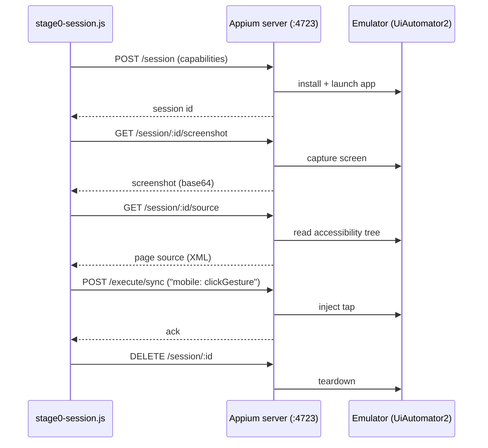

# Status — detailed engineering record

This is the full, detailed status history: every capability, what's
proven on real hardware vs. only unit-tested, real bugs found and
fixed (with root causes), and what's still open. The [README](../README.md)
carries only the current-state summary and points here for the rest.

CI (`test.yml`) runs the `capture/`, `generation/`, `engine/`,
`live-view/`, and `frontend/` suites on every push; the frontend
(`deploy-frontend.yml`) auto-deploys to GitHub Pages on every push that
touches it.

## Contents

- [Handoff to the dev team](#handoff-to-the-dev-team)
- [The "AI" question, answered precisely](#the-ai-question-answered-precisely)
- [Recording and script generation](#recording-and-script-generation)
- [LLM refinement (opt-in)](#llm-refinement-opt-in)
- [End-to-end wiring and frontend](#end-to-end-wiring-and-frontend)
- [Uploading an app directly](#uploading-an-app-directly)
- [Running the full loop locally](#running-the-full-loop-locally)
- [Public frontend URL](#public-frontend-url)
- [Engine session flow (spawn path)](#engine-session-flow-spawn-path)
- [Engine architecture: spawn vs. embedded (Android)](#engine-architecture-spawn-vs-embedded-android)
- [iOS support](#ios-support)
- [Remote provider: BrowserStack App Automate](#remote-provider-browserstack-app-automate-for-when-theres-no-local-device-host)
- [Running the Android engine directly (spawn path)](#running-the-android-engine-directly-spawn-path)

## Handoff to the dev team

**Ready now (BrowserStack path only):** upload flow, session/live-view/capture/generation pipeline, script output — all proven end to end on real hardware (see "Uploading an app directly" below). This is what's in scope for immediate use; the local-provider path (your own Android/iOS VM hosts) is implemented the same way but genuinely unverified, and isn't expected to be exercised until those VMs exist (Oct–Nov).

**Real backlog for the dev team to plan against, not blockers for using the BrowserStack path today:**
- **Concurrent sessions.** One recording session at a time, hard limit — a second upload while one's active gets a 409. No device pool yet.
- **TestOps embedding.** Per the original spec (`docs/PHOENIX_SPEC.md` §3), a generated script should save directly as a TestOps test case with no export/import step. Today it's written to `generated/<name>.test.js` on disk and shown in the browser with a copy button — the actual integration with TestOps's own test-case storage hasn't been built.
- **Real-device CI.** `test.yml` only runs unit tests (`capture/`, `generation/`, `engine/`, `live-view/`, `frontend/`) against fixtures and fakes — every "confirmed on real hardware" claim in this doc came from a manual session, not an automated gate. Worth a scheduled or gated real-device/BrowserStack CI job at some point.
- **Elements with no accessibility info at all** (custom-drawn Canvas/OpenGL UI) still fall back to a raw screen coordinate — the last-resort tier, and the most fragile one. Flagged as a TODO in `capture/recorder.js` since Stage 0; not needed for standard native widgets, which covers most apps.
- Smaller, already-noted items: upload cleanup only happens on the BrowserStack success path (see "Uploading an app directly"), and the public GitHub Pages frontend can't accept an upload itself (static hosting, no backend).

## The "AI" question, answered precisely

Phoenix's AI story is two deliberately separate acts, not one blurred claim:

- **Act 1 — Guided AI (shipped, working today).** A human still walks the flow once — the judgment calls (an OTP screen, a payment confirmation, "is this actually the right button") aren't reliably solvable by an agent yet, and guessing wrong there is the kind of mistake that costs trust fast (`docs/PHOENIX_SPEC.md` §2 — this is why v1 is guided recording, not autonomous, on purpose). What's AI here is everything *around* that human judgment: `capture/recorder.js` resolves the right locator, `generation/pipeline.js` infers what to assert from what visibly changed, and an opt-in local-LLM pass (`generation/llm.js`, `PHOENIX_USE_LLM=1`, Ollama) writes a better flow name and filters incidental noise — fails safe to the plain rule-based output if Ollama isn't running. The pitch: *a human's judgment, a machine's tedium removed.* Real, demoed end to end, defensible under questions.
- **Act 2 — Unattended AI (Phase 2 building blocks built, now reaching a live session).** Give the agent a goal in plain language and it reads the screen the way the guided version already does, decides the next action itself, and knows when to stop and hand back to a human rather than guess — `docs/PHOENIX_SPEC.md` §6. The three Phase 2 bullets each have a first implementation, built in isolation from the guided (Act 1) path so nothing here risks it:
  - **Grounded snapshot** — `generation/semantic-snapshot.js` turns a captured accessibility tree into a compact, ref-indexed text block an LLM can read directly (`[3] Button "Log In" (id: login_button)`), the mobile equivalent of the grounded ARIA-snapshot approach used by web agents. `buildFusedSnapshot()` adds the other half of that bullet — pairing a bounds-annotated version of the same text (`at 100,560 880x100`) with a real screenshot, so a multimodal-capable model can cross-check the two. Opt-in via `useVisualGrounding: true` on `executeSemanticAction()` (default off — text-only is cheaper and is what's been exercised so far); a screenshot-capture failure falls back to text-only rather than failing the action.
  - **Semantic action layer** — `generation/semantic-act.js` resolves `act("tap the Login button")`-style instructions against that snapshot via the local Ollama model, returning a concrete `{strategy, value}` locator (reusing the same selector shape `pipeline.js`'s `buildSelector` already consumes) when confident, or `{resolved: false, reason}` rather than ever guessing. **Real bug found and fixed on a live BrowserStack run:** a container element (e.g. a Compose tab control's `composeView`) can itself be non-clickable with no clickable ancestor of its own (its clickable descendants sit *below* it in the tree, not above) — a guaranteed no-op tap target that was still being offered to the model alongside a correctly-redirectable label, and got picked. Fixed by filtering such elements out of the tap-candidate list entirely.
  - **State-diff reporting → assertion inference** — `generation/semantic-diff.js` diffs two grounded snapshots and reports what appeared/disappeared; `generation/semantic-assertions.js` turns that into the same `{label, resourceId}` shape the guided path's `inferAssertions` already produces. Both `engine/semantic-act-executor.js` (every single action) and `engine/semantic-loop.js` (every step, stamped with its index) compute this automatically.
  - **Live execution** — `engine/semantic-act-executor.js` is the piece that actually reaches a real device: it takes one instruction, resolves it via `semantic-act.js` against the session's current screen, taps or types through the *same* WebDriver calls (`driver.$(selector).click()`/`.setValue()`) the guided path's generated scripts use, re-checks the element still exists immediately before acting, and reports the diff.
  - **`run-semantic-action.js`** — a standalone CLI (mirrors `run-session.js`'s shape) that starts a real session and runs exactly one instruction through `executeSemanticAction()`: `node run-semantic-action.js "tap the Login button"`. **Now proven on real hardware** — a real run against `my.yes.yes4g` on BrowserStack correctly resolved and tapped the real LOGIN button and reported the resulting screen change. Its first-ever run surfaced one real gap, now fixed: it read the screen immediately on session start, before the app was past its splash screen, and correctly refused to guess rather than act on it — `run-batch-executions.js` already had a startup-delay fix for exactly this, this CLI just hadn't gotten it yet. Fixed with the same `PHOENIX_STARTUP_DELAY_MS`-configurable wait; the next run succeeded.
  - **`POST /api/semantic-action`** (`frontend/semantic-action-endpoint.js`, gated behind `PHOENIX_ENABLE_SEMANTIC_API=1`) — runs an instruction against whatever session a tester already has open through the normal upload flow, rather than starting its own. Answers `200` with the resolved selector + diff on success, `422` when the action couldn't be resolved/failed, `409` if no session is active. Plain JSON over HTTP, so TestOps's actual stack (Python backend, JS/React frontend) can call it directly — `docs/examples/testops_semantic_action_client.py` is a ready-made starting point for the Python side. **Now proven on real hardware**: with a real upload-flow session active (a dealer login screen, `com.ytlcomms.ymca`), `curl -X POST http://localhost:8091/api/semantic-action -d '{"instruction": "tap the LOGIN button", "kind": "tap"}'` correctly resolved to the real `btSignIn` button, tapped it, and correctly reported a validation toast ("Please enter your User ID.") appearing — exactly right, since the username field was empty. A curl fired before the session was fully up correctly got `409`, confirming that guard works too.

  All six pieces are unit-tested (`generation/test/semantic-*.test.js`, `engine/test/semantic-act-executor.test.js`, `frontend/test/semantic-action-endpoint.test.js`) against fakes/fixtures, and **now also confirmed against real hardware** — both entry points (the CLI and the API) have each had a real successful run, closing out every item Phase 2 had listed as open. **Not wired into `run-session.js`/`session-manager.js`/the upload flow's own logic** — the guided-recording path doesn't call any of this, so none of it touches or re-risks that path. The experimental API endpoint still defaults off; dev-team adoption is a rollout decision now, not a "does it work" question. The pitch stays: *same trusted foundation, now walking the flow itself.*

  **Auto-heal — where Act 1 and Act 2 actually meet.** `engine/auto-heal.js`'s `resolveElementWithHealing()` is a fallback for a guided script's recorded selector: try it first (normal, fast, unchanged). Two distinct triggers fall back to healing, both explicitly requested — **the selector stops resolving** (an id got renamed), and **the selector still resolves but to the wrong element** because the underlying path/structure shifted, caught via an optional `expectedLabel` check against the found element's actual visible text. Either way, it falls back to resolving the step's human-readable description semantically against the current screen, via `resolveSemanticAction()`. Opt-in and not wired into generated scripts — a script has to deliberately call this instead of a plain `driver.$(selector)` for it to apply.

  **Phase 3 (goal → autonomous action loop) — R&D only, actively being hardened against real hardware.** `engine/semantic-loop.js`'s `runAutonomousLoop()` takes a goal ("log in and reach account settings"), decides one action at a time via the local model, executes it, feeds the result back in, and repeats — stopping the moment the model says the goal's done, asks to stop itself, an action fails, or a hard step cap is hit. Per spec §6, Phase 3 doesn't touch a customer app until proven against Phoenix's own internal apps first — that hardening is in progress against `my.yes.yes4g` on real BrowserStack hardware. Real bugs found and fixed so far, each from an actual failed run, each covered by a regression test reproducing the exact real screen/prompt shape:
  1. **Dead-end tap container** — same root cause as the semantic-action-layer bug above, first surfaced here.
  2. **Model typed a field's own label hint instead of the real value** — given a goal that correctly embedded a real phone number, the model typed the literal string it saw in the screen's own `(empty input near: "Yes Number")` annotation instead of the actual credential from the goal text. Fixed with an explicit prompt reminder distinguishing "which field is empty" from "what to type into it."
  3. **Model echoed the prompt's own example-format placeholders** — two consecutive "type" steps had `instruction` fields literally reading `"type ... into ..."` and `"type ... into [18]"` (the prompt's old literal `"..."` placeholders and the snapshot's own `[18]`-style ref-bracket notation, copied verbatim instead of a real description being written). Fixed by replacing the placeholder-shaped examples with concrete ones (`"tap the Login button"`, `"type the phone number into the Yes Number field"`) and adding an explicit anti-copying reminder.
  4. **Malformed "type" response with no text** — the model would occasionally choose `kind: "type"` and omit `"text"` entirely, reproduced on consecutive runs at the same step. Given one bounded retry with a sharper reminder before being treated as a genuine failure.
  5. **Shared resource-id, disguised by hint text, defeated the existing ambiguity guard** — an initial hypothesis, fixed but NOT the actual real-hardware root cause (kept and tested since it's a genuine latent bug, see below for what actually happened). `semantic-snapshot.js`'s existing ambiguity guard (flag any resource-id shared by more than one element as `ambiguousResourceId`) also required the element to have no `label` of its own, on the assumption only a genuinely blank field could collide this way — but an empty Android `EditText`'s *hint* text (e.g. "Password") is reported via the exact same `text` attribute a real value would use, which would wrongly exclude a genuinely-ambiguous field from the guard if two such fields were ever on screen simultaneously. Fixed by judging ambiguity purely on resource-id uniqueness, regardless of hint text.
  6. **The real root cause of the `edtCommon` failures: there was only ever ONE `edtCommon` field on screen, not two.** Reading the actual real-device page-source dumps (not just the error message) showed `my.yes.yes4g`'s login screen has exactly one `EditText` (`edtCommon`, currently holding "Yes Number"), plus two non-input `View`s labeled "PASSWORD" and "USE TAC" — tappable tabs for *choosing a login method*, not a second input field. No password field exists in the tree at all until one of those tabs is tapped. The loop's model went straight from "type the phone number" to "type the password" without ever tapping "PASSWORD" first, so `resolveSemanticAction()` had nothing to bind "type the password" to except the one field that already existed — correctly refused by the anti-clobber veto (bug 4/5's fix), but the loop still failed 3/3 because the right prior action (tap the login-method tab) was never taken.
  7. **A plain prompt reminder did not change the model's behavior.** The first fix attempt for bug 6 was a general instruction added to `decideNextAction()`'s prompt ("before typing a value, make sure a field for it is visible..."). Re-run on real hardware: failed identically, 3/3, same exact refused action every time — a general reminder up front is easy for a small local model to not connect to the specific situation it's in. Fixed properly by making the loop **retry with situated feedback** instead of relying on prompt wording alone: when `executeSemanticAction`'s `beforeAct` veto refuses an action, `runAutonomousLoop` no longer fails the whole loop on the first refusal — it feeds the exact refused `{instruction, kind}` and the exact refusal reason back into the *next* `decideNextAction()` call (a new `refusedAttempt` parameter, rendered as "your last proposed action was rejected because: ... do not propose that again"), bounded to `MAX_VETO_RETRIES = 2` extra attempts before giving up for real — mirrors the existing bounded-retry pattern already used for a "type" response missing `text`. This is a materially different, more reliable mechanism than bug 6's fix, not just a rewording of the same reminder.
  8. **A password field's own masked display text was used as a live selector, and went stale the instant it was used.** With bugs 1–7 fixed, a real run reached the genuine password field, typed into it, and read it back correctly (confirmed via page-source dump: `text="•••••••" password="true"`) — but then needed to act on that same field again (to retry a transient failure) and could never find it again, burning the rest of its step budget on `findElements` calls that returned `[]`. Root cause: once a password `EditText` has anything typed into it, UiAutomator2 reports its `text` attribute as the masked placeholder (e.g. `"•••••••"`), which `buildGroundedSnapshot()` treats exactly like a genuine label — and `toSelector()`'s existing "fall back to the element's own label/hint text" branch (the fix for bug 5) then built a live WebDriver `text` selector from those dots. That selector is only valid for the instant it was read: clearing and retyping the field changes the dot count (or empties it), so the exact selector just used can never match the field again. Fixed in two parts: `semantic-snapshot.js` now records a `secure: true` flag (from Android's `password="true"` attribute) on any such element; `semantic-act.js`'s `toSelector()` now skips the live-text strategy entirely when `secure` is set, falling through to the stable `xpath` (ambiguous case) or `resource-id` (unique case) instead — never the field's own live, mask-changing text.
  9. **No safety net against a model repeating an action that visibly does nothing — burned an entire 20-step budget on a real run (android17).** With bugs 1–8 fixed, a run typed the phone number correctly, then needed to tap the "PASSWORD" tab before the password field would exist — but instead proposed "tap the Yes Number field" (the field it had just filled) 15 times in a row. Each tap was a legitimate, successfully-executed WebDriver click (so the existing `beforeAct`-veto/`MAX_VETO_RETRIES` guard from bug 7, which only fires on an explicit refusal, never engaged), and `generation/semantic-diff.js`'s `diffToText()` correctly reported `"No visible change."` every single time — fed back into the model's own history on every step — but nothing forced the model to act on that signal; the prompt only lists "stuck in a loop" as a valid reason for the model to *choose* to stop. Fixed with a code-level guard rather than another prompt reword (bug 7 already showed prompt-only fixes don't reliably land): `runAutonomousLoop` now tracks consecutive successful steps whose `diffSummary` is exactly `"No visible change."`, and stops the loop outright (`stoppedBecause: "action-failed"`, reason names the repeated instruction) after 3 in a row, resetting the counter the moment a step produces real change. **Confirmed working on real hardware (android18):** the exact same "re-tap the already-filled Yes Number field instead of the PASSWORD tab" slip recurred, and the loop now stopped cleanly after 7 steps (3 consecutive no-ops) instead of running all 20 — the fix's actual job (fail fast and legibly) is proven; it does not by itself make the model tap the right tab every time, which remains occasional real-model nondeterminism on top of bug 6/7's already-fixed guidance, not a new resolver bug.

  **Android loop work is closed out for now** at this point: nine real bugs found and fixed (selector/resolver bugs 1–6 and 8, a prompt-reliability fix in 7, and a code-level stuck-loop backstop in 9), a genuine end-to-end login proven twice on real hardware (an invalid-credentials rejection and a successful login reaching the post-login screen), and a fast, legible failure mode for the one remaining nondeterministic model slip (tab-tap vs. re-tap) rather than a silent step-budget burn. Further Android hardening (the "Ask Sofia" conversation goal, the Add-ons listing goal, and the app's own auto-launch of OS Settings post-login) is parked, not abandoned — pick back up if/when there's a reason to. Attention now shifts to iOS.

  ### iOS loop — first real runs against `my.yes.yes4g` on BrowserStack (XCUITest, real device), bugs found

  10. **A mid-transition-animation snapshot produced a selector that went stale by the time it was used — 3/3 retries, same xpath, same failure (ios2).** The very first real run to tap "LOGIN" successfully (after fixing the goal text to name the "EN"/"ACTIVATE SIM"/"NEW TO YES?" decoys explicitly — see below) then failed to type the phone number at all: `findElement`/`findElements` resolved a `TextField` by xpath (iOS text fields commonly carry no accessibility id of their own, so `toSelector()` falls through to position-based xpath the way Android's ambiguous-resource-id fields do), but by the time `executeSemanticAction` tried to act on it, `element.isExisting()` came back false -- `"resolved element (...) is no longer on screen"` -- identically for all 3 attempts the existing `MAX_VETO_RETRIES` budget allows (this generic retry-on-any-failure path, originally written for bug 7's beforeAct vetoes, already covers any `result.success === false`, including this one). Root cause, visible directly in the page-source dump taken right after the "LOGIN" tap: it contained the OLD home screen's elements ("EN", "ACTIVATE SIM", "NEW TO YES?", the app-version button) **and** the NEW login form's elements (the "Yes Number" field, the PASSWORD/USE TAC tabs) **and** an already-open numeric keyboard, all simultaneously -- a snapshot caught mid-transition, before the home screen had finished being torn down. The selector built from that transient tree pointed at an xpath index that didn't exist a moment later once the transition settled and the tree reflowed. Fixed by adding a brief pause (`DEFAULT_TAP_SETTLE_DELAY_MS = 800`ms, configurable via `options.tapSettleDelayMs`, injectable `options.sleep` for tests) after any successful `"tap"` step, before the next iteration's `getPageSource()` -- not after `"type"`, since typing a character doesn't trigger a full-screen transition the way navigating to a new screen does. Not yet re-confirmed on real hardware (iOS's first run to get past the home screen at all was ios2; this fix targets what stopped it from going further, but hasn't itself been exercised on a live device yet).
  11. **(non-bug, fixed by goal wording, not code) The home screen has a real "EN" language-toggle button that looks just as tappable as "LOGIN."** The first iOS run (ios1) picked "EN" over "LOGIN" and re-tapped it 4 times with zero effect (caught cleanly by bug 9's stuck-loop guard in 5 steps, not a budget burn) -- the goal text for that run didn't explicitly name "LOGIN" as the target or "EN"/"ACTIVATE SIM"/"NEW TO YES?" as decoys, the same class of goal-wording gap documented earlier for Android (the home-landing-screen and FORGOT PASSWORD-decoy non-bugs above). Fixed by naming the decoys explicitly in the goal text, mirroring the pattern already proven on Android; ios2 (same goal plus this fix) correctly tapped "LOGIN" on the first attempt.

  New iOS findings so far, not yet bugs needing a fix: the app's own version button on iOS reads `"v19.3.12 "` (a newer build than the Android side's) and the iOS accessibility tree uses `XCUIElementType*` tag names throughout (`XCUIElementTypeTextField`, `XCUIElementTypeButton`, etc.) rather than Android's `android.widget.*` -- both already handled transparently by the existing platform-aware code, called out here only as a sanity-check record, not a gap.

  Confirmed working end to end on real hardware so far: tap Login → type the Yes Number field (correct value) → tap the PASSWORD tab (correct clickable-ancestor redirect) → type the password (correct value, properly masked in reports) → tap Login (submitted) → correctly handle an "Invalid username/password" dialog by dismissing it and returning to a clean login screen. A matching CLI, `run-semantic-loop.js`, exists: `node run-semantic-loop.js "log in and reach account settings"`.

  **Milestone reached: a confirmed successful end-to-end login on real hardware**, with bugs 1–8 all fixed. A run against `my.yes.yes4g` on real BrowserStack hardware (goal: tap LOGIN → tap the PASSWORD tab → enter the phone number → enter the password → tap LOGIN to submit, explicitly told not to tap the FORGOT PASSWORD/RESET PASSWORD decoys) tapped LOGIN on the home screen, correctly navigated the PASSWORD-vs-TAC tab choice, entered a verified-valid phone number and password, correctly avoided the FORGOT PASSWORD decoy this time, tapped the real submit LOGIN button, and the app accepted the credentials — advancing to a post-login onboarding/coach-mark carousel screen that only appears after a successful login (also correctly handling an Android system permission dialog along the way). The run still reported `max-steps-reached` rather than `goal-achieved`, but that's a goal-scope gap, not a login failure: the goal text only covered "log in," so once logged in the model had no defined stopping point and kept trying to click through the onboarding carousel's slides until its step budget ran out. Next (not yet done): extend the goal text to define success as reaching the logged-in home screen (dismissing/skipping onboarding if shown), so a run can report `goal-achieved` rather than hitting the step cap after a login that already succeeded.

  Worth knowing for anyone asking "hasn't this been done before": Appium's own team ships [`appium-mcp`](https://github.com/appium/appium-mcp) with the same accessibility-id-first locator priority we use, and a few early/experimental projects ([`headspinio/appium-llm-plugin`](https://github.com/headspinio/appium-llm-plugin), Kobiton's commercial "Appium AI") do natural-language element resolution too — but none combine a compact text-only snapshot, "return unresolved rather than guess" semantics, and reuse of one deterministic selector pipeline across both the guided and semantic paths, inside a single guided-then-semantic product story. Full comparison, including where we're honestly behind on maturity: [`docs/COMPETITIVE_LANDSCAPE.md`](COMPETITIVE_LANDSCAPE.md).

## Recording and script generation

**Session engine.** `engine/session.js` (Android, UiAutomator2) and `engine/ios-session.js` (iOS, XCUITest) each start a real Appium session and expose the same lifecycle: session start → screenshot → accessibility tree → tap → clean teardown. Android needs no project-level Appium version pin (Appium and its drivers are installed globally via the `appium` CLI, not as `engine/package.json` dependencies); iOS capabilities target either a built `.app`/`.ipa` or, for smoke-testing the plumbing itself, an app already on the Simulator by bundle id (`appium:bundleId`).

**Locator resolution.** `capture/recorder.js` resolves a tap coordinate to a real locator — resource-id/name, then accessibility-id (content-desc/name), then text/label/value, then a computed structural xpath, then raw coordinates as a last resort — by walking the accessibility tree and picking the smallest element whose bounds contain the tap point. Reads either platform's tree shape (Android's `resource-id`/`content-desc`/`text`/single `bounds` string, or iOS's `name`/`label`/`value`/`x`,`y`,`width`,`height`) with no upfront platform flag needed at this layer. Verified with a test suite (`capture/test/`) against both a real captured Android tree and a real captured iOS/XCUITest tree, not synthetic XML alone. `live-view/server.js`'s tap-forwarding path is wired to it, using the device's real window size (not the rendered image's) to convert a tester's on-screen tap ratio into device pixels, and injects the tap via each platform's own extension (`mobile: clickGesture` on Android, `mobile: tap` on iOS — neither platform's driver implements the legacy JSONWP touch-actions endpoint anymore).

**Script generation.** `generation/pipeline.js` turns a captured session into a runnable WebdriverIO script — entirely rule-based by default, no LLM call required: `inferTestName` names the flow from the first screen's title, `inferAssertions` diffs each step's before/after accessibility tree and proposes an assertion per label that newly appeared, `extractParameters` lifts typed values into named test data from the field's own locator, and `synthesizeCode` renders it all as a `describe`/`it` block with `waitForDisplayed`/`click`/`setValue` calls and `expect(...).toBeDisplayed()` assertions — falling back to a flagged raw-coordinate tap only when locator resolution couldn't resolve a stable one. A `platform` option switches selector syntax and the tap extension between Android's `UiSelector`/`mobile: clickGesture` and iOS's `-ios predicate string:`/`mobile: tap`. Verified with a test suite (`generation/test/`, 17 tests) covering both platforms, sample output below.

`inferAssertions` also collapses repeated labels within a single step to one assertion each: nested accessibility nodes commonly expose the same text at multiple bounds (a button and its inner label child both reading "Screen Time"), which the underlying `(resourceId, label, bounds)` diff key correctly treats as distinct elements — needed for the cross-screen "seen" tracking described in the function's own comments — but which read as pure repetition when each one produced its own near-identical `toBeDisplayed()` check in the same step. Found on a real 15-step iOS Settings recording (178 assertions, several outright duplicated); fixed by tracking already-asserted labels per step while leaving the cross-step dedup logic untouched.

<details>
<summary>Sample generated script (login flow, 3 recorded steps)</summary>

```js
// Generated by Phoenix from a recorded session — 3 step(s).
// Locators use the priority resolved during capture: resource-id > accessibility-id > text > xpath > coordinate.

// Test data — lifted from values typed during recording.
const username = "prabath@example.com";
const password = "hunter2";

describe("login", () => {
  it("login", async () => {
    // Step 1
    const step0El = await $("android=new UiSelector().resourceId(\"com.phoenix.demo:id/username_input\")");
    await step0El.waitForDisplayed();
    await step0El.click();
    await step0El.setValue(username);

    // Step 2
    const step1El = await $("android=new UiSelector().resourceId(\"com.phoenix.demo:id/password_input\")");
    await step1El.waitForDisplayed();
    await step1El.click();
    await step1El.setValue(password);

    // Step 3
    const step2El = await $("android=new UiSelector().resourceId(\"com.phoenix.demo:id/login_button\")");
    await step2El.waitForDisplayed();
    await step2El.click();
    await expect($("android=new UiSelector().resourceId(\"com.phoenix.demo:id/welcome_text\")")).toBeDisplayed(); // "Welcome" appeared
  });
});
```
</details>

## LLM refinement (opt-in)

**Complete, verified on real hardware end to end.** `generation/llm.js` refines `inferTestName`'s and `inferAssertions`' output via a local Ollama instance (`PHOENIX_OLLAMA_HOST`/`PHOENIX_OLLAMA_MODEL`, see `.env.example`) — a better flow name summarizing the whole recorded path instead of just the first screen, and filtering out incidental assertions (a clock or ad banner ticking over) a plain accessibility-tree diff can't tell apart from a meaningful change. It's designed to never break the pipeline: any failure (Ollama not running, a timeout, a malformed response) is caught and falls back to the exact v1 rule-based value, logging a warning. Verified both ways: with Ollama absent (clean fallback, no crash, unchanged v1 output) and with Ollama + `llama3` running against a real 11-step recorded flow (no fallback triggered — produced `accessibility_clock_talkback_explore` as the flow name, a real whole-flow summary rather than the first-screen-title heuristic, and kept 13 of the diff's proposed assertions). Opt in with `generateScript(steps, { useLlm: true })`, or `PHOENIX_USE_LLM=1` for `run-session.js`; the default stays the unrefined v1 rule-based output, which remains a complete result on its own.

## End-to-end wiring and frontend

**Complete, proven on a real device with a real multi-step flow.** `run-session.js` at the repo root wires all four pieces into one live recording session: starts a real Appium session (Android or iOS, via `PHOENIX_PLATFORM`), starts `live-view`'s WebSocket server against it with a `SessionRecorder` attached, and on `"stop"` hands the recorded steps to `generation/pipeline.js`, writes the resulting script to `generated/<test-name>.test.js`, and sends it back over the socket as a `script-generated` message. A real Android run against ApiDemos (home screen → "Views" submenu → "Animation" demo screen, 2 real taps) surfaced and fixed two real bugs: list-row selectors needing `resourceId` + `text` combined to disambiguate (shared row-template ids), and assertion diffing needing to key on `(resourceId, text, bounds)` rather than text alone (two different elements coincidentally sharing a label across screens). A real iOS run (Safari, launched by bundle id, 2 taps) confirmed the same wiring on the XCUITest path — see the iOS section below.

**Real front-end complete.** `frontend/index.html` (served by `frontend/server.js`, no build step, vanilla JS) is the actual tester-facing recording UI — replaces `live-view/test-client.js`'s simulated tester with a real live device mirror: it renders each polled screenshot, lets the tester click directly on the image to tap (converting the click position to a device coordinate ratio automatically), has a text field for typed input, a live list of recorded steps, a "Stop & Generate Script" button, and displays the generated script inline with a copy button once the session finishes.

## Uploading an app directly

**Confirmed end to end on real hardware, for the BrowserStack provider; local-provider support is wired but only reaches an Appium server on the same machine, not yet exercised.** Originally, the app under test was fixed by an env var (`PHOENIX_STAGE0_APP_PATH`/`PHOENIX_IOS_APP_PATH`/`PHOENIX_BROWSERSTACK_APP_URL`) before `run-session.js` even started — there was no way for a tester to pick a file once the page was open, unlike TestOps proper, where a tester uploads a `.ipa`/`.apk` directly. `frontend/index.html` now opens on an upload screen (drag-and-drop or click to choose a `.apk`/`.ipa`) instead of connecting immediately; the frontend posts it as `multipart/form-data` to a new endpoint, `POST /api/sessions` (`frontend/upload-session.js`), which:

- saves the upload to `frontend/uploads/`,
- figures out the platform from the file extension (`.apk` → Android, `.ipa` → iOS; a `platform` form field can override this if ever needed),
- under `PHOENIX_APPIUM_PROVIDER=browserstack` (the priority path — TestOps is already tightly integrated with BrowserStack, so this needed no new infrastructure, just one more hop): calls `engine/browserstack-upload.js`'s existing `uploadApp()` on the saved file to get a `bs://` URL, then deletes the local copy,
- under the local provider: passes the saved file's own path through as `appium:app` directly — this only works when `frontend/server.js` and the Appium server share a filesystem (the same constraint `PHOENIX_STAGE0_APP_PATH`/`PHOENIX_IOS_APP_PATH` already have; an upload doesn't relax it). This is the path for TestOps's own Android VM and the planned AWS iOS VM once those are Appium hosts in their own right, not yet exercised against either.
- starts a session via a new `engine/session-manager.js` (the orchestration extracted from `run-session.js`'s original `main()`, so the boot-once CLI flow and this on-demand one share one implementation) with that app reference as a `capabilityOverrides` argument, overriding the env-var default for just this session,
- responds with the started session's live-view port, and the page connects its WebSocket to it exactly as before.

Only one recording session runs at a time — a second upload while one's in progress gets a 409, since today's live-view server binds a single fixed port and `capture/recorder.js` assumes one active driver; a real device-pool (concurrent sessions, one port each) is a bigger follow-on, not part of this. Uploaded files are deleted after a successful BrowserStack hand-off, or left in `frontend/uploads/` (gitignored) on the local-provider path/on error, for now.

The env-var-configured flow (`PHOENIX_STAGE0_APP_PATH` + `node run-session.js` before opening the page) still works completely unchanged — `run-session.js` is now a five-line wrapper around `engine/session-manager.js`'s `startRecordingSession()` with no app override, so nothing about that path's behavior moved.

**This upload endpoint only exists on a self-hosted `frontend/server.js`.** The public GitHub Pages deploy (below) serves `index.html` as a static file with no backend behind it at all — `POST /api/sessions` has nowhere to land there. Uploading a file only works when you're running `node frontend/server.js` yourself (or pointing the public page at a self-hosted backend that also serves this endpoint, which it doesn't today — the public page still assumes a pre-started `run-session.js` reachable at `?host=&port=`).

Verified with a unit test suite (`frontend/test/`, 7 tests, and `engine/test/session-manager.test.js`, 4 tests) covering platform detection, the concurrency guard, capability-override wiring for both providers, and error responses — against fake session/upload/provider modules, no real network or Appium session. **And confirmed against a real BrowserStack account with a real tester's browser end to end:** dragging `BitBarSampleApp.ipa` into the upload screen below, with only `PHOENIX_APPIUM_PROVIDER=browserstack` + BrowserStack credentials exported (no `PHOENIX_BROWSERSTACK_APP_URL` set beforehand — that's the whole point) started a real session on a real BrowserStack device and dropped straight into the live mirror.


A real 4-tap recording against the biometrics screen from that same session generated this:

<details>
<summary>Sample generated script, from the upload flow (BitBar Sample App, biometrics screen, 4 recorded steps)</summary>

```js
describe("bitbar_sample_app", () => {
  it("bitbar_sample_app", async () => {
    // Step 1
    const step0El = await $("~Biometric authentication");
    await step0El.waitForDisplayed();
    await step0El.click();
    // ...16 assertions on the screen's labels appearing, including:
    await expect($("-ios predicate string:label == \"Authentication status title WAITING\" OR value == \"Authentication status title WAITING\"")).toBeDisplayed();

    // Step 2 — tapped an element with no accessible name/label at all
    const step1El = await $("~");
    await step1El.waitForDisplayed();
    await step1El.click();

    // Step 3 — same
    const step2El = await $("~");
    await step2El.waitForDisplayed();
    await step2El.click();

    // Step 4 — also unlabeled, fell back to a structural XPath
    const step3El = await $("/AppiumAUT[1]/XCUIElementTypeApplication[1]/.../XCUIElementTypeOther[3]");
    await step3El.waitForDisplayed();
    await step3El.click();
    await expect($("-ios predicate string:label == \"Authentication status title FAILED\" OR value == \"Authentication status title FAILED\"")).toBeDisplayed(); // real state change: WAITING -> FAILED
  });
});
```
</details>

The `WAITING` → `FAILED` assertion is real inferred state — the app's own authentication status label actually changed between steps, and `inferAssertions` caught it correctly. Steps 2-4's weak locators are a real gap, not a recording error — see "What's still open" below.

This surfaced one real bug along the way, now fixed: `remote-provider.js`'s `buildCapabilities()` validated `PHOENIX_BROWSERSTACK_APP_URL` unconditionally, even when `capabilityOverrides` already supplied a per-session `appium:app` — which is exactly what the upload path does after calling `uploadApp()`. Every upload failed immediately with "requires PHOENIX_BROWSERSTACK_APP_URL" until that validation was changed to check `overrides["appium:app"]` first. Covered by a new regression test in `engine/test/remote-provider.test.js`.

**What's still open:**
- **Local-provider upload path** (Android VM, planned AWS iOS VM) is implemented identically to the BrowserStack path but not yet run against a real local Appium host reachable from `frontend/server.js` — the two are expected to be co-located once those VMs exist, but that's unverified.
- **One session at a time.** A concurrent-session device pool (matching TestOps's real device-farm model) is a real follow-on, not started.
- **Upload cleanup on the local-provider path** — files in `frontend/uploads/` are only deleted after a successful BrowserStack hand-off; a local-provider run or a failed upload leaves the file behind today.
- ~~Locator quality on elements with no accessible label~~ **Root-caused, fixed, and re-confirmed on real hardware.** Two of the four taps in the first biometrics recording resolved to an unusable empty accessibility-id (`~""`, nothing after the tilde) instead of falling through to a real locator. `capture/recorder.js`'s `resolveElementAtCoordinate()` chose the accessibility-id strategy based on a plain truthiness check on the raw `name`/`content-desc` attribute — but a whitespace-only value (e.g. `name="   "`) is truthy in JS, so it was accepted as a "real" identifier instead of being treated as absent and falling through to text/xpath as designed. Fixed by trimming before the truthiness check, covered by a new test in `capture/test/`. **Re-recording the same app after the fix** (a real 28-step BrowserStack session, not a replay) confirmed it: zero empty accessibility-id selectors anywhere in the output — every tap either resolved a real `~<name>` or correctly fell through to a structural xpath.
- ~~Assertion on an empty/invisible label~~ **Also root-caused and fixed, found in that same 28-step re-recording.** One assertion read `expect($(...label == ""...)).toBeDisplayed(); // "" appeared` — a real, non-empty label that nonetheless displays as nothing. The cause: iOS accessibility containers can roll up a child's label as a **zero-width space** (`​`), which is non-empty and truthy in JS, and — unlike ordinary whitespace — `String.prototype.trim()` doesn't strip it either, so it survived both `capture/recorder.js`'s and `generation/pipeline.js`'s existing whitespace checks as a "real" value. Fixed by adding a shared `isBlank()`/`cleanLabel()` check (in `generation/pipeline.js`, and the equivalent inline in `capture/recorder.js`) that strips zero-width space/non-joiner/joiner and the BOM/ZWNBSP before deciding whether a value counts as blank, so a rolled-up-empty label is skipped entirely (as an assertion source) or treated as absent (as a locator candidate) instead of appearing as a visually-empty result. Covered by new tests in both `capture/test/` and `generation/test/` reproducing the exact character; not yet re-confirmed against a fresh recording of this specific app screen (the fix landed after that 28-step session).
- **The public GitHub Pages frontend still can't upload** (see above) — it only works against a pre-started session today.

## Running the full loop locally

**Option A — upload the app through the page (no env var, matches TestOps's own flow):**

```bash
cd frontend && npm install && cd ..
node frontend/server.js
```

Open **http://localhost:8091/**, drag in a `.apk`/`.ipa`, and click "Start recording session" — Phoenix uploads it (to BrowserStack, or uses it directly under the local provider) and connects you straight into the live device mirror. See "Uploading an app directly" above for what's actually happening.

**Option B — the original env-var-configured flow**, with the emulator + Appium server already running (see "Running the Android engine directly" near the bottom of this doc for one-time setup):

```bash
# terminal 4 — starts the session, live-view server, and waits for a tester
export PHOENIX_STAGE0_APP_PATH=~/Downloads/apidemos.apk
node run-session.js

# terminal 5 — serves the recording UI, with ?port=8090 so it skips the upload screen
node frontend/server.js
```

Then open **http://localhost:8091/?port=8090** in a browser: you'll see the live device mirror, and can tap directly on it to record a real flow, type into fields, and stop to see the generated script.

To exercise the loop without a browser (e.g. in CI, or to test a specific tap sequence programmatically), `live-view/test-client.js` still works the same way — a scripted stand-in for a tester, configurable via `PHOENIX_TAP_SEQUENCE`:

```bash
node live-view/test-client.js
```

## Public frontend URL

`frontend/index.html` is also deployed via GitHub Actions (`.github/workflows/deploy-frontend.yml`) to GitHub Pages on every push to `main` that touches `frontend/`, so it has a stable public URL instead of needing `node frontend/server.js` run locally every time:

**https://prabathkumar.github.io/phoenix/**

**This deploys the static page only — it still needs a Phoenix backend to talk to.** The page connects, in your own browser, to `run-session.js`'s live-view WebSocket. Two ways to use it:

- **Backend on the same machine as your browser (the normal case):** just open the public URL — it defaults to `ws://localhost:8090`, and browsers treat `localhost` as a secure-context exception, so an `https://` page connecting to `ws://localhost` works with no extra setup. Start `run-session.js` locally as usual, then open the public URL instead of running `frontend/server.js`.
- **Backend on a different machine:** tunnel `run-session.js`'s port (e.g. `ngrok http 8090`) and open the public URL with `?host=<tunnel-host>&port=<tunnel-port>`.

**One-time setup required** (can't be done from a git push — a repo owner needs to flip this once): in the repo's GitHub Settings → Pages, set **Source** to **GitHub Actions**. Until that's set, the workflow will run but the page won't be reachable at the URL above.

## Engine session flow (spawn path)

The core session lifecycle the spawn path (`stage0-session.js`, `run-session.js`) builds on, end to end against a local emulator. The embedded path (see below) reaches the same four milestones — session start, screenshot, accessibility tree, tap, teardown — through direct in-process driver calls instead of this HTTP round trip; the sequence below shows the spawn path specifically, since that's what `run-session.js` and every product entry point currently use.



## Engine architecture: spawn vs. embedded (Android)

**Complete.** `engine/embedded-session.js` runs `appium-uiautomator2-driver` **in-process** — no spawned `appium` server, no separate process, no WebDriver-over-HTTP round trip to our own server. `engine/embedded-session-stage0.js` re-runs the exact engine-session milestone (session start → screenshot → accessibility tree → tap → teardown) through it, calling the driver's own command methods directly (`getScreenshot()`, `getPageSource()`, `mobileClickGesture()`) instead of going through webdriverio's `remote()` client.

Two architecturally different ways to talk to the driver now coexist in `engine/` on purpose:

| | `stage0-session.js` / `run-session.js` (spawn) | `embedded-session*.js` (embed) |
|---|---|---|
| Process model | Separate `appium` CLI process, talked to over HTTP | Same Node process, direct method calls |
| Driver install | `appium driver install uiautomator2` (CLI-managed) | `npm install` in `engine/` (normal npm dependency) |
| `appium`/`appium-uiautomator2-driver` in `engine/package.json` | Must **not** be listed (CLI manages its own, causes ERESOLVE if pinned here too) | **Must** be listed (no CLI involved, this is how they get installed) |
| What's proven | Real device, full multi-step flow, real front-end | **Confirmed on real hardware** — full milestone (session start → screenshot → accessibility tree → tap → teardown) run against a real emulator (ApiDemos, `emulator-5554`), no `appium` server process involved |

Full vendoring/forking of the driver's own source was scoped and deliberately not done: `appium-uiautomator2-driver`'s exports are entangled with the `appium` package's own subpath exports rather than the more decoupled `@appium/base-driver`, so a real fork would mean also forking `appium-android-driver` and `@appium/base-driver`'s session/capability machinery — a multi-week effort with no upstream precedent for doing it this way, for no clear payoff yet. Embedding gets the actual goal (no separate process, no extra HTTP hop) without that cost; revisit vendoring only if a concrete need shows up that embedding can't satisfy (e.g. a protocol extension the driver itself doesn't expose).

```bash
cd engine
npm install
export PHOENIX_STAGE0_APP_PATH=~/Downloads/apidemos.apk
npm run embedded-stage0   # needs the emulator running — no appium server needed
```

**Verified against a real emulator** — `npm run embedded-stage0` completed all four milestone steps end to end with no `appium` server running: session created (`AndroidUiautomator2Driver` in-process, session id assigned directly), screenshot captured (72,552 bytes base64), accessibility tree captured (13,600 chars), tap injected via `mobileClickGesture`, and teardown ran cleanly (UiAutomator2 server instrumentation exited with code 0, port forward removed, hidden-api policy restored). The Appium fork work (embed v1) is closed.

Next (open, not yet scheduled): decide whether `run-session.js`'s full pipeline should migrate from the spawn path to the embedded path — not required now since both are proven, but embedding removes a process and an HTTP hop, which matters more once this needs to scale to many concurrent sessions.

Next (product side): harden the live-view/generation edge cases further (typed-input flows, back-navigation, screens with no accessible labels).

## iOS support

`engine/ios-session.js` and `engine/ios-stage0-session.js` mirror the Android spawn path against `appium-xcuitest-driver` instead of `appium-uiautomator2-driver` — same architecture, different driver, different capability shape (`appium:app` is a `.app`/`.ipa`, not a `.apk`; `appium:deviceName`/`appium:platformVersion` select an installed Simulator rather than a fixed AVD name). `run-session.js` picks the platform via `PHOENIX_PLATFORM` (`android` default, or `ios`).

The parts of the pipeline that assumed Android's UiAutomator2 tree shape now handle XCUITest's shape too: `capture/recorder.js`'s `resolveElementAtCoordinate` and `generation/pipeline.js`'s `extractLabels` read either attribute set (Android's `resource-id`/`content-desc`/`text`/single `bounds` string, or iOS's `name`/`label`/`value`/`x`,`y`,`width`,`height`), and `generation/pipeline.js`'s selector/tap-extension generation (`buildSelector`, `buildResourceIdSelector`, `synthesizeCode`) takes a `platform` option that switches between Android's `UiSelector`/`mobile: clickGesture` and iOS's `-ios predicate string:`/`mobile: tap`.

**Confirmed on real hardware.** `npm run ios-stage0` ran end to end against a real booted Simulator (`iPhone 15 Pro`, iOS 17.0), launching Safari by bundle id (`appium:bundleId`, see `engine/ios-session.js` — useful for smoke-testing the session/driver layer without a custom app build first): session started, a real XCUITest accessibility tree captured (22,539 chars — confirmed the exact shape `capture/recorder.js` and `generation/pipeline.js` were built to parse: `name`/`label`/`value`/`x`/`y`/`width`/`height` attributes, no `resource-id` or single `bounds` string), a screenshot captured, a tap injected via `mobile: tap`, and teardown ran cleanly. Combined with the unit tests against real XCUITest-shaped fixtures (`capture/test/`, `generation/test/`), iOS is now proven at both the engine layer and the capture/generation layer — the same two layers Android needed before being called complete. **Full pipeline also confirmed.** A real `run-session.js` recording (`PHOENIX_PLATFORM=ios`, launching Safari by bundle id) recorded 2 taps and generated a runnable script: one tap correctly resolved to `~favoritesItemIdentifierHeader` (the accessibility-id strategy, `~value`, identical syntax to Android since it's cross-platform in WebdriverIO), the other correctly fell back to a structural xpath when the tapped element had no name/label — exactly the designed fallback behavior. iOS is now proven at the same bar Android was: engine layer and full record-to-script pipeline both confirmed on real hardware (a real booted Simulator). Not yet done: a recording against a real custom `.app` (rather than Safari) to see assertions/parameters populate against an app with real navigation — Safari's static start page didn't produce screen changes between the two arbitrary taps used here, so 0 assertions in this run reflects the test app choice, not a gap in the assertion-diffing logic (already unit-tested separately).

**iOS typed-input path — fixed after two attempts, confirmed live.** `live-view/server.js`'s `"type"` handler originally drove XCUITest through `driver.keys()` (W3C key actions), which WebDriverAgent on Appium 3 rejects for plain character input (`Key Down action 's' must have a closing Key Up successor`) — reproduced live against a real Simulator recording session. First fix attempt routed iOS typing through the `mobile: type` extension instead; also confirmed live to fail, but differently — this xcuitest-driver build doesn't implement that extension at all (`405 Method is not implemented`). The fix that actually lands: `elementSendKeys`/`elementClear` against the currently-focused element (found via the standard `getActiveElement`), a separate, older WebDriver endpoint XCUITest implements directly rather than through W3C actions, so it hits neither broken path. Android is unaffected throughout and keeps the plain `driver.keys()` path.

That fix surfaced one more real edge case live: `getActiveElement()` only resolves to a usable element when XCUITest considers a field genuinely keyboard-focused — tapping a non-editable row (a plain Settings cell, a disabled control) leaves nothing focused, and WDA's resulting "no such element" response was crashing the whole `run-session.js` process instead of failing just that one keystroke. Now handled the same way as typing before any tap is recorded: reports a `type-error` back to the tester ("tap directly into a text field that brings up the on-screen keyboard") and keeps the session alive. See `live-view/server.js` and its test suite (`live-view/test/`, 5 tests — dedicated cases for the working iOS path, confirming neither `driver.keys()` nor `mobile: type` is ever called and `elementClear`/`elementSendKeys` receive the expected calls, and for the unfocused-field case not crashing the session).

**Confirmed end to end on real hardware.** A real 17-step `run-session.js` recording against a booted Simulator tapped into an Apple ID sign-in field and typed into it: the generated script correctly emitted `step11El.setValue(username)` against the `~username-field` accessibility-id locator, with `username = "test"` lifted into named test data by `extractParameters` — the full tap → type → parameter-extraction pipeline working on iOS the same way it already did on Android. iOS typed input is no longer an open item.

**Precondition, not a Phoenix bug — recorded apps need accessibility identifiers.** A real 18-step recording against a custom SwiftUI app (`org.stratalang.orders`) resolved every single tap to the same `~Orders` locator and produced zero assertions, regardless of where on screen the tester tapped. `capture/recorder.js`'s `resolveElementAtCoordinate` picks the smallest accessible element whose bounds contain the tap point — that logic is correct and already unit-tested; the app's own XCUITest accessibility tree simply exposed only one accessible node on screen (the nav title/root view, named "Orders"), with none of its rows, buttons, or fields carrying their own `.accessibilityIdentifier(...)`. Without distinct accessible elements underneath, there is nothing smaller for any resolution strategy to find, on any tool built on XCUITest, not just Phoenix. **Takeaway for anyone recording a custom app**: the app's interactive views need explicit accessibility identifiers (SwiftUI's `.accessibilityIdentifier("...")`, or UIKit's `accessibilityIdentifier` property) before a recording will produce distinguishable locators or meaningful assertions — confirm first with Xcode's Accessibility Inspector (Xcode → Open Developer Tool → Accessibility Inspector, hover the app's elements on the booted Simulator) that individual controls report their own identifiers, not just the screen as a whole.

## Remote provider: BrowserStack App Automate, for when there's no local device host

TestOps running on Linux VMs is a hard wall for iOS specifically — Xcode and the iOS Simulator only run on macOS, and Apple's license rules out virtualizing macOS on non-Apple hardware, so there's no way to stand one up directly on a Linux host. Standing up a dedicated Mac (owned or cloud-rented) works but is a real ongoing cost on top of whatever's already paid for; `engine/remote-provider.js` lets an already-licensed BrowserStack App Automate account be reused instead, with **no changes needed anywhere else in the pipeline** — `capture/`, `generation/`, and `live-view/` only ever see a normal WebdriverIO `Browser`, regardless of where its session actually runs. This falls directly out of a decision already made early on: `engine/session.js` and `engine/ios-session.js` always talked to Appium over a plain hostname/port rather than assuming `localhost`, so "point this at a different Appium-compatible endpoint" was already possible — BrowserStack just needed its own connection shape (HTTPS, a fixed hub hostname, account auth via a `bstack:options` capability block) and app-reference format (an uploaded app's `bs://` URL, not a local file path or a bundle id already installed on a Simulator/emulator) taught to it, via `PHOENIX_APPIUM_PROVIDER=browserstack`.

One real tradeoff: BrowserStack App Automate runs real physical devices for iOS, not Simulators — `PHOENIX_IOS_DEVICE_NAME`/`PHOENIX_IOS_PLATFORM_VERSION` then mean "which of BrowserStack's real-device catalog to request," not "which Simulator to boot."

See `docs/SETUP.md`'s "2b. Or: skip your own device host entirely and use BrowserStack" for the full walkthrough, including `engine/browserstack-upload.js` (a one-time-per-build helper for getting an app its `bs://` URL, since BrowserStack has no concept of "a file already on this machine"). Verified with a unit test suite (`engine/test/`, 9 tests) covering both providers' connection config and capability shape, including the required-env-var error messages, and now also confirmed end to end against a real BrowserStack App Automate account: uploading BrowserStack's own `BitBarSampleApp.ipa` (`bitbar/test-samples`), running a full recording session against it on real hardware, and generating a correct script from real captured taps confirmed the provider, install, session, live-view, and generation layers all work correctly together. That run also isolated a separate problem seen with an internal app (Rope): a 404 on launch there is Rope's own backend being unreachable from BrowserStack's real-device network, not a Phoenix or BrowserStack integration issue — since a public app with no backend dependency rendered and recorded correctly on the same setup.

That backend-reachability gap is what BrowserStack Local (a tunnel binary that gives BrowserStack's remote devices a route into a private/internal network) is for. It's only needed for an app-under-test whose backend isn't reachable from the public internet (Rope, for instance) — a self-contained app with no such backend dependency (BrowserStack's own sample apps, including the biometrics screens in `BitBarSampleApp.ipa`) runs on BrowserStack App Automate with **no Local tunnel at all**, exactly as already verified above.

`engine/remote-provider.js` now supports Local for when it *is* needed: with a `BrowserStackLocal` tunnel already running separately (Phoenix doesn't start or manage that process — see BrowserStack's own docs for the binary), set `PHOENIX_BROWSERSTACK_LOCAL=1` (and `PHOENIX_BROWSERSTACK_LOCAL_IDENTIFIER` if running more than one tunnel at once) to route that session's `bstack:options` through it; leave both unset for anything that doesn't need it. Verified via `engine/test/`'s unit suite (2 more tests covering the flag's on/off/identifier shape); not yet exercised against a real internal backend end to end.

## Running the Android engine directly (spawn path)

One-time setup and a minimal session against just `engine/`, with no capture/generation/live-view involved — useful to confirm the engine layer works in isolation before running the full loop above.

```bash
# one-time setup
npm i -g appium
appium driver install uiautomator2
sdkmanager --sdk_root=$ANDROID_HOME "build-tools;34.0.0"   # provides aapt2

# terminal 1 — leave running
appium

# terminal 2 — leave running
emulator -avd <your_avd_name>

# terminal 3
cd engine
npm install
export PHOENIX_STAGE0_APP_PATH=/absolute/path/to/some-app.apk
npm run stage0
```

Do not declare `appium` or `appium-uiautomator2-driver` in `engine/package.json` for this path — Appium 3.x's drivers require `appium@^3.0.0-rc.2` as a peer, and pinning an older `appium` there causes an ERESOLVE conflict. The CLI manages driver installation itself. (The embedded path, described earlier under "Engine architecture: spawn vs. embedded", has the opposite rule — see its table.)

For the equivalent iOS check, see the iOS section above (`npm run ios-stage0`) and `docs/SETUP.md`'s iOS setup instructions.
