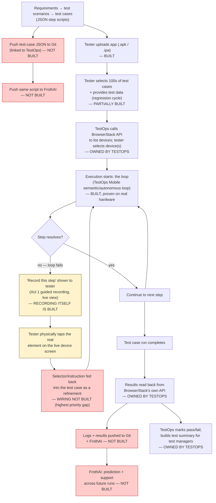

# TestOps integration workflow — UI/UX for the dev team

Purpose: a concrete, sequential screen-by-screen flow the dev team can build against, wiring the already-proven backend pieces (`engine/test-case-runner.js`, `run-batch-executions.js`, BrowserStack App Automate) into TestOps's own UI, in the same shape testers already expect from TestOps today.

**Governing decision (explicit, from the product owner):** the semantic/`test-case` layer (Act 2/3) is the default execution path. Guided recording (Act 1) is a *fallback*, surfaced only when a specific test-case step fails to resolve — never a separate thing a tester starts with. No recording happens up front for a normal run.

## The four screens, in order

```
1. Test Case Library  →  2. Execution Cycle  →  3. Attach App  →  4. Run & Results
        (author/link)         (select + schedule)      (build)          (execute)
```

This mirrors TestOps's existing mental model (a test case is authored once, reused across many execution cycles, each cycle runs against a chosen app build) — nothing new to teach a tester conceptually. What's different under the hood is step 4: instead of replaying a previously-recorded script against a fixed selector, each run resolves every step live against whatever's actually on screen.

---

### 1. Test Case Library

**What a tester sees:** a list of test cases (name, platform(s), last-run status, step count), same list view TestOps already has for recorded scripts today. "New Test Case" opens a step editor.

**Step editor**, one row per step:

| Action | Instruction (plain language) | Value / variable | Optional? |
|---|---|---|---|
| Tap | "tap the LOGIN button on the home screen" | — | ☐ |
| Type | "type the phone number into the phone field" | `{{PHONE}}` | ☐ |

- "Instruction" is free text — no selector picker, no "tap to select element" step. This is the core UX difference from Act 1: the tester describes *what* to do, never *where* it is on screen.
- "Value" supports a `{{VARIABLE}}` token for anything that shouldn't be hardcoded (credentials, test data) — resolved from the execution cycle's variable set (see screen 2) or a secrets store, never typed into the test case itself.
- "Optional" checkbox maps directly to a step's `optional: true` (a system dialog that doesn't always appear, for instance).
- A "Link existing test case" action lets a tester reuse one across multiple apps/cycles rather than duplicating it — same reuse model TestOps already has for scripts.

**What this produces, under the hood:** exactly the JSON shape already built and proven (`test-cases/login.json`'s shape) — this screen is a form over that file, not a new format:

```json
{
  "name": "login",
  "steps": [
    { "kind": "tap", "instruction": "tap the LOGIN button on the home screen" },
    { "kind": "type", "instruction": "type the phone number into the phone field", "text": "${PHONE}" }
  ]
}
```

No new backend work needed here beyond CRUD + storage for these JSON documents (a table/collection, not a file on disk, for a real multi-tenant product) and a thin validation layer that's already written: `engine/test-case-runner.js`'s `loadTestCaseSteps()` validation rules (`kind` must be `tap`/`type`, a `type` step needs `text`, etc.) can run directly against a step as the tester edits it, surfacing the same errors in the UI instead of only at run time.

---

### 2. Execution Cycle

**What a tester sees:** "New Execution Cycle" — select one or more test cases from the library (checkboxes, same multi-select TestOps already uses for its own execution-cycle screen), then:

- **Platform(s):** Android / iOS / both.
- **Device matrix:** pick real BrowserStack devices (device name + OS version), reusing the device picker TestOps already has for BrowserStack-backed runs.
- **Variables:** key/value pairs for every `{{VARIABLE}}` token referenced across the selected test cases (phone/password, promo codes, etc.) — collected once per cycle, not per test case, and never written back into the test case JSON itself.
- **Schedule:** run now, or on a schedule (reuses whatever TestOps already has for scheduled runs).

This is where test cases get tied to a concrete run, same relationship TestOps already models between "script" and "execution cycle" — nothing conceptually new, just a different thing being executed underneath.

---

### 3. Attach App

**What a tester sees:** the existing TestOps upload flow — drag in a `.apk`/`.ipa`, or pick a previously-uploaded build. Nothing changes here; this is `frontend/upload-session.js`'s existing upload-and-get-a-`bs://`-URL flow (`engine/browserstack-upload.js`), already built and proven end to end.

One addition: an execution cycle created in screen 2 can be attached to a *new* app build later (re-run the same cycle against build v2.3 once it's uploaded) — the cycle/test-case definitions are build-independent, matching how TestOps already separates "what to test" from "which build to test."

---

### 4. Run & Results

**What happens when "Run" is pressed:**

1. For each (test case × device) pair in the cycle, start a real BrowserStack session against the attached app build.
2. Run that test case's steps via `test-case` mode (`engine/test-case-runner.js`'s `runScriptSteps`) — each step resolved live by the existing semantic resolver, no selectors, no recording.
3. **No recording happens in this path at all.** A run either completes (pass) or a step fails to resolve (fail) — resolved exactly like every other `executeSemanticAction` call already proven on real hardware.

**What a tester sees, live:** a results grid — one row per (test case × device), status (running/pass/fail), updated as each finishes. Same shape as TestOps's existing results grid.

**On a failed step only — the Act 1 fallback, surfaced inline:**

> Step 4 of "login" failed: *"tap the PASSWORD tab to switch the form into password-entry mode"* — no confident match on screen.
> **[ Record this step ]**

Clicking "Record this step" launches a guided-recording session (Act 1, already shipped) scoped to the failing screen, with live view, so the tester taps the real element themselves. The output of that recording session feeds back into the test case as a *refinement*, in one of two ways (pick based on how much the dev team wants to invest up front):

- **Simple (recommended to start):** the recorded tap's resolved locator is shown to the tester as a suggested rewording of the failing instruction (e.g. the resolver's own "nearby label" text), which they can accept to edit the test-case step's instruction text directly — still a plain-language instruction, just a better-worded one, with no selector stored anywhere.
- **Later, if needed:** store an optional literal selector *override* on that one step (`classChain`/`resourceId`/etc., the same shape `generation/semantic-act.js`'s `toSelector()` already understands), tried only as a last-resort fallback after the plain-language instruction fails to resolve on a future run — keeps the self-healing behavior as the default while giving a known-tricky step a safety net.

Either way, recording is never where a tester starts — it only ever appears as a repair action on a specific failure, exactly as asked.

---

## What's already built vs. what the dev team needs to add

| Piece | Status |
|---|---|
| Step resolution against a live screen (no selectors) | **Built, proven on real hardware** (`generation/semantic-act.js`, bugs 1–23) |
| Fixed step-sequence execution, JSON-driven | **Built, proven on real hardware** (`engine/test-case-runner.js`, `test-cases/login.json`, login closed out both platforms) |
| BrowserStack session lifecycle, app upload | **Built, proven on real hardware** (`engine/remote-provider.js`, `engine/browserstack-upload.js`) |
| Guided recording + live view | **Built, shipped** (Act 1, `capture/`, `live-view/`) |
| Test Case Library CRUD + step-editor UI | **To build** — thin form over the existing JSON shape + existing validation rules |
| Execution Cycle UI (select cases, devices, variables, schedule) | **To build** — UI only; underlying execution is `run-batch-executions.js`'s `test-case` mode, already callable per (test case, device) pair |
| A real HTTP API wrapping `run-batch-executions.js` for one (test case, device) pair, returning a pass/fail + detail per call (today it's a CLI/env-var batch script) | **To build** — the one real backend gap; see below |
| Results grid, live status | **To build** — UI only, polling or streaming the API above |
| "Record this step" fallback + feedback into the test case | **To build** — wires existing Act 1 recording into the step editor as a repair action |

### The one real backend gap: an API, not a CLI

Everything the UI needs already exists as functions (`runOneTestCaseIteration`, `loadTestCaseSteps`, `runScriptSteps`), but today they're only reachable via `run-batch-executions.js`'s env-var-driven CLI, built for batch soak-testing, not for "run this one test case against this one device and tell me pass/fail right now." The dev team's first concrete task: a thin HTTP layer (same shape as `frontend/semantic-action-endpoint.js`'s existing experimental endpoint) exposing something like:

```
POST /api/execution-cycles/:id/run
  → starts one BrowserStack session per (test case, device) in the cycle,
    runs runOneTestCaseIteration() for each, streams/polls results back
```

No new execution logic needed — this is packaging, not re-proving anything.

---

## The full end-to-end lifecycle (regression test cycle) — the complete picture

The four screens above are TestOps Mobile's execution slice. This section is the whole loop around it, as the product owner described it directly — who owns each stage, and what's actually built vs. still to build. This is the authoritative sequence; refer back here instead of re-describing it.



Red = not built, no design yet. Yellow = the manual-fallback path itself (recording capability exists; the loop around it does not). Everything else is either built/proven or explicitly owned by TestOps outside TestOps Mobile.

1. **Test scenarios → test cases.** Test scenarios are derived from requirements (upstream of TestOps Mobile entirely — a TestOps/analyst activity, not TestOps Mobile's concern). Test cases are generated from those scenarios as plain-language step scripts (the JSON shape this repo already defines — `test-cases/*.json`). **Built**, for the shape itself; the generation-from-requirements step is outside TestOps Mobile.

2. **Script versioning.** The generated test-case JSON is pushed into Git, linked to TestOps, so test assets are version-controlled the same way code is. **Not built, not designed yet** — no repo, branch, or commit convention for tester/TestOps-authored test-case JSON exists today. This is a real gap: distinct from TestOps Mobile's own repo, and distinct from `execution-log.js`'s in-run learning state.

3. **Script also pushed to FrothAI.** The same test-case JSON is pushed into FrothAI (the LLM/resolution layer) alongside Git. **Not built** — today a test case is read straight off disk by `test-case-runner.js`; there's no push/sync step to a separate FrothAI store. Needs clarifying what FrothAI does with a script it hasn't executed yet (pre-analysis? Just storage for later correlation with results?).

4. **Tester loads the app.** Upload `.apk`/`.ipa` via TestOps's existing upload flow. **Built, proven** (`engine/browserstack-upload.js`).

5. **Tester selects test cases + provides test data.** For a regression cycle this is not one scenario at a time — it's hundreds of test cases/scenarios selected together, with test data parameterized across all of them and collected once via TestOps's UI (matches the existing "Execution Cycle" screen's "Variables: collected once per cycle, not per test case" design above). **Partially built**: the parameterization mechanism (`{{VARIABLE}}` tokens resolved from an execution cycle's variable set) already exists and is proven; the UI to collect hundreds of test cases' worth of data from a tester in one pass is **to build**.

6. **TestOps calls BrowserStack to list devices; tester selects one or more.** TestOps's own call, using TestOps's own BrowserStack credentials — confirmed earlier in this engagement as TestOps's responsibility, not TestOps Mobile's. **Outside TestOps Mobile**, owned entirely by TestOps.

7. **Execution starts — the loop process.** TestOps triggers execution against the selected device(s); TestOps Mobile runs the autonomous/semantic loop per test case. **Built and proven on real hardware** for the resolution/execution mechanics themselves (`engine/semantic-loop.js`, `test-case-runner.js`) — though this session's real-device validation also found the loop's structural failure modes (max-steps, stuck-repeating, stale-resolution — see the iOS/Android log analysis above) are real and unresolved.

8. **Loop failure → manual selector.** When a step fails to resolve, the tester is asked to go select the element manually to complete execution — this is the "Record this step" fallback (Act 1 guided recording, already shipped) that was the subject of the last exchange. **The recording capability is built; the wiring from "step failed" to "show Record-this-step, capture the selector, feed it back into the test case" is explicitly NOT built** (same gap flagged in the table above, line "Record this step fallback"). This is the most concrete, correctly-scoped "next thing for developers" to date — everything upstream and downstream of it is already proven or already scoped.

9. **Execution against BrowserStack; results read back via BrowserStack's own API.** TestOps pulls results back from BrowserStack directly (not only from TestOps Mobile's own pass/fail return value) — confirms step/session outcome against BrowserStack's own session record. **Partially built**: TestOps Mobile's `runOneTestCaseIteration`/`runScriptSteps` already return a structured pass/fail + detail per test case; a separate TestOps→BrowserStack results-API call is TestOps's own integration, outside TestOps Mobile.

10. **Logs and execution results pushed back — to Git and to FrothAI.** Same dual-push pattern as the script itself (steps 2-3) — now for the *results* of running it. **Not built** — `execution-log.js` keeps this run's history in TestOps Mobile's own state for cross-run resolution reuse (dead selectors, past failures/successes), but there is no push of logs/results to an external Git location or to FrothAI as a separate system today.

11. **TestOps marks pass/fail and builds a test summary for test managers.** Aggregation and decision-support UI, entirely TestOps's own responsibility, consuming the structured per-test-case result TestOps Mobile already returns. **Outside TestOps Mobile**; TestOps Mobile's job is only to supply a clean, structured, step-level pass/fail that TestOps can roll up without reinterpreting raw logs.

12. **Logs/results pushed into FrothAI for prediction and support.** Beyond the regression cycle itself, the same execution history feeds FrothAI for whatever predictive/support use TestOps builds on top (e.g. surfacing "this step fails most months around release day" patterns). **Not built** — `execution-log.js`'s learning is local to a TestOps Mobile run; there's no external push to a FrothAI prediction store yet. This is the same mechanism the Beta framing (failures-as-training-signal) from earlier in this engagement depends on, just now named as a concrete cross-system integration rather than an in-process log.

### What this adds to the punch list

Three genuinely new, previously-undocumented gaps, none of them resolver bugs:
- **Test-case JSON → Git push/versioning** (stage 2) — no design yet.
- **Script and results → FrothAI push** (stages 3, 10, 12) — no design yet; needs a decision on what FrothAI actually consumes (raw logs? structured summaries? both?).
- **"Record this step" wiring** (stage 8) — already scoped in the table above, now confirmed as the single highest-leverage gap: it's the one piece that turns every resolver/loop failure this session found into a 30-second tester fix instead of a developer ticket.
